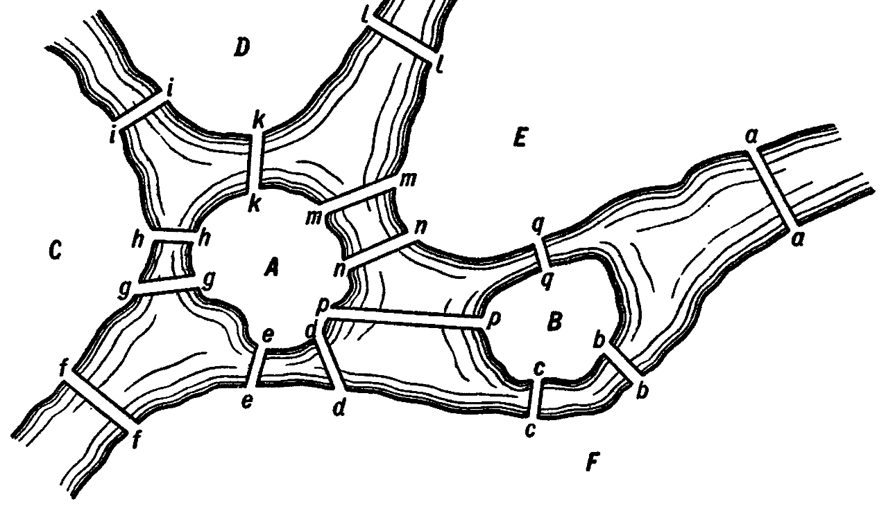

# На просторах Интуиции

## Битва Ахиллеса с гомофобами

Газон сам себя не пострижёт, поэтому после [поездки](/otvetochka-zenona/) с Зеноном, Ахиллесом и черепахой Авророй мне срочно пришлось возвращаться к борьбе с одуванчиками. Эта работа не пугала, ведь под мерное жужжание триммера можно хорошенько осмыслить всё, что я узнал о рассечения числовой прямой методом Рихарда Дедекинда и теории множеств Георга Кантора. 

Закончив с газоном, я вышел из калитки на внешнюю дорожку. Там следовало выкосить сорняки с особой тщательностью, потому что на собрании садоводческого товарищества было принято решение штрафовать тех, кто допускает вдоль участков ботанические безобразия. «Новый председатель СНТ — молодец: энергичный, принципиальный,  — думал я, переключаясь с математических тем на садоводческие. — Штрафы ввёл для тех, кто автостоянки в неположенных местах устраивает…» Тут я поднял глаза и увидел, что рядом с соседскими воротами опять припаркована какая-то машина.  «Ну, погоди, негодник! — сердито подумал я в адрес нерадивого соседа, частенько оставляющего свой крупный автомобиль прямо у забора. — Теперь всё правление на моей стороне!» Однако, присмотревшись, я заметил, что сегодняшний джип больше похож на какой-то старинный тарантас. Более того, мне ещё минут пять назад следовало бы обратить внимание на то, что трава, которую я косил вдоль забора, подозрительно низкорослая, хотя судя по тому, сколько я отсутствовал на даче, она должна была уже превратиться в бурьян. Причём зелень была даже не скошена, а как-то… выщипана. Кто же мне помог? «Чудеса творятся в нашем СНТ! Неужели ввели английское новшество, когда для «стрижки» газонов привлекают овец?» 

Сзади между тем отчётливо стало доноситься какое-то усердное пыхтение и чавканье. Я оглянулся… Вот так раз! Траву вдоль забора с аппетитом уплетала двухметровая черепаха Аврора. Рядом с ней стоял, улыбаясь, старый знакомый, древнегреческий философ Зенон. 

— Привет, Костя! Не ожидал? — поприветствовал он меня. Мы обменялись рукопожатиями. Костей он меня назвал, видимо, потому что псевдоним Эйкостос Протос, историю появления которого можно узнать из предыдущего рассказа, длинноват для произношения, а имя Михаил он так и не признал за слово, которое стоит запоминать.

— Здравствуй, Зенон! — перешёл и я «на ты», учитывая, сколько в прошлый раз мы пережили приключений. Да и по возрасту я уже гожусь ему в товарищи. — Опять на охоту за бесконечно малыми собрался?

— Нет, с этим покончено, — серьёзно заявил он. — Георг Кантор прекрасно вправил мне мозги, да и теорема о сходимости рядов, которая прозвучала ещё раньше, в твоём [эссе о Вейерштрассе](/math-inquisitor/) теперь кажется мне убедительной. Но ты ведь знаешь, как я люблю поспорить: диалектика, Парменид… В общем, я приехал помириться. В предыдущий раз я был настолько озадачен успехами новомодной математики, что даже толком с тобой не попрощался. Поехали ко мне, в Элею, посмотришь, как мы, древние греки, умели отдыхать! Закрепим приятельские отношения!

— Предложение заманчивое, но я же дома никого не предупредил. Давай на первый раз у меня повеселимся. Сейчас за мясом для шашлыка сгоняю, пивка возьмём (ты же его в прошлый раз, вроде, распробовал). Гамак вон у меня есть, теннисный стол. Но это уж вечером, а пока жара — на Каму можно сходить искупаться. Каких-то 300 метров от моего участка!

— Да, мы видели, Ахиллес уже туда отправился, — сказал он.

Я хотел было вставить дежурную фразу о том, что и возницу нашего рад приветствовать у себя в гостях, но в этот момент с реки донёсся тревожный шум: там явно затевалась какая-то ссора. Как потом рассказывал сам Ахиллес, купаться по античной привычке он полез голышом, что вызвало недовольство местной публики. Когда же он вылез из воды, его обступили радетели за «традиционные ценности». Дело могло закончиться и без осложнений: поняв, что здесь не принято ходить без одежды, Ахиллес быстро облачился в своё походное обмундирование, как мог извинился и совсем уже хотел ретироваться, но кто-то обругал его сначала словом с греческим корнем `ὁμός`, а потом словом с греческим корнем `παιδος`. Наш водитель-воитель, уловив оскорбительную коннотацию, полез в драку, но недовольных было гораздо больше, и долго отбиваться он бы не смог.

— Наших бьют! — воскликнул Зенон, выдрал из забора штакетину и мгновенно набросил оглобли на Аврору. Я тоже запрыгнул в колесницу времени и на правах эксперта скомандовал:

— Правь выше по течению, сейчас пролетим вдоль берега, чтобы он мог заскочить на ходу!

Мы подоспели в критический момент. Ахиллес уже отступил к самой кромке воды, огрызаясь в ответ на нападки разъярённой толпы местных бузотёров:

— Ах ты пиндос несчастный! Не иначе на гей-парад вырядился. Знаем мы, чем там эти ваши «древние греки» занимались на своих симпозиумах!

Именно в этот момент наш экипаж, паря над водой Камы у самого берега, уже подоспел на подмогу. В распряжённом состоянии Аврора казалась медлительным животным, но в связке с колесницей превращалась в боевой болид, безупречно перемещавшийся не только во времени, но и в пространстве.

— Μπείτε μέσα! Μπείτε μέσα! (Запрыгивай! Запрыгивай!) — закричал Зенон. Он хряснул штакетиной по спине какого-то гопника, уже схватившего было Ахиллеса за грудки, и наш ветеран, пробежав за экипажем несколько шагов, вцепился в борт, легко сделал выход на две и, перекинув ноги вовнутрь, оказался в безопасности. Аврора взмыла в небо.

— Вот это я понимаю: Ахиллес догнал черепаху! — попытался пошутить я, чтобы сгладить пережитый товарищами стресс.

— А с этого и начиналось, — на полном серьёзе ответил Зенон. Когда у меня появилась колесница времени, я нанял возницей Ахиллеса, чтобы заключать пари: ставил 10 против 1, что Ахиллес не догонит черепаху. Аврора, когда не впряжена в колесницу, движется с обычной черепашьей скоростью, так что когда мы впрягали её ещё и в повозку, казалось, что она и вовсе не тронется с места. Со временем, конечно, наш трюк раскусили. Тогда я и придумал свой мысленный эксперимент, и на нём заработал даже больше денег, чем на гонках колесниц… — Он задумчиво помолчал несколько секунд. — И куда мы теперь?

— Назад нельзя, — сказал я. — Вечером обязательно придут разбираться. К вам в Грецию тоже не годится. Я ещё за прошлую «командировку» перед женой не отчитался… Да, выбрось ты за борт этот дрын, он уже вряд ли нам пригодится. А впрочем… Дай-ка его сюда.

Только теперь я заметил, что на конце штакетины болтается провод, а на нём — пара секций китайской солнечной батареи! Это я в прошлом году экспериментировал, да так и забросил, оставив на улице: мощность маловата. Однако на борту колесницы времени, где нет даже обычного автомобильного аккумулятора, такое устройство могло пригодиться.

— Ахиллес, у тебя сохранился тот смартфон? — спросил я.

Он порылся в в складках своей амуниции, нашёл девайс и равнодушно протянул мне. Лишенный заряда, карманный компьютер перестал представлять для него практическую ценность, но был дорог как память.

— Молодец, что не выбросил. Смотри!

Я подсоединил к смартфону USB-разъем, припаянный к солнечной батарее через преобразователь напряжения, и через несколько секунд на экране закрутилось знакомое «колёсико» — процесс заряда начался.

Обрадованный Ахиллес перехватил вожжи у Зенона и спросил?

— Куда едем?

— А давайте по старым местам! — предложил я.

— Почему бы и нет? Согласился Зенон. Я бы не прочь ещё разок побеседовать с Леонтием Магницким, а то в прошлый раз как-то скомкано всё получилось. Айда в Москву!

— Только время попозже выбери, — добавил я. — В 1702 году, где мы уже побывали, Леонтий был ещё довольно молодым человеком. Давай в 1730-е, там ещё и Эйлера можем застать.

## Бочонок кваса, second edition

Старину Леонтия мы застали, как и в предыдущий раз, на крылечке у Сухаревой башни, только он уже постарел и написанию учебников предпочитал просто греться на солнышке. Его жизнь, увенчавшаяся должностью начальника учебной части Навигацкой школы, вполне удалась, почему бы и не почивать на лаврах, когда тебе седьмой десяток?

— Здравствуйте, Леонтий Филиппович, — поприветствовал я его от имени всей компании. — Вы нас, наверно, не помните, мы заезжали сюда лет 30 назад, беседовали с вами о математике.

— Как же, забудешь такое! — оживился Магницкий. — Ведь в тот раз начальник наш, Яков Брюс, чуть из пушки по вашей колеснице не выпалил, да уж больно юркая у вас черепаха. Меня же после разговоров с вами аж к царю вызывали по подозрению в государственной измене, но батюшка наш Пётр Алексеевич как узнал, что это сам древнегреческий философ Зенон со свитой к нам в Московию пожаловал, так сменил гнев на милость. Даже попенял, что вы к нему на личную аудиенцию не записались. Вдохновился вашим появлением, Пётр наш Великий, велел в здешней Еллино-греческой академии преподавать не токмо математику, но и философию. «Может, — сказал, — собственных Зенонов земля российская рождать». За ним это даже кто-то записал, да всё переврали потом. Так что помню я вас прекрасно, спасибо, что уважили старика, навестили, добро пожаловать. Присаживайтесь вот со мной кваску с кренделями отведать.

Мы разместились за столом под липками. Я, как пришелец из будущего, порадовал старину Леонтия тем, что его «Арифметику» будут изучать даже в XX веке, утаив, правда, что в XXI математическая смекалка, которой переполнены его задачи, утратит свою ценность.

— А напомните-ка ту задачу, о которой мы говорили в прошлый раз, — подключился к разговору Зенон.

— Это какую же? Мы тогда две решили, — явил прекрасную память русский математик.

— Первую, про бочонок кваса.

— Ну, это самая лёгкая, — снисходительно улыбнулся Леонтий. — Впрочем, извольте: «Один человек выпивает бочонок кваса за 14 дней, а вместе с женой выпивает такой же бочонок кваса за 10 дней. Нужно узнать, за сколько дней жена одна выпивает такой же бочонок кваса». Решение: «За 140 дней супруги выпьют 14 бочонков кваса, 10 муж и 4 жена. Значит, один бочонок она выпьет за `140 / 4 = 35` дней».

— А не крутенько берёте? — спросил Зенон с какой-то затаённой язвительностью.

— Да разве ж решение неправильное? — заволновался Леонтий. — Тут и думать нечего, если уж здесь ошибка, тогда всю арифметику только в печке сжечь и остаётся! 

— А мне вот, допустим, непонятно, откуда взялось 140, — ехидничал Зенон.

— Такому-то знатному философу — и непонятно? Шутить изволите. Эту задачу и решение к ней сам царь-батюшка похвалить изволил, да именно за то, что всё тут без лишних лукавств, по-нашему, по-простому, по-русски — раз, два и готово!

— А если в промежуточных рассуждениях ошибка? — не унимался Зенон. В нём опять проснулся дух спорщика Парменида.

— Давайте я продемонстрирую, как нас учили решать такие задачи в советской школе, — подключился к разговору я, чтобы разрядить обстановку.

— А ну-ка, Костя!.. — подбодрил Зенон. Лицо Леонтия, который был не в курсе нашей игры в псевдонимы, вытянулось от удивления: я-то ему представился как Миша.

— У нас есть скорость, с которой пьёт квас муж. Ведь словом «человек» в старину называли мужа в семье, а не особь `homo sapiens`, и так, кстати, до сих пор остаётся в украинском — «чоловік» значит муж, да ведь, Леонтий Филиппович?

Тот кивнул.

— То есть начало задачи лучше воспринимать так: «В одиночку муж выпивает бочонок кваса за 14 дней, а вдвоём с женой — за 10».

— Так гораздо понятнее, — заметил Зенон.

— Вот видите, даже лингвистика играет роль в интерпретации условия. Так вот, выразим скорость потребления кваса мужем (я взял палочку и начал чертить на песке):

$$
\Large
v_m = {\frac{1}{14}}\,(1)
$$

Скорость потребления вдвоём:

$$
\Large
v_m + v_f = {\frac{1}{10}}
$$

Переносим $v_f$ (скорость жены) в правую часть:

$$
\Large
v_m = {\frac{1}{10}} -  v_f \,(2)
$$

Объединяем уравнения (1) и (2):

$$
\Large
{\frac{1}{14}} = {\frac{1}{10}} -  v_f
$$

Переносим переменную в левую часть с противоположным знаком:

$$
\Large
v_f + {\frac{1}{14}} = {\frac{1}{10}}
$$

…а константу в правую:

$$
\Large
v_f = {\frac{1}{10}} - {\frac{1}{14}}
$$

Приводим к общему знаменателю:

$$
\Large
v_f = {\frac{1 \times 14}{10 \times 14}} - {\frac{1 \times 10}{14 \times 10}} = {\frac{14}{140}} - {\frac{10}{140}} = {\frac{4}{140}}  = {\frac{1}{35}}
$$

Вот где, Леонтий Филиппович, появляется у меня впервые 140! Поскольку нас интересует не скорость (сколько жена выпивает бочонков в день), а время, переворачиваем дробь: 

$$
\Large
v_f = {\frac{140}{4}} = 35 
$$

Такое вот подробное решение, и то я в конце схитрил: это нужно ещё потрудиться, чтобы показать, почему дробь переворачивается. Я бы и это продемонстрировал, но она громоздкая, двухэтажная, а свободное место на песчаной дорожке, как видите, закончилось.

Формулы произвели на обоих стариков глубокое впечатление, только с разными знаками. Зенон молча восхищался, а Леонтий, напротив, впал в уныние:

— Да ежели эдак-то над каждой пустяковой задачей биться, времени не напасёшься. Пока ты, Миша, рассуждал, я с каждым твоим шагом был согласен. Я их тоже в своей голове проделываю во время счёта, только так быстро, что на словах и проговорить бы не успел, если бы и хотел. Только что за удовольствие заниматься математикой, если всё так долго разжевывать приходится? От нас царь-батюшка быстроты требует, иначе мы ихнюю Европу никогда не обгоним!

— А если ошибка в спешке будет допущена, кто отвечать будет? — с усмешкой поинтересовался Зенон.

— Так это же не часто случается, — заверил Леонтий. — Хотя, конечно, хорошего мало, государь если осерчает — три шкуры спустит… Мы поэтому и не ошибаемся никогда! — выкрутился он.

— Ошибка может проявиться через много лет после того, как допустивший её ушел из жизни, — заметил я. — С самого-то с него шкуру спустить, может, уже и не удастся, а вот потомкам придётся туго. Были тут у нас такие — большевики. Тоже говорили, что любые расчёты им по плечу, а как до дела дошло — таких дров наломали, что до сих пор расхлебать не можем.

— Ну, у потомков свои головы на плечах должны быть, — простодушно ответил Леонтий. — Выкрутятся как-нибудь.

Я не нашелся что ответить. Помалкивал и Зенон, видимо, опасаясь, что ему могут припомнить мошеннический парадокс про состязание Ахиллеса и черепахи. Поэтому я счёл за благо переключить всеобщее внимание на превкусные московские калачи: попросил Леонтия объяснять Зенону смысл выражения «дойти до ручки». Это разрядило обстановку, и даже Ахиллес охотно послушал эту байку.

Убедившись, что Леонтий повеселел, я спросил его, не встречался ли он с господином Леонардом Эйлером, научная карьера которого протекала в России и как раз подходила в то время к зениту славы. Он ответил, что наслышан о заслугах швейцарца, но лично встречаться не доводилось: тот живёт в Санкт-Петербурге и в Первопрестольную пока не заглядывал. Я объяснил Зенону, что разговор с Эйлером может заменить знакомство как с Ньютоном, так и с Лейбницем, которые к тому же на тот момент уже умерли. Можно было, конечно, вернуться немного назад во времени, но перелёты на небольшие расстояния давались Авроре с трудом: пока разгонится, пока затормозит, — глядишь, и промахнулись лет на 10. Так что решили лететь в Северную столицу.

— Знаешь, Миша, — сказал на прощание Магницкий, — ты меня убедил. Формулы нужны. На одной русской смекалке далеко не уедешь. Жаль, староват я уже, по-новому не успею преподавать, но вот такие умы, как господин Эйлер, надеюсь, привьют молодым российским математикам не только навыки быстрого счёта, но и основательность записи, когда каждый сможет проверить твои выкладки на предмет ошибок.

Леонтий снабдил нас на дорогу всевозможной московской снедью, не пожалел и пару бочонков квасу. Он даже сбегал в Сухареву башню к новому начальнику Навигацкой школы (Яков Брюс к тому времени уж год как умер), чтобы тот выписал нам подорожную грамоту: вид у нашей компании был всё-таки подозрительный. Хорошо, что Аврору мало кто видел, её пристроили пастись в Аптекарский огород, но прожорливость рептилии уже начала беспокоить сторожей. Это было ещё одним поводом поскорее отправляться в Санкт-Петербург.

## Швейцарский нож русской математики

Если от негостеприимных московских взглядов Аврору пришлось прятать в Аптекарском огороде, то жители Санкт-Петербурга 1730-х годов, где мы вскоре оказались, встретили нас с восторгом. Заметив в небе нашу колесницу времени, которая специально сделала несколько миролюбивых кругов над центральной частью города, они не стали палить в нас из пушек. Быстро сообразив, что к ним прибыла интернациональная делегация учёных, они устроили торжественную встречу. Аврора вальяжно приводнилась на поверхность Невы и несколько сотен метров проскользила на пузе к самому входу в Кунсткамеру, волоча за собой явившую свою плавучесть ещё во время «камского побоища» колесницу времени. Гремел духовой оркестр, в воздухе мелькали цветы и дамские чепчики.

На берегу нас встречал знаменитый архитектор Пётр Михайлович Еропкин, который, узнав о цели нашего визита, сразу же занялся организацией встречи с Леонардом Эйлером. Аврору отправили пастись на луг перед Летним дворцом.

***

Эйлера мы застали в цветущем состоянии: ему не было и тридцати, а он уже возглавил кафедру математики Российской академии наук. В отличие от престарелых учёных, начинающих по достижении вершины научной карьеры упиваться своей солидностью, Леонард вёл себя легкомысленнейшим, совсем не подобающим его официальному статусу образом. Пользуясь предоставленными полномочиями, он стремился проникнуть во все уголки града Петрова, где происходило хоть что-то, касающееся науки и техники. Старшие коллеги и чиновники Академии брюзжали, что иногда подолгу не могут его найти по служебным надобностям, но молодой Эйлер никак не мог укротить порывы своего энтузиазма. Он хватался за всё и преуспевал во всех своих начинаниях. В конце концов ему предоставили возможность заниматься чем вздумается.

В день нашей встречи он забрался на самую верхотуру Кунсткамеры, в только что построенную обсерваторию, где в окружении новомодных астрономических приборов решил разобрать свежую корреспонденцию. Когда Леонарду доложили, что его желают видеть древнегреческий философ Зенон, воин по имени Ахиллес и какой-то странный господин «из будущего», он не только не удивился, а, напротив, отложил все дела и незамедлительно принял нас. Не смутил его и рассказ о чудесной черепахе, умеющей перемещаться во времени. Напротив, он взял один из телескопов, навёл его на противоположный берег Невы и с любопытством стал рассматривать Аврору, делая заметки в блокноте.

— Господа! — наконец обратился он к нам. — Простите обстановку некоторой сумбурности, в которой я вас принимаю, но моё сердце переполняют надежды о великом будущем, которое ждёт российскую науку. Подобно основоположнику нашей Академии — Петру Великому, мне хочется заложить основы каждой отрасли знания, которой предстоит развиваться на местной почве: от математики до музыки, от архитектуры до кораблестроения. Как это прекрасно — творить, полагаясь не на приказы начальства, а повинуясь веленьям сердца, которое во всём видит непочатый край для работы во имя процветания державы!

В подтверждение этих слов, он обвёл взглядом рассыпанные на столе письма и наугад взял одно.

— Вот, пожалуйста. Мы с моим итальянским другом, инженером Маринони обсуждаем по переписке любопытную задачу, которую придумали в Кёнигсберге в незапамятные времена. Там, видите ли, есть остров, на который ведут семь мостов, да так хитро расположенных, что никому ещё не удавалось обойти их все, не пересекая один и тот же дважды. Однако и доказать, что это невозможно, никто пока не смог. Вот, взгляните:

Зенон как коллекционер неразрешимых парадоксов так и впился в схему глазами:

— И что же вы, молодой человек, нашли решение? — спросил он с тайной надеждой на отрицательный ответ.

— Конечно! — самоуверенно воскликнул Эйлер. Да ещё и нестандартное. Когда я увидел эту картинку впервые, мне подумалось, что здесь недостаточны ни геометрия, ни алгебра, ни комбинаторное искусство. Я нашел легкое правило, с помощью которого можно во всех задачах такого рода тотчас же определить, может ли быть совершен такой обход через какое угодно число и как угодно расположенных мостов или не может. Скажу больше, это решение имеет мало отношения к математике. Зачем применять тяжеловесную теорию, когда достаточно простого здравого смысла, смекалки?

— Опять смекалка… — пробурчал Зенон.

— Прежде всего нужно смотреть, — продолжил молодой академик, не обратив внимания на замечание философа —  сколько есть участков, разделенных водой, таких, у которых нет другого перехода с одного на другой, кроме как через мост. В данном примере таких участков четыре, А, В, С, D. Далее нужно различать, является ли число мостов, ведущих к этим отдельным участкам, чётным или нечётным. Так, в нашем случае к участку А ведут пять мостов, а к остальным — по три моста, т. е. число мостов, ведущих к отдельным участкам, нечетное, а этого одного уже достаточно для решения задачи…

Он хотел детальнее разъяснить, но в этот момент с дальнего края стола, где расположился Ахиллес, донеслась явно синтезированная электронным устройством искаженная немецкая речь, пропитанная гневными интонациями:

— Ахтунг! Нихт картинкен! Герр Вейерштрасс дер гроссе протестен махен! Ай! Ай! Шибко ругаться верден! Битте лиферн зи айне штренген алгебраистишен бевайс! — декламировал  механический голос, а в конце зачем-то добавил: — Яволь!

Оказывается, смартфон успел подзарядиться от солнечной батареи, а Ахиллес, многократно видевший, как я с помощью карманного компьютера перевожу иностранную речь непосредственно в процессе разговора, решил воспользоваться этой практикой. Однако, формулируя свои возражения, он явно нажал какие-то лишние кнопки. 

Мы с Зеноном изумились: казалось бы, умственное развитие нашего возницы находилось на подростковом уровне, а вот поди ж ты: молча присутствуя на всех наших научных дискуссиях, он усвоил, что интуиция в математике допустима как «специя», но не может служить «основным блюдом». Он хотел, видимо, сказать, что решение, основанное на изображении, не может всерьёз считаться научным. Вейерштрассу бы действительно такое не понравилось.

Встрепенулся и Зенон. Он вспомнил всё, что слышал о серьёзной математике и, будучи сам ещё совсем недавно будучи большим поклонником интуиции, собирался, судя по выражению лица, прочесть наставление о важности методологии.

«Какие же они все дети по своей сути! — подумалось мне. — Как бы не перессорились со своими амбициями». Вспомнив свою не последнюю роль в этой экспедиции, я миролюбиво предложил:

— Ахиллес, научи господина Эйлера пользоваться смартфоном. Он хоть и академик, а такой игрушки точно в руках не держал. А мы с Зеноном пока пройдёмся по экспозициям Кунсткамеры. 

Зенон, кажется, понял мой замысел: Леонард — совсем пацан. Постоянное общение на научные темы для него всё-таки обуза. Было видно, что с самого начала нашего визита Эйлер с огромным любопытством и даже завистью поглядывает на светившийся в руках Ахиллеса смартфон, так что решение предоставить ему возможность позабавиться «волшебным» устройством было не лишним.

Вернувшись примерно через час с осмотра коллекции диковинок, собирать которую начал ещё Пётр Первый, мы застали в целом мирную, но напряженную картину. Ахиллесу было лестно, что ему поручили объяснить как пользоваться компьютером целому академику, но тот обучался мгновенно и вскоре завладел устройством, в связи с чем наш возница испытывал мучительные приступы ревности. Было и ещё одно забавное обстоятельство. Сначала они сидели у окна, чтобы не отключаться от солнечной батареи: провод, который подводил электропитание от неё к смартфону, был короток. 

Вскоре Эйлера осенило: от сбегал в один из залов Кунсткамеры, принёс оттуда какое-то старинное золотое украшение, состоявшее из тонких золотых нитей, и варварски распустил на провода. Сообразив, что они не должны соприкасаться, изобретатель притащил из другого зала набор каких-то старинных счетных палочек, сделав из них изоляторы с интервалом сантиметров в 30. Разрезав (к ужасу Ахиллеса) пополам USB-кабель, Эйлер безошибочно собрал свой удлинитель, давший парням возможность переместиться от окна, где экран сильно отсвечивал, вглубь кабинета. Там они нашли затенённый столик. 

Ахиллес проникся уважением к смекалке Эйлера. Они вдвоём погрузились в игру «Викинги». Сначала Ахиллес с гордостью показал, как он проходит начало квеста, но в очередной раз застрял на уровне, который уже несколько часов не мог преодолеть. Эйлер взял дело в свои руки. Он легко проскочил затруднительный участок, и с этого момента обладатель смартфона уже не смотрел на него с надменностью наставника. 

Когда мы с Зеноном вернулись в обсерваторию, они галдели и размахивали руками, споря о том, как бы половчее пройти какого-то очередного «босса». Впрочем, Эйлер действительно легко переключатся с одного дела на другое и, охотно подарив Ахиллесу вновь изобретённый удлинитель, вернулся к разговору, с «учёными мужами» который явно предпочитал яркой, но не содержащей по-настоящему интеллектуальных заковык игре. 

— Уважаемый пришелец из будущего, — обратился он ко мне. — Я в восторге от этого волшебства, но мне кажется, что этот прибор ещё не скоро заменит человеческий мозг, а даже если и заменит — живое мышление ещё долго останется непревзойдённым, божественным феноменом, благодаря которому я, например, только и ощущаю себя человеком. Ведь формулы рождаются не из алгоритмов, а из созерцания гармонии! Мой метод «нечётных мостов» обнаруживает суть задачи сразу, а ваш автомат, скорее всего, внутри себя перебирает миллионы вариантов, в поисках ответа.

Зенон, вполне довольный экскурсией по Кунсткамере и уже забывший, что собирался поругать своего телохранителя за то, что тот суёт нос не в своё дело, благодушно ответил:

— Господин Эйлер, мы много путешествуем во времени и в пространстве, встречались с выдающимися математиками (к числу которых, кстати, я отношу и себя самого), и пришли вот к какому выводу. Многие из нас переоценивают значение творческих озарений, смекалки, таланта, если хотите, а также налёта «магии», присущего некоторым вычислениям. Часто эмоциональный подход сначала помогает, но затем вредит делу, если принятое на его основе решение не подтверждается выражением мыслей на строгом математическом языке формул. Вот и мой друг Ахиллес, который тоже стал немного математиком в течение наших странствий, хотел обратить внимание присутствующих на то, что в вашем решении задачи о мостах совмещено слишком много разномастных подходов: тут и чертёж, и указание на практику («ни у кого не получилось, но не все варианты испробованы»), и эвристическое заявление о чётности и нечётности. Нисколько не сомневаюсь, что вы ясно «видите» безупречное решение перед вашим внутренним взором, но нужно сделать так, чтобы и другие смогли убедиться в его правильности.

И потом… Вы уж простите моё стариковское брюзжание. Швейцарец на русской службе занимается обсуждением с итальянцем проблемы немецких мостов. Это, конечно, расширяет кругозор, но раз уж вы так рано достигли серьёзных должностей — вам следовало бы выбирать более солидные темы для исследований. Положение обязывает!

Леонард не обиделся и даже не расстроился. Он расцвёл в очередном порыве энтузиазма и, пожимая Зенону руку, ответил:

— Гениально! Я понял, чего мне не хватало до сих пор! Методичности, усидчивости. Вместо того, чтобы решить «начерно» множество мелких задач, лучше заняться одной, но разобраться с ней от начала до конца, чтобы у тех, кто будет проверять решение, не оставалось никаких вопросов. С этого дня из всех затей, манивших меня в юности, сосредоточусь на самых важных. Я среди прочего задумал фундаментальный математический труд «Введение в анализ». Вот за него и примусь, как только разгребу текущие дела. Спасибо за наставление.

— А Коши считал отцом математического анализа себя, помнишь? — шепнул я Зенону.

Тот одобряюще хмыкнул.

— Господин Эйлер, — обратился я к молодому академику. — Я не ахти какой математик, зато знаю, что в этом волшебном устройстве есть справочник, сведения из которого могут пригодиться вам в будущей работе. 

— Ахиллес, открой страницу Википедии с задачей о мостах, — обратился я к нашему вознице, который с некоторых пор с удовольствием выполнял ещё и роль голосового помощника, лишь бы не выпускать смартфон из рук. Найдя нужный ресурс, он показал Леонарду современное, основанное на теории множеств, а не на чертежах, решение. — Смотрите, Леонард, как будут разбираться с подобными проблемами в XX веке. Ваша интуиция совершенно верно подсказывает, что задача с мостами — частный случай большого класса математических объектов — графов. Со временем появится целая теория, описывающая их, причём находить решения можно будет строго алгебраически, без картинок. Нужно описать множество вершин (участков суши в вашем случае) и рёбер (мостов). Потом производится подсчёт степеней вершин и, что самое интересное, там действительно всё упирается в чётность или нечётность, то есть ваша интуиция вас снова не подвела. Важно лишь уметь правильно выразить это математически. Так что одними рассуждениями всё-таки не обойтись, если вы хотите, чтобы на вашу задачу обратили внимание серьёзные специалисты.

Эйлер был в восторге:

— Какой изящный язык формул будет у математиков через 200 лет! — восхитился он. — А решение выглядит действительно безупречным по сравнению с моим, скоропалительным. Спасибо, теперь я точно знаю, в какую сторону развиваться.

— Удачи тебе, сынок, — прослезился Зенон. — У тебя ещё всё впереди.

Мы стали собираться в дорогу: пополнили запас провианта, а оставшийся бочонок кваса и всё ещё свежие калачи, которыми снабдил нас в Москве Леонтий Магницкий, передали в ведение Российской академии наук в лице Леонарда Эйлера. 

Аврора, хорошенько почистив будущее Марсово поле от сорняков, уже плыла к нам по Неве, пересекая реку наискосок. 

— Ну что, навестим Коши? — предложил я.

— Да ну его, жлоба старорежимного! — возмутился Ахиллес. — Опять с пустым брюхом оставит.

— Жаль, что Ахиллес против, — сказал Зенон. — В Париже мне понравилось.

— Так на Политехнической школе свет клином не сошелся, — проинформировал я. — Есть ещё много французских математиков, которых неплохо было бы полечить от избыточной склонности к интуитивным решениям. Вот, например, Анри Пуанкаре, уже упоминавшийся в одном из моих эссе. Он, кстати, современник нашего уважаемого Вейерштрасса, так что потом можно будет по традиции и к немцам заглянуть.

— Годиться, — согласились греки, и мы тронулись в путь.

## Накосячивший Пуанкаре

Если во время своего предыдущего путешествия мы получили большое удовольствие от рождественского Берлина, то теперь, направляясь к дому, где жил Анри Пуанкаре, любовались январским Парижем. Дух праздника ещё не выветрился, и была надежда, что встреча с этим французским математиком пройдёт в более радостной обстановке, чем с предыдущим.

У нас к тому моменту сложился уже целый регламент путешествий во времени. 

Оказавшись в новом месте, нужно было первым делом переоблачиться в обычную для здешних обитателей одежду. Её приобретению способствовала стопочка античных монет, которую Зенон прихватывал в дорогу из V века до новой эры. Они представляли собой драгоценность не только из-за металла, из которого были сделаны, но и благодаря невиданной древности и сохранности. У нумизматов глаза лезли на лоб от лицезрения этих раритетов, но они так ни разу и не смогли доказать поддельность наших артефактов, так что вырученной за несколько монеток суммы хватало на пару недель безбедного существования в любой локации цивилизованного мира.

Второй момент, который нужно было держать под контролем — заряд смартфона. Это было поручено Ахиллесу, который потихоньку превращался в неплохого электрика, особенно после общения с Эйлером.

Главной заботой было пристроить Аврору. Ещё по прошлой берлинской поездке мы знали, что зима может оказаться для черепахи губительной, поэтому придумали небезопасный, но, пожалуй, единственно возможный лайфхак. Мы «припарковались» в Булонском лесу за полгода до Рождества. Там нашли егеря и за приличное вознаграждение поручили ему поместить черепаху на огороженный участок, где не было бы недостатка в зелёном корме. Хотя Аврора была категорически против того, чтобы её показывали за деньги, мы дали нашему контрагенту негласное разрешение на это, только чтобы зрители находились в отделении, в каком-нибудь укрытии и наблюдали в бинокль. Он быстро смекнул, что из этого можно устроить прибыльный аристократический аттракцион и охотно согласился. 

После этого колесница времени забросила нас в январь 1890-го года, а черепахе была дана четкая инструкция: самой вернуться в лето, а за нами явиться сюда ровно через три дня.

***

Итак, мы разгуливали по зимней французской столице, не отказывая себе в удовольствии погреться в лучших кафе. «Парижане играют в снежки, только им всем невдомёк», — припомнилась мне советская песенка. 

35-летний, но уже прославленный Пуанкаре встретил нас радушно, распорядился насчёт горячего обеда (Ахиллес при этом облегчённо выдохнул), но на лице математика читалась какая-то невнятная тревога. Я списал это на рассеянность, которая, после перенесённых в детстве заболеваний, осложняла жизнь этого учёного. 

Как и наши прежние собеседники, в момент знакомства Анри был скорее воодушевлён, чем напуган тем, что мы — путешественники во времени. К тому же античные монеты Зенона и смартфон, подаренный мной Ахиллесу, стали сильными подтверждениями этой версии. За обедом, устроенном в нашу честь в просторной гостиной, Зенон на правах старшего взял слово и после дежурных вежливостей перешел к делу:

— Господин Пуанкаре, мы уже встретились со многими выдающимися математиками: Магницким, Беркли, Коши, Эйлером. Хотели побеседовать и с господином Вейерштрассом, но, к сожалению, немного опоздали. Зато нас проконсультировал один из самых выдающихся его учеников — Георг Кантор. Каждый раз мы обращали внимание на то, что интуиция служит хорошим катализатором при совершении научных открытий, но она же настоятельно требует после этого остановиться и, так сказать, «прикрыть тылы» мощными теоретическими обоснованиями. Вы слывёте приверженцем научных озарений. Хотелось бы услышать ваше мнение о роли интуиции в науке.

— Да какие уж озарения, господин Зенон, — махнул рукой Пуанкаре. — Я так досадую, что наша встреча омрачена недоразумениями, которые преследуют меня в последние недели… Как бы мне хотелось беседовать с вами во всеоружии бодрости духа, приливы которой я нередко ощущаю в спокойные времена, но сейчас прошу извинить мою рассеянность и мрачный вид.

— А вы выговоритесь, расскажите нам о своих бедах, — посоветовал я. — Мы всё равно скоро уедем, и о вашей тайне никто из современников не узнает. А может ещё и посоветуем что-нибудь дельное.

Анри Пуанкаре на минуту задумался и сказал:

— Так и быть, расскажу о своих несчастьях. Дело действительно щекотливое. Речь идёт о моей научной репутации, которая сейчас находится на грани крушения как раз из-за слишком щедрой ставки, которую я сделал на интуицию. К сожалению, одной из причин случившегося стал и господин Вейерштрасс…

Поскольку в нашей команде вокруг упомянутого немецкого учёного сложился уже некий культ (даже Ахиллес знал, что Вейерштрасс — это сила!), мы пришли в недоумение: как наш вдумчивый кумир мог стать причиной каких бы то ни было недоразумений?

— Дело в том, что с юных лет меня хвалили за математические способности. В наше время таковые действительно высоко ценятся, и в кругах современной элиты бытует мнение, что с помощью точных наук можно решить любые проблемы, стоящие перед человечеством. Когда вы рассказывали об энтузиазме господина Эйлера, я узнавал в его образе свои поступки. До недавних пор я тоже чувствовал себя эдаким «творцом», для которого нет ничего недоступного. Опасность заключалась в том, что и другие поверили в мою исключительность. Даже господин Вейерштрасс проникся безусловным обаянием к моему таланту…

«…чем и оказал, похоже, медвежью услугу», — домыслил я по-русски, но вслух сказать не решился.

— …чем и осложнил мою научную карьеру, — подобрал нужные слова Пуанкаре. — Дело в том, что со времён Ньютона известно очень удобное уравнение о гравитационном взаимодействии двух тел. Сила их притяжения пропорциональна массе и квадрату расстояния между ними. Но тот же Ньютон показал, что гравитацией связаны одновременно все тела во Вселенной, то есть изолированных систем, состоящих всего из двух тел, не существует. Например, несложно вычислить орбиту движения Земли вокруг Солнца, но на эту пару ощутимо влияет ещё и довольно массивный Юпитер, да и все остальные планеты, астероиды и даже пылинки из хвостов комет.

Конечно, учесть все эти факторы нет никакой возможности, но нельзя ли составить уравнение хотя бы для гравитационной системы из трёх тел? Вот за решение этой задачи я самоуверенно и взялся пару лет назад. Моё честолюбие дополнительно стимулировалось тем, что ещё в 1885 году шведский король Оскар II назначил премию в 2500 крон тому, кто придумает такое уравнение. 

Поначалу всё шло прекрасно. Имея перед глазами хорошо описанные траектории движения астрономических тел Солнечной системы, я просто очень тщательно описал их формулами, объявив, что это и есть решение. Все поверили мне на слово, даже господин Вейерштрасс, и начали хвалить с удвоенной энергией! Мне тут же присудили премию короля Оскара II, а моя работа вошла в сборник авторитетнейших научных трудов. Я просто упивался своей гениальностью в ожидании дня, когда смогу подержать в руках пахнущий типографской краской оттиск своей революционной статьи. Сейчас мне даже трудно осознать, что те счастливые дни были всего несколько недель назад! 

И вот представьте, приходит вскоре письмо из типографии. Я думал, это сообщение о том, где можно получить желанную книгу, но вместо этого некий молодой швед по имени Эдвард Фрагмен, которому поручили окончательно вычитать текст сборника, задавал мне несколько вопросов, касающихся моего решения задачи о трёх телах. Он, что называется, «дико извинялся» через слово, боясь задеть мой авторитет, и многократно подчёркивал, что вопросы порождены не моими заблуждениями, а его непонятливостью, и тем не менее он видел в моих рассуждениях изъяны. Добравшись до сути, я похолодел: это было не его недопонимание, а мои несомненные ошибки! Я не решил задачу о трёх телах, а всего лишь описал несколько частных случаев на примере уже существующих в природе объектов. 

До сих пор не могу забыть кошмарного отчаяния, навалившегося на меня в тот момент. Ведь книга была уже готова к продажам. Даже если Эдвард Фрагмен будет молчать из уважения к моим прошлым заслугам, найдётся кто-нибудь, кто обнаружит ошибки. Они были «закопаны» не так уж глубоко. Но больше всего меня беспокоило, что выход сборника бросит тень ещё и на моих благодетелей: на короля Оскара II, на рецензента Карла Вейерштрасса, который, вопреки своей обычной въедливости, на этот раз допустил благодушие и не рассмотрел того, что обнаружил молодой шведский математик.

— Вы уже придумали, как будете выпутываться? — спросил Зенон после некоторой паузы.

— Да, но моё решение навлечёт на меня новые неприятности. Дело в том, что на издание книги господин Миттаг-Леффлер уже затратил 3500 крон. Чтобы не допустить скандала, я должен выкупить весь тираж. У меня есть 2500 крон, полученных в качестве награды за **неправильное** решение задачи о трёх телах от короля Оскара II, но где взять ещё 1000 — ума не приложу. То есть я прекрасно понимаю, что придётся идти на поклон к богатым родственникам. В деньгах они не откажут, но какую же взбучку они мне устроят! Впрочем, пусть лучше насмехаются они, чем всё научное сообщество.

Зенон почесал в затылке:

— Решение ваше — наиблагороднейшее, — сказал элеец. — Я, честно говоря, тоже не вижу другого разумного выхода. Примите от меня вот эти античные монеты, которых должно хватить на покрытие расходов, если обратитесь к грамотному нумизмату. Только взамен я хотел бы получить какую-нибудь книгу из вашей библиотеки с дарственной надписью…

Этот хитрюга уже понял суть антикварного бизнеса, так что в деньгах ничего не терял. Воодушевленный Пуанкаре незамедлительно исполнил его просьбу, надписав самое редкое издание, которое только нашёл на своих полках.

— Господин Пуанкаре, — добавил я. — Заверяю вас, что вы не пожалеете о том, что спасли свою научную репутацию ценой финансовых жертв. Поверьте, у вас впереди ещё много славных открытий и почётных титулов. Вы станете основоположником новой отрасли математики — топологии, а одна из ваших гипотез останется нерешенной почти сто лет, пока математик из Санкт-Петербурга по фамилии Перельман…

— Костя, Костя! — с упрёком перебил меня Зенон. — Мы же договорились, когда обсуждали Этический кодекс путешественника во времени: не раскрывать нашим собеседникам слишком много подробностей о будущем, иначе…

— Иначе может сработать «эффект бабочки», первооткрывателем которого тоже можно считать Анри Пуанкаре! — разошелся я. — Впрочем, ты прав. Если вам, уважаемый Анри, — добавил я в адрес нашего французского гостеприимца, — наш визит показался слишком необычным, можете считать нас странствующими чудаками-миллионерами, которых немало развелось в конце XIX века.

Зенон и я ещё немного побеседовали со знаменитым французским математиком. Затем Ахиллес провёл для него уже становившийся традиционным «курс молодого бойца» по пользованию смартфоном. Наш «компьютерщик» даже нашел в глубинах файловой системы «гифку» (откуда он только слов-то таких нахватался!), демонстрирующую хаос, случающийся при решении задачи о трёх телах. Пуанкаре был, конечно же, в восторге от компьютера, который счёл несомненным торжеством скорее математической, чем инженерной мысли. Затем стали прощаться…

***

Оказавшись на свежем воздухе и дождавшись в назначенном месте Аврору, мы взмыли в парижское небо.

­— Куда едем? — поинтересовался Ахиллес.

На его вопрос внезапно ответили не Зенон или я, а Аврора:

— Как же выматывает этот ваш варварский холод! Неужели я не заслужила права погреть свой панцирь на южном солнышке! Я же всё-таки тропическая, можно даже сказать экваториальная черепаха!

(Кстати, как галапагосская черепаха попала в Древнюю Грецию к Зенону — до сих пор ума не приложу).

— А ведь можно совместить приятное с полезным, — сообразил я, заглянув в Википедию. — Поехали на Ривьеру, там сейчас как раз отдыхает Софья Ковалевская. Даже указатель времени переводить не надо. У меня к ней, как к соотечественнице, есть несколько вопросов. 

— Так это же почти у нас дома! — радостно откликнулся Ахиллес.

— И на переодевании сэкономим, ­— добавил практичный Зенон.

## Премудрости Софии

Кружащая над побережьем Ниццы колесница времени не произвела на тамошних обитателей почти никакого впечатления. Разве что дети с минуту удивлялись и показывали пальцами, но и они были слишком избалованы диковинками, которые исправно поставляли в те края эксцентричные миллионеры.

Мы припарковались среди яхт и с облегчением выдохнули: Аврору на этот раз можно было просто отпустить в свободное плавание на время нашей стоянки. Крупная черепаха на Средиземном море в XIX веке, видимо, ещё не стала редкостью. Правда, на всякий случай мы оснастили её ошейником, чтобы каким-нибудь браконьерам не пришла в голову мысль об экзотическом супе. Полиция тоже была предупреждена и заблаговременно вознаграждена.

Мы без труда отыскали на набережной совершавшую дневной моцион Софью Ковалевскую и не стали медлить. Приблизившись к умнейшей из дам, я попытался завязать беседу, элегантно приподняв котелок на парижский манер:

— Софья Васильевна, позвольте представиться: купец второй гильдии Михаил Красавцев, — наврал я, но лишь частично: у моего прадедушки действительно был галантерейный магазинчик на Васильевском острове.

— Сударь, вы напрасно рассчитываете, что я стану уделять вам время только потому, что вы мой соотечественник, — холодно ответила Софья. — Русских здесь и так немало, и все норовят познакомиться с женщиной-математиком, как будто я какая-нибудь… экзотическая черепаха, — нашлась она, разглядев блаженствующую неподалёку в морских волнах Аврору. 

Иной реакции я и не ожидал: по Википедии выходило, что Софья Ковалевская как раз и приехала на Ривьеру, чтобы порвать отношения с мужчиной, который слишком настойчиво предлагал ей замужество. Новые проявления внимания ей сейчас явно претили. На этот случай у меня был заготовлен «туз в рукаве»:

— Прошу извинить мою навязчивость. Мы странствующие философы и интересуемся исключительно математикой. Позвольте представить моих спутников. Этого старика с всклокоченной бородой зовут Зенон, а этого силача — Ахиллес. Это греки, самые что ни наесть древние. — В этот момент мои античные друзья лучезарно улыбнулись и синхронно приподняли котелки. — И черепаха с нами. Аврора, поприветствуй госпожу Ковалевскую! — крикнул я в сторону моря.

Черепаха вынырнула на полкорпуса и помахала лапкой на манер дрессированного тюленя.

Сердце Софьи Васильевны оттаяло. Она, видимо, почувствовала себя маленькой девочкой, которую привели в цирк или зоопарк. Засмеявшись, она сказала:

— Что же вам угодно, господа странствующие философы?

— Присядем здесь, в прибрежном кафе, поедим мороженого и не торопясь поговорим о роли интуиции в науке.

— А вы, оказывается, изрядные зануды, — скривила губки наша дама.

— Ах вот как! — делано рассердился я. — Ахиллес, давай удивим Софью Васильевну, где там наш бортовой компьютер?

Наш «сисадмин» понял, что снова настал его звёздный час и, достав смартфон из внутреннего кармана, принялся с упоением объяснять недотроге назначение кнопок и иконок. Ещё никто из выдающихся учёных прошлого, с которыми нам довелось встречаться, не мог устоять перед информационной магией XXI века. Все они чувствовали: это устройство буквально нашпиговано математикой. Не стала исключением и Софья Ковалевская, сначала слушавшая лектора затаив дыхание, затем деликатно отняв у него смартфон и начав самостоятельно исследовать возможности устройства. Ахиллес между тем пояснял, как удобнее выполнить те или другие действия и вставлял теоретические замечания:

— Наш русский друг говорит, что мы в XIX веке не можем пользоваться и сотой долей возможностей этого устройства, потому что здесь ещё не раскинута какая-то огромная рыболовная сеть, которой покроют всю планету в будущем. Люди будут попадаться в неё как рыбки, но при этом будут очень довольны. Ведь внутри этой сети, дёргая за её ниточки, можно будет беседовать с друзьями и родственниками, где бы те ни находились, совершать покупки в лучших магазинах Парижа, даже если живёшь в какой-нибудь захолустной Фтиотиде, посещать лучшие картинные галереи…

— И даже смотреть кино! — добавил я.

В этот момент все посмотрели на меня с недоумением: никто из моих собеседников ещё не знал, что такое кино, а греки были удивлены ещё и тем, что слово из их языка употреблено в каком-то непонятном контексте. Софья тоже несомненно знала греческий, но была удивлена ничуть не меньше.

— Сейчас объясню. Зенону и Ахиллесу, наверно, приходилось видеть на острове Крит фрески, изображающие тавромахии, представления с участием быков?

Оба грека воодушевлённо закивали головами, выказывая восхищение высокими художественными достоинствами этих, кажется, готовых на глазах у зрителя задвигаться изображений.

— Δυναμικά, — сказал Зенон, поцокав языком.

— Κίνηση, — подтвердил Ахиллес.

— Ну вот, осталось добавить ещё два греческих слова — φῶς и γράφω, и получится кино. Ведь в конце XIX века уже никто не удивляется фотографии, верно, Софья Васильевна? 

— Что вы, это давно стало обыденностью. Поговаривают, что скоро такие снимки будут вклеиваться даже в паспорта.

— Так и будет! А кино — это множество фотографий, выполненных быстро одна за другой. Их показывают зрителю в той же последовательности и с такой же частотой, и наше несовершенное зрение сливает их в единую иллюзию движения. Более того, со временем кино станет длительным, цветным и звуковым!

— Какое чудо! — восторгалась Софья, как ребёнок. — Я слышала о том, что в Америке Томас Эдисон с партнёрами уже проводят в этом направлении какие-то секретные опыты, но думала, что речь идёт о примитивном аттракционе.

— Приоритет останется за французами, — пояснил я. — Успеха добьются братья Люмьер.

— Когда же?

Я хотел воскликнуть: «Да всего через каких-то пять лет! Ещё при вашей жизни кино из минутного развлечения превратится в полноценное искусство, а ближе к середине XX века даже станет цветным и звуковым!», но осёкся. Я-то знал, что Софье Ковалевской оставалось жить чуть больше года. На выручку пришёл Зенон:

— Костя! — он забыл, что я представился госпоже Ковалевской как Михаил. — Сколько раз тебе напоминать: мы обязаны чтить Кодекс путешественника во времени и не раскрывать собеседникам слишком много подробностей о будущем!

На вопросительный взгляд Софьи я ответил:

— Мой греческий друг наотрез отказывается запоминать моё настоящее имя. Вместо этого он придумал мне псевдоним — Εικοστή Πρώτος, а теперь, небось, и сам не рад, потому что получилось длинно и не изящно, вот и «перекрестил» меня в Костю.

— Почему же Двадцать Первый? — смеясь спросила Софья.

— Видите ли, я очень люблю помечтать о будущем, о том, как будут жить люди в XXI веке. И не только рассуждать о грядущих временах, но и моделировать их. Вот это волшебное устройство, например, по моему заказу делали лучшие китайские мастера, — снова не слишком сильно соврал я. 

На наше счастье, Софья Ковалевская не утратила за научными трудами женской непосредственности и умения прощать мужчинам не слишком удачные выдумки. Для меня же главным было то, что её удалось отвлечь от грустной темы об её участи. 

— Таким образом, в не столь уж далёком будущем, — подытоживал я, — можно будет смотреть что-то вроде полноценного спектакля прямо на таком вот экране. Мне кажется, Софья Васильевна, что и о вас как о выдающемся математике снимут кино, — мне не казалось, я точно знал, что такой фильм выйдет на экраны в 1956 году. Я посмотрел его недавно, и он мне показался крайне неудачным. 

— На какие моменты вашей биографии вы посоветовали бы обратить внимание создателям такого произведения? — спросил я.

Софья вспыхнула от приступа женской застенчивости, но собралась и находчиво сказала:

— Я бы просила, чтобы там как можно более полно было отражено влияние, которое на меня оказал мой друг профессор Вейерштрасс. Для меня он стал не только учителем, но и, по сути, родным человеком. Дело не только в том, что он помог мне получить докторскую степень в Гёттингенском университете. Семь лет назад, в самый отчаянный момент моей жизни, он принял меня в Берлине как родную, помог получить заработок, что позволило нам с пятилетней дочерью буквально выжить.

«Так-так… — думал я. — Хорошо, что Софья Васильевна не увидит эту экранизацию своей биографии. С образом Вейерштрасса советские кинематографисты обошлись, мягко говоря, вольно». 

— Ещё я бы хотела, чтобы в этом… кино прозвучало что-то вроде разъяснения моих математических открытий.

«И этого не случилось, — с сожалением подумал я, вспоминая фильм. — В самом конце звучит что-то про кольца Сатурна и движение твердого тела вокруг точки, но буквально скороговоркой».

— Вы имеете в виду исследования про кольца Сатурна и движение твердого тела вокруг точки? — рискнул поинтересоваться я, не слишком доверяя советскому сценарию.

— Что вы, «Дополнения и замечания к исследованию Лапласа о форме кольца Сатурна» — моя ранняя, очень приблизительная работа. А вот с волчком действительно получилось нечто ценное. До меня за математическое описание вращающегося тела брались дважды. Леонард Эйлер научился рассчитывать траекторию волчка лишь для частного случая, когда центр тяжести совпадает с точкой опоры.

— Ну что ты будешь делать с этим Эйлером! — возмутился Ахиллес. — Опять не довёл дело до конца! — Он умолк, перехватив гневный взгляд Зенона.

— Лагранж, — продолжала Софья, — улучшил уравнение. После его доработки появилась возможность вычислять траекторию движения волчка, когда центр вращения лежит на оси симметрии. Я же применила… ультраэллиптические функции. К сожалению, в двух словах я не могу объяснить, что это такое, но Парижская академия наук оценила мою находку и даже увеличила размер премии с 3 до 5 тысяч франков. Правда, это был один из случаев, когда человек сам не может понять, чего стоил его труд. С одной стороны, само открытие пришло ко мне в виде озарения и его оформление на бумаге оказалось сущим пустяком. Я написала работу о вращающемся теле в такие рекордные сроки, что теперь и самой не верится, когда оглядываюсь в прошлое. С другой — были долгие годы рутинной подготовки, когда мне приходилось семестр за семестром читать студентам Стокгольмского университета теорию эллиптических функций.

— Надеюсь, на этот раз уже отпечатанную работу не пришлось выкупать у типографии? — съязвил Зенон, намекая на нашу недавнюю встречу с французским математиком.

— Вы знаете историю несчастного Анри? — озабоченно сказала Софья. — Надеюсь, вы не предадите её огласке?

— Сударыня, мы джентльмены и не только не предадим, но и сделали кое-что для того, чтобы это досадное недоразумение навсегда исчезло в топках стокгольмских котельных, ­— заверил Зенон, попутно проверив, не намокла ли завёрнутая в пергамент книга, полученная в подарок от Пуанкаре. Он не успел переложить её в багажник колесницы и всё ещё хранил в кармане пальто, которое в тёплой Ницце пришлось снять и носить в руках.

— Видите ли, уважаемые странствующие философы. — сказала Софья после небольшой паузы. — Ваша тема мне действительно близка. Я неоднократно спорила с Карлом Вейерштрассом о роли интуиции в развитии математики. Его ни в коем случае нельзя считать человеком чёрствым, эмоционально неразвитым. Один только случай участия в моей судьбе чего стоит. Но в том, что касается математики, он был непреклонен: только на рациональных началах, по его мнению, должен зиждиться фундамент этой науки. Он забывал при этом, что математика — не здание, а динамичная система. Топливом же для её движения может служить только интуиция. Роль женщины в науке, мне кажется, как раз в том и заключается, что в отличие от мужчин, впадающих порой в безответственность, мы всегда прилагаем максимум усилий, чтобы не допустить… неприятных последствий сиюминутных порывов. 

— Что бы вы без нас делали, обормоты, — раздался голос Авроры, которая, хорошенько выкупавшись, давно уже стояла рядом и слушала беседу.

***

Пожелав Софье Васильевне хорошего отдыха на ласковом побережье зимней французской Ривьеры, мы отправились на гораздо более прохладные берега Камы, ещё толком не прогревшейся в мае 2026 года. Ведь мне нужно было продолжать дачные работы, которых так много в начале сезона. Правда, возвращение осложнялось вероятностью последствий утреннего инцидента.

— Ничего, отобьёмся. У меня есть газовый баллончик, в крайнем случае вызовем полицию, — успокаивал себя я. Героические же греки к предстоящей стычке с местными относились совершенно по-спартански. 

Опасения подтвердились. Хотя мы вернулись уже в сумерках, радетели о традиционных ценностях стычку не забыли. Едва мы припарковались на дорожке между участками, к нам явилась делегация человек из десяти. Некоторые из пришедших были узнаваемы по утреннему происшествию. Они подошли к нам, но, вместо того, чтобы затеять «разборки», миролюбиво обратились к Ахиллесу:

— Братан, извини, погорячились. Мы не знали, что ты грек. Греки ведь наши, православные. Это вон Васька за базаром не следит, обозвал тебя всякими непотребными словами. За то и огрёб от вон того бородатого деда штакетиной по хребту. Так ему и надо, козлу невежливому! Вася, а ну извиняйся давай перед гостями!

Василий, почёсывая поясницу и потупив глаза, пробурчал что-то в сторону. 

— Айда с нами, качок, пивка выпьем, — не унимались парламентёры. Ахиллес, уловив какие-то знакомые веяния, исходившие от этой компашки, неожиданно согласился и в обнимку с ними заковылял в сторону участка, с которого раздавалась «умца-умца» и доносился запах шашлыка. Вскоре мы услышали, как прибытие Ахиллеса было встречено мужским рёвом восторга и не менее восхищённым дамским визгом: видимо, обнажившийся утром герой Троянской войны произвёл на всех неизгладимое впечатление. Вскоре оттуда вместо новомодного рэпа стали доноситься песни в исполнении Демиса Руссоса, столь популярные в СССР.

Нас с Зеноном тоже пытались залучить на вечеринку, но мы с ним решили, что негоже старикам путаться под ногами у молодых. Лучше посидим у костра, обсуждая впечатления от поездки. Я нашёл среди дачных запасов картошку, которую мы частично запекли в золе, частично отварили для салата, самодельное консервированное лечо из прошлого урожая, а главное — банку первоклассной белорусской тушёнки. На грядке нарвал свежего зелёного лука, редиски. Запивали всё это яблочным сидром, тоже собственного изготовления. Импровизированный салат я заправил подсолнечным маслом. В запасе имелось и немного хлеба. В общем, посидели ничуть не хуже, чем соседи, залучившие к себе Ахиллеса.

— Извини, что по-северному, по-простому, — сказал я.

— А ты думаешь, я тебя в Элее чем-то другим бы угостил? — рассмеялся Зенон. — Мы там тоже пока ещё не изнежились: лук, овощи, оливковое масло, говядина. Правда, вино у тебя кисловато и… яблоками пахнет. А вот эти шарики на углях очень необычны на вкус и готовятся очень просто, только вот руки пачкают, — сказал он про печёную картошку, которой в античной Греции, конечно же, не было. Про лечо из томатов и перцев он, почему-то промолчал, хотя ел с удовольствием.

— Жаль Софью… — переключился Зенон после небольшой паузы на серьёзную тему. — Я думаю, что её заслуга перед наукой, конечно, не в том, что она вывела формулу вращающегося тела. Это рано или поздно сделали бы и без неё. А вот за то, что она нашла меру между интуицией и формализацией, ей действительно надо воздать должное.

— А я так думаю, что такой меры не существует. Ты ведь ещё не знаешь историю развития квантовой физики в XX веке. Вот где ребят по-настоящему колбасило, куда там твоему Пуанкаре! Порой между озарением и теоретическим обоснованием лежали десятилетия, и автор идеи даже не был знаком с тем, кто довёл её до ума. Так и блуждают до сих пор на ощупь и ничуть этого не стесняются. Один из корифеев современной физики — Роджер Пенроуз (он жив до сих пор) сказал в одном из видео:

> Квантовая теория поля описывает вселенную, но не объясняет её, и различие между описанием и объяснением чрезвычайно важно. В тот день, когда вы становитесь равнодушным к этому различию, вы перестаёте заниматься фундаментальной физикой и начинаете заниматься инженерией.
    
То есть не все знания о Вселенной можно уложить в рациональные схемы, как того требовал Карл Вейерштрасс. Да вот, взгляни сам. 

Я включил было стационарный компьютер, чтобы показать Зенону несколько научно-популярных видео из серии «Фейнмановские лекции по физике», но в этот момент у калитки послышался шум: новые друзья привели захмелевшего Ахиллеса, как и было велено, около часа ночи. Он сердечно прощался с ними и так залихватски поцеловал одну даму, что пресловутый Василий опять чуть не полез в драку. Чтобы не допустить нового обострения, Зенон вышел ускоренным шагом на дорожку, оперативно накинул на Аврору оглобли, затащил на заднее сиденье набулдыкавшегося Ахиллеса и взмыл в небо, помахав всем рукой. 

Вдогонку песне Демиса Руссоса «Goodbye My Love Goodbye, Goodbye Auf Wiedersehen!» в ночное небо летели петарды прощального салюта. Было слышно, как где-то в вышине сдержанно матерится черепаха… 

