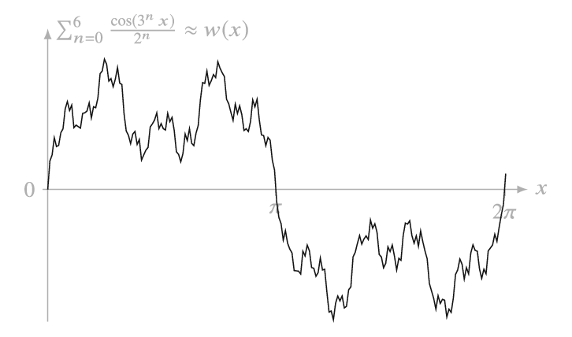

# Забег на улице Вейерштрасса

> Как-то раз на дне стакана 
  Карлик встретил великана 
  – Как же ты попал в стакан? — 
  Удивился великан.
>
> Из журнала «Весёлые картинки».

## Предисловие

Закончив на днях эссе [«Ахиллес и черепаха-мозгоед»](/tortoise-and-achilles/), я остался доволен им как историк. В тексте удалось компактно показать длившееся две с половиной тысячи лет развитие знаменитой апории Зенона, до сих пор продолжающей вдохновлять философов, физиков и математиков. Впрочем, с математиками-то как раз и получилась незадача. Добросовестно перечислив тех из них, кто приложил руку к решению элейского парадокса — Аристотеля, И. Ньютона, Г. Лейбница, О. Коши, К. Вейерштрасса, и даже «нестандартного» А. Робинсона, я оставил читателю для самостоятельного изучения методы решения задачи об Ахиллесе и черепахе. Мол, моё дело — дать исторический экскурс, а не вести факультатив по высшей математике. За этой отговоркой скрывалось лукавство: я сам в точности не знал на тот момент, как выглядит безупречное математическое решение, поэтому никак не мог успокоиться. В общем, на следующий день я решил побеседовать об этом с искусственным интеллектом. 

`Gemini` помог «навести мосты» между интуицией и строгой теорией. Я разобрался, как решаются подобные задачи, и, надеюсь, смогу объяснить читателям. Однако формой изложения снова будет исторический экскурс: в ходе небольшого исследования я в очередной раз убедился, насколько нюансы биографий и знание событийного контекста важны для понимания «скучных» академических концепций.

## Матан, родства не помнящий

В моей библиотеке есть издание Л. Д. Кудрявцев. «Курс математического анализа». Я купил эту книгу в конце 1980-х в надежде освежить и упрочить знания по высшей математике, полученные в автомеханическом техникуме. Хороший советский техникум в плане обучения математике был посильнее многих современных вузов. Мне с этим особенно повезло, в связи с чем хочу сказать спасибо нашей преподавательнице Альбине Викторовне Симановской. Но вернемся к упомянутому учебнику. За прошедшие десятилетия я несколько раз снимал его с полки, делал попытку читать и, не одолев и десятка страниц, ставил на место: скучно и непонятно. Нет, не потому, что я тупой или «гуманитарий». По математике у меня всегда были отличные оценки. Что же помешало товарищу Кудрявцеву захватить моё внимание, несмотря на то, что он в предисловии говорит о себе как о преподавателе МФТИ, одного из престижнейших отечественных вузов? 

Вот как заканчивается формальное, безликое, двухстраничное предисловие к этой книге:

> Автор выражает благодарность… С. М. Никольскому, О. В. Бесову, Г. Н. Яковлеву… Раздел, посвященный обобщенным функциям, написан под несомненным влиянием. В. С. Владимирова… Особенно признателен автор рецензентам книги — Н. В. Ефимову и В. А. Ильину… Благодарность…  И. А. Борачинскому, К. А. Бежанову, Ф. Г. Булаевской, В. А. Ходакову… Признательность научному редактору Н. М. Флайшеру…

Нет сомнений в научных заслугах перечисленных джентльменов, но не следовало бы в предисловии отдать дань уважения и основоположникам математического анализа — Огюстену Луи Коши и Карлу Вейерштрассу? В учебнике Кудрявцева эти фамилии, конечно, упоминаются, но лишь там, где не назвать их просто не получится. Выглядит так, как будто все эти «теоремы Коши» и «функции Вейерштрасса» — что-то вроде ярлыков, наклеенных на инструменты. Можно представить такой диалог советских учёных:  «Коллега, где-то там у нас завалялась теорема Коши. Не применить ли её к анализу характеристик ядерного распада?» Это звучит как будто сантехник говорит практиканту: «Сынок, достань-ка из ящика штуцер на полтора дюйма». Математический анализ в советском изложении выглядит как «безродный» — у него нет отцов, нет драм, нет ошибок, только стерильные, непонятно откуда взявшиеся формулы. В СССР высшая школа была направлена на быстрое освоение студентами теоретического аппарата. Им предстояло в кратчайшие сроки решать практические наукоёмкие задачи: расщепление атома, освоение космоса. Философии (кроме марксистско-ленинской) просто не уделялось времени. Куда уж там Зенону с его «бесполезными» парадоксами.

Впрочем, ёрничать на эту тему бессмысленно. Причина игнорирования выдающихся математиков прошлого кроется, конечно, не в интеллектуальной нечуткости авторов изданных в СССР учебников, а в тогдашней идеологии. Советское государство сводило к минимуму упоминания о знаменитых учёных, которым «не посчастливилось» родиться до 1917 года, да ещё и в Западной Европе. Нарушение этого негласного запрета каралось научным остракизмом: отказом в публикациях и карьерном росте. Однако считаться с фамилиями «буржуазных» математиков советской науке, всё-таки, приходилось. Не переименовывать же теорему Коши в «теорему имени Карла Либкнехта», а формулу Вейерштрасса в «формулу имени Розы Люксембург». Неплохо бы, конечно, но на Западе засмеют. 

Между тем не только у каждой теоремы, но и у каждого математического значка есть интересная история, судьба, смысл. Всё это, к сожалению, упоминалось в наших вузах и техникумах вскользь. Ведь на вопрос почему при исследовании пределов используется оператор $lim$ пришлось бы объяснять, что это от английского слова $limit$ («предел») и даже глубже — от латинского $limes$ — «граница», «межа». Или диктует преподаватель: «Обозначим вероятность как $P$» Почему? Да просто так принято! А ведь причина проста: $P$ — от слова $probability$, т. е. «вероятность», а $F$ в физике — от английского $force$, $V$ — от $velocity$,  работа — $A$ (от немецкого $Arbeit$) или $W$ (от английского $Work$) и т. д. Насколько легче запоминать формулы, зная это!

Почему бы, рассказывая о символах, применяемых в теории множеств, не упомянуть Готлоба Фреге, в одиночку оснастившего математику этим прекрасным аппаратом для логической записи выражений? Почему не пояснить, что для описания пределов $ε$ (эпсилон) и $δ$ (дельта) выбраны не случайно, первый — от французского $erreur$ (ошибка), второй — от  $distance$ (расстояние)?

«А не попахивает ли тут низкопоклонством перед загнивающим Западом?» — этот вопрос интересовал советскую систему образования, видимо, больше, чем усвоение материала. И всё-таки, говоря о математическом анализе, не упоминать о Карле Вейерштрассе, которого называют отцом этого раздела математики, просто неприлично. Для моего же эссе этот немецкий ученый, лишенный советскими учебниками своего человеческого лица, важен именно тем, что не просто «расколол» Зенона, тысячелетиями пудрившего людям мозги, а запер его в клетку безупречной логики.

## Пеплом, пеплом станет бумага… 

Задумав разобраться с математическими способами решения задачи об Ахиллесе и черепахе, я начал с конца. Ведь в предыдущем эссе я выяснил, что безупречно с ней справились лишь в XIX веке О. Коши и К. Вейерштрасс, значит с наследием этих ученых и нужно ознакомиться в первую очередь. Начать решил с чтения статьи о Карле Вейерштрассе в Википедии. Не только потому, что его фамилия идёт первой по алфавиту. В ней я увидел ещё и «расходящиеся веером улицы» (`strasse` — улица по-немецки), что напомнило родной Ярославль, где улицы по указу Екатерины II, тоже сделали расходящимися веером от центральной площади. Правда, потом выяснилось, что или `Weiher` по-немецки означает не «веер», а «пруд». То есть фамилия математика переводится как «прудовая улица». (А Бетховен — «свекольная грядка», вы знали?) 

Прочитав биографию К. Вейерштрасса, я заволновался: в ней столько перекликающегося с судьбами других выдающихся учёных XIX в., что эссе снова рискует не добраться до места, где речь пойдёт, собственно, о вычислениях. Но раз уж взялся за подачу материала методом погружения в эпоху, буду как-то выкручиваться. 

Пробудить интерес к жизни этого немецкого математика легче лёгкого, потому что с ней связана судьба знаменитой Софьи Ковалевской. В советское время она прославлялась как пример «раскрепощения женщины», но мало кто знал, что без участия Вейерштрасса она не стала бы столь выдающимся учёным. Даже в относительно недавней книге М. Ю. Пантаева «Матанализ с человеческим лицом» (М., 2015) об их союзе сказано скуповато:

> …Она отправилась в Берлин, чтобы послушать знаменитого Вейерштрасса, однако совет университета запретил ей присутствовать на лекциях. Она обратилась к самому Вейерштрассу с просьбой давать ей частные уроки. Чтобы избавиться от просительницы, он предложил ей решить несколько трудных задач. К его удивлению, она с ними справилась. Тогда он согласился. Через 4 года Ковалевская напечатала три научные работы, а в 1874 г. Геттингенский университет присудил ей степень доктора философии, математических наук и магистра изящных наук.

Карл Вейерштрасс здесь снова выглядит как «бесплатное приложение» к Софьи Ковалевской. А ведь их отношения могли бы стать сюжетом для захватывающего романа, основанного на переписке. Не случилось же этого, возможно, потому, что после безвременной (в 42 года) и нелепой (от воспаления лёгких) смерти своей любимой ученицы немецкий математик сжег письма, полученные от неё.

Сюжет о Вейерштрассе и Ковалевской — это не просто светская хроника, а драматическая история «Пигмалиона и Галатеи». Коротко расскажу об их отношениях, чтобы скорректировать впечатление о мимолетности их знакомства. 

Когда в 1870 году Ковалевская приехала в Берлин, она действительно не могла посещать университетские лекции, но не потому, что чем-то лично провинилась. Просто вход для всех женщин в этот вуз был запрещён. Чопорный берлинский профессор Вейерштрасс сначала и впрямь отнесся к абитуриентке скептически и выдал трудные задачи, чтобы она интеллектуально надорвалась и навсегда покончила с «глупостями» о роли женщины в науке. Однако через неделю, когда Софья принесла решения (оригинальные и глубокие), он понял, что перед ним гений. Пока всё шло почти как в вышеприведённой цитате из книги М. Ю. Пантаева, но дальше начинаются отличия. 

Вейерштрасс, почувствовав, что на убеждение коллег-профессоров в исключительности девушки нечего и рассчитывать, пошел на беспрецедентный шаг, организовав «университет на дому». В течение четырех лет он бесплатно давал Софье частные уроки, буквально пересказывая ей свои университетские лекции в индивидуальном порядке. Он стал её главным защитником, «пробив» для неё степень доктора в Геттингене (заочно, так как женщину в зал совета, опять-таки, не пустили бы). Их переписка длилась до конца жизни Софьи. Вейерштрасс называл её своим «самым любимым учеником». Для него она была единственным человеком, который полностью понимал его абстрактные идеи. Для Ковалевской же он был математическим «Богом», но её живая натура часто конфликтовала с его строгостью. Она писала не только формулы, но и романы, к которым Вейерштрасс относился без энтузиазма. Что же касается вопроса о том, насколько их отношения были платоническими, этого мы, благодаря решению Карла сжечь письма, не узнаем, и так, наверно, даже лучше. Если же говорить о «практическом» результате их дружбы, то именно Софья Ковалевская стала проводником строгих идей Вейерштрасса в России, да и по Европе его теоретические находки стали распространяться активнее благодаря «душевности», которую ей удалось привнести в сухие научные понятия. 

## Угнетатель интуиции

Вейерштрасс не терпел приблизительности ни в чувствах, ни в расчетах. Его знаменитые «эпсилон» и «дельта» стали теми самыми хирургическими инструментами, которыми он отсек от математики всё лишнее, включая возможность Ахиллеса вечно бежать за черепахой в тумане интуитивных догадок. Он был воплощением строгости, «арифметизации» и закона. Для этого перфекциониста эпсилон ($ε$) в описании математических пределов был воплощением возможной, но недопустимой ошибки (`erreur`) как ни для кого другого. Ковалевская же, напротив, провозглашала интуицию если не инструментом науки, то по крайней мере катализатором. Она так и говорила: «Нельзя быть математиком, не будучи в душе поэтом». 

Этот рассказ о дружбе двух ученых, принадлежащих к разным полам, культурам и поколениям (разница в возрасте 35 лет) — нечто большее, чем заигрывание с читателем, стремление удержать внимание сюжетом из «мексиканского сериала». Противоречивые отношения Карла и Софьи как нельзя лучше подводят нас к главному математическому конфликту XIX в. В то время были сильны романтические взгляды на развитие науки, так что Ковалевская не была исключением. Считалось, что, хорошо развитый и дисциплинированный ум, это, конечно, хорошо, но нужны ещё и порыв, энтузиазм, воодушевление. Разве могут «чёрствые сухари» вроде Вейерштрасса по-настоящему двигать вперёд науку? Они, как «скупые рыцари», сидят на своих сундуках с интеллектуальным золотом и только мешают прогрессу. Даёшь живое творчество в науке!

Лидером тех, кто считал интуицию важнейшим инструментом математики был Пуанкаре, язвительно называвший строгость Вейерштрасса «нагромождением чудовищ». Здесь воспитанный в советских традициях читатель может воскликнуть: «Да этот Пуанкаре вообще был человеком малоприятным! Вон, Маяковский, и то многократно поминает его в своих стихах недобрым словом». А ведь и правда:

>
    По политике глядя, 
    Пуанкаре 
    такой дядя. — 
    Фигура 
    редкостнейшая в мире — 
    поперек 
    себя шире. 
    Пузо — 
    ест до́сыта. 
    Лысый. 
    Небольшого роста — 
    чуть 
    больше 
    хорошей крысы. 
    Кожа 
    со щек 
    свисает, 
    как у бульдога. 
    Бороды нет, 
    бородавок много. 
    Зубы редкие — 
    всего два, 
    но такие, 
    что под губой 
    умещаются едва. 
    
— иронизирует пролетарский поэт в [стихотворении](https://ru.wikisource.org/wiki/%D0%9F%D1%83%D0%B0%D0%BD%D0%BA%D0%B0%D1%80%D0%B5_(%D0%9C%D0%B0%D1%8F%D0%BA%D0%BE%D0%B2%D1%81%D0%BA%D0%B8%D0%B9)), которое так и называется — «Пуанкаре». 

Или вот:

>
    Прочли: 
    — «Пуанкаре терпит фиаско». — 
    Задумались. 
    Что это за «фиаска» за такая? 
    Из-за этой «фиаски» 
    грамотей Ванюха 
    чуть не разодрался: 
    — Слушай, Петь, 
    с «фиаской» востро держи ухо: 
    даже Пуанкаре приходится его терпеть.

Вот и нам с вами, читатель советской закалки, не потерпеть бы фиаско, запутавшись в «пуанкарах». Дело в том, что эта славная аристократическая фамилия дала Франции, как минимум, две всемирных знаменитости, двоюродных братьев — математика Анри Пуанкаре (1854–1912) оппонента Вейерштрасса, и премьер-министра, а потом и президента Франции Раймона Пуанкаре (1860–1934), вызывавшего ненависть пролетарского поэта. Как видим, их даже современниками можно назвать не без натяжки. Тем не менее, был момент, когда оба были примерно одинаково знамениты. В Париже начала XX века шутили, что Франция находится в надежных руках: один Пуанкаре правит страной, а другой — бесконечностью. Поэтому с Раймоном мы почтительно раскланиваемся и возвращаемся к рассказу о математиках.

Итак, лидером тех, кто считал интуицию важнейшим инструментом математики был Анри Пуанкаре.  По его мнению выходило, что если мы не можем представить себе функцию в виде графика, то она бесполезна; если же можно нарисовать линию, не отрывая карандаш от бумаги, то у неё почти везде есть направление движения (касательная).
 
Вейерштрасс возражал: если мы полагаемся на картинку, то строим здание на песке. Чтобы доказать, что интуиция вредна, он представил миру нарочито «лохматую» функцию, которую в честь него и назвали: 

Её график похож не на плавные изгибы античных статуй, а на ощетинившегося дикобраза. Она, как и график Пуанкаре, непрерывна, но ни в одной точке не имеет направления, состоит из бесконечных зазубрин. Куда бы мы ни приложили линейку, там окажется новый «острый угол». Глаз это увидеть не может, а формула — описывает. Так что те, кого терзает вопрос когда же история Европы свернула от Прекрасной эпохи (`La Belle Époque`) к Первой мировой войне, могут обратиться именно к математическим дискуссиям между приверженцами «романтизма» (Клейн, Пуанкаре) и «технократами» (Вейерштрасс), разворачивавшимися в конце XIX века. Попутно можно припомнить строчки из блоковских «Скифов»:

>
    Мы очищаем место бою 
    Стальных машин, где дышит интеграл, 
    С монгольской дикою ордою!

Математики-интуитивисты видели в формулах музыку и архитектуру. Вейерштрасс видел в них закон. Он считал, что если мы разрешим «чуть-чуть интуиции», то Зенон со своими парадоксами всегда будет возвращаться и путать нам карты. Интуиция говорит нам, что Ахиллес догонит черепаху, потому что «это очевидно». Вейерштрасс отвечает: докажите это без слов «очевидно», «движется» и «летит».

Вейерштрасс стал «инквизитором от математики». Он пытал интуицию логикой, но, как и всякий инквизитор, считал, что делает это исключительно для всеобщей пользы, чтобы очистить истину. Из самых лучших побуждений он «оторвал» ноги у Ахиллеса, и лапы у черепахи. Мы, мол, тут наукой занимаемся, а не мультики снимаем. Но именно эта «жестокость» позволила математике стать фундаментом для квантовой физики и теории относительности.

Можно было бы ещё долго сокрушаться о потере математикой души и привести по этому поводу цитаты Феликса Клейна и других современников, а также рассказать об ещё одном «отце» математического анализа — Огюсте Луи Коши, но пора переходить непосредственно к вычислениям и убедиться в том, что Ахиллес не просто обгонит черепаху на третьей минуте, как свидетельствует простая арифметика. Он сделает это с учётом уловки Зенона, предлагавшего поломать голову над «уходящим в бесконечность» рядом деления дистанции на всё более мелкие отрезки.

## Ахиллес расправил плечи

Неподготовленный человек, решая задачу об Ахиллесе и черепахе, начинает представлять себе этих бегунов, делить отрезки пути, потом кидается делить отрезки времени, вычислять скорости и… сдаётся, спалив запас интуиции и энтузиазма. «С наскоку не получилось, —  вздыхает он. — Ладно, как нибудь на досуге разберусь». Но «как нибудь на досуге» не наступает ни через неделю, ни через месяц, ни через год, ни через десятилетие…

Решить парадокс можно с помощью концепции пределов, разработанной Вейерштрассом, но слишком уж они замысловато выглядят. Как можно в них разобраться, минуя мир загадочных формул? 

Представим себе муху, сидящую на столе. Допустим, вы достаточно ловки, чтобы накрыть её стаканом. Муха в нём, конечно, начнёт метаться, ударяясь о стеклянные стенки. Значит, для неё не всё потеряно, отпустим напуганное насекомое на волю. А вот другая муха. Попробуем повторить эксперимент, накроем её стаканом и… она остаётся неподвижной. Вот еле заметно шевельнулась, но лишь потому, что за окном с грохотом проехал трамвай, заставив вибрировать мебель. Она и не собирается покидать пределы стакана, потому что, как бы это поделикатнее сказать… сдохла.

Вейерштрасс, который, кстати, напрямую решением парадокса Зенона и не занимался, создал теоретический инструментарий, позволивший поместить Ахиллеса и черепаху в подобной математический «изолятор», защитив их от дурной бесконечности, превратив из подвижных персонажей в числовые последовательности. Немецкий математик не то чтобы изобрёл пределы, ими пользовались и до него. Он довёл эту концепцию до совершенства. Именно с его подачи учебники по математике запестрели словечками $lim$ в окружении залихватских символов. Смысл математического понятия предела в том, что нам не нужно вычислять опытным путём значения для каждого члена последовательности в поисках подходящего. Нужно лишь подумать, наступит ли такой момент, когда один из них станет больше или меньше какого-то определённого значения.

Рассмотрим, наконец, вымышленное состязание между Ахиллесом и черепахой с математической точки зрения. Последовательность, которую навязывает нам Зенон, описывается простой формулой:

$$
    \Large S = a + aq^1 + aq^2 + \dots = \sum_{n=0}^{\infty} aq^n
$$

где — где $S$ — пройденный Ахиллесом путь, $a$ — первоначальный разрыв (1000 шагов), а $q$ — коэффициент уменьшения каждого следующего отрезка ($1/10$). Путь, пройденный черепахой, вычисляется так же, но за вычетом слагаемого $a$, представляющего собой предоставленную ей фору.

Для наглядности посчитаем первые несколько членов этой последовательности, т. е. координаты на числовой прямой, пробегаемые персонажами задачи (отсчёт ведётся от точки старта Ахиллеса):

$$
    \Large 
    \begin{aligned}
    S_1 &= 1000 \\
    S_2 &= 1000 + 100 = 1100 \\
    S_3 &= 1100 + 10 = 1110 \\
    S_4 &= 1110 + 1 = 1111 \\
    \dots
    \end{aligned}
$$

Как видим, каждая новая итерация лишь уточняет положение бегунов, добавляя единичку справа. Достигнет ли эта последовательность значения, скажем, $1111,2$? Нет, не достигнет. А $1111,1112$? Тоже не достигнет. Пределом здесь является $1111,1(1)$, что на языке математики читается как «$1111,1$ и $1$ в периоде». Каждый член этой последовательности является точкой, в которой, по задумке Зенона, побывает сначала черепаха, а некоторое малое время спустя — Ахиллес.

На первый взгляд, число $1111,1(1)$ какое-то подозрительное, но если вам так кажется, то разделите яблоко поровну на троих. Каждому достанется по одной трети, то есть по $0,3(3)$ (три десятых и три в периоде). Это ведь нормально? Вот и $1111,1(1)$ — довольно обычное число, лежащее на пути и Ахиллеса, и черепахи. Оно не обязано выглядеть красиво с десятичной точки зрения. 

Гораздо важнее вопрос: уходит ли этот ряд в бесконечность, пусть даже и медленно? Конечно, нет, ведь он даже двойкой никогда не станет, какая уж тут бесконечность. Приближаться будет, достигнуть не сможет.

Но если Ахиллес «не достигнет» значения, скажем, $1111,2$ можно подумать: «Ага! Значит, Зенон прав, атлет не обгонит черепаху!» В чём же дело? 

Элейский хитрец так затейливо подмешал в условии задачи время к расстоянию, что можно подумать, будто они изменяются по одной и той же закономерности. Вчитаемся внимательно в описание парадокса: «Самый быстрый атлет Греции и самое медлительное животное состязаются в беге. За то время, пока Ахиллес пробегает $1000$  шагов, черепаха уползает на $100$; пока он пробегает $100$, она продвигается на $10$…» За экзотическим антуражем скрывается простой факт: два объекта движутся **с разной скоростью**, первый — в 10 раз быстрее второго. Только не надо торопиться из этого делать примитивный вывод «значит он победит уже на третьей минуте»! Мы же пытаемся решить задачу безупречно, с помощью пределов.

Там, где упоминается скорость, важно не только расстояние, но и время. Нас же принуждают вычислять значение времени для каждой точки, которую проходят «бегуны», как будто время ничем не отличается от расстояния. Зенон, чтобы запутать нас, совмещает дорожку стадиона, на которой проводится состязание с хронологической лентой времени. Но разве время и расстояние подсчитываются одинаково? Вопрос не в том, можно ли делить и время до бесконечности (что и означает «никогда не догонит»), а в том, существует ли предел у суммы этих отрезков.

Одна из догадок, к которым приводит это наблюдение — ситуацию нужно рассматривать не на числовой прямой, а на координатной плоскости с двумя осями: $x$ — пройденное расстояние на беговой дорожке, и $t$ — затраченное время.

Ну вот! Видно же, что Ахиллес обгонит черепаху! Правда, мы опять поторопились. Это интуитивное решение. Оно устроило бы Анри Пуанкаре, но Карлу Вейерштрассу бы не понравилось, поэтому вернёмся к координате $1111,1(1)$. Каждый из соперников её обязательно достигнет, просто Ахиллес (как заставляет нас думать Зенон) — всегда на одну итерацию позже черепахи. А раз так, значит это произойдёт в какое-то конкретное время. Черепаха делает один шаг в секунду, а Ахиллес — $10$, причём шаги эти в точности совпадают (такая вот крупная черепаха). Тогда момент, в который черепаха достигнет точки $1111,1(1)$ можно вычислить так: 

$$
    \Large
    T_{🐢} = \frac{1111,1(1) - 1000}{1} = 111,1(1) \text{ сек}
$$

Но ведь в тот же самый момент там окажется и Ахиллес: 

$$
    \Large
    T_{🏃} = \frac{1111,1(1)}{10} = 111,1(1) \text{ сек}
$$

Вот когда он догонит черепаху! Координата, в которой это произойдёт, (1111,1(1)), называется точкой сходимости, которую более строго можно описать так:

$$
    \Large
    L = \lim_{n \to \infty} \sum_{i=0}^{n} a \cdot q^i = \frac{a}{1 - q}
$$

Где: $L$ — предел; $a$ — фора в 1000 шагов, предоставленная черепахе; $q$ — разница в скоростях, т. е. коэффициент $0,1$, «отвечающий» за генерирование бесконечного количества зеноновых измерений.

Точка сходимости — это математический «час икс», момент полного обнуления форы. Как в сказке про Золушку, где в полночь карета превратилась в тыкву, в парадоксе Зенона через $111,1(1)$ секунды после старта черепаха утратит статус королевы забега. Ведь хитрый элеат здесь опять нас попытался надуть. Он подменил 1000-шаговой уступкой способность Ахиллеса всегда бежать быстро. Фора, между тем, **не отменяет** его мощных легкоатлетических качеств. Преимущество черепахи начинает «таять» сразу же после старта, то есть начинает стремиться к нулю. Как только фора окончательно растворяется в бесконечной последовательности измерений, ситуация становится нормальной, т. е. атлет и рептилия оказываются на одной и той же отметке числовой прямой. В представлении Зенона фора вечна, она лишь дробится на бесконечно малые части. Вейерштрасс же ставит точку: в пределе фора не просто уменьшается, она исчезает полностью.

Зенон, конечно, хотел бы ещё потыкать Ахиллеса носом в черепашьи следы, но время — это вам не пространство, оно движется только вперёд. Так что какой бы мельчайший отрезок времени мы не прибавили к $111,1(1)$ секундам, Ахиллес за него пробежит вдесятеро большее расстояние, чем соперница и безусловно победит в гонке, ведь на этот раз никакой форы у неё нет! Когда мы рассматривали ситуацию лишь с точки зрения беговой дорожки, состязающихся можно было накрыть «стаканом», из которого им было не выбраться (да они в той ситуации и не стремились оказаться снаружи). С точки же зрения времени стакан будет рано или поздно пробит бегущим изнутри Ахиллесом, который не обязан останавливаться для измерений в каждой точке последовательности в угоду Зенону (если обязан — пусть Зенон уточнит алгоритм, будет другой разговор).

Если сумма времени $T = t_0 + t_1 + t_2 + \dots$ сходится к определённому числу (в нашем случае — к $111,1(1)$ секундам), это означает: бесконечное количество «зеноновых шагов» укладывается в один конечный миг. Для Вейерштрасса точка схождения — это не стена, в которую упирается Ахиллес, а значение функции. Как только часы показывают время, хотя бы на миллисекунду большее предела, формула встречи перестает быть суммой прогрессии и становится обычным движением, где Ахиллес быстрее, как и сказано в условии. Зенон просто пытался убедить нас, что время останавливается на финише, но предел функции доказал: бесконечность шагов — это не тюрьма, а просто способ записи конкретного момента времени. Ряд — это лишь способ описать путь, а не сам путь. 

***

В своем [предыдущем эссе](/tortoise-and-achilles/) я предложил «логически-юридическое» решение парадокса Зенона для дискретной вселенной. Методика Вейерштрасса годится даже для случаев, когда время и пространство делимы сколь угодно мелко, ломая уловки Зенона, которые строились как раз на том, что «движение невозможно, потому что оно бесконечно делимо». Элеат проигнорировал при этом время. Нет, не его бесконечную делимость, которую математика не отрицает, а его связь с пространством, раз уж речь идёт о движении с некоторой скоростью. Вейерштрасс доказал, что бесконечная делимость — это не тюрьма, а просто свойство чисел, хотя не запрещено, если кому-то время больше не на что потратить, бесконечно заниматься выяснением того, где окажется Ахиллес, пока черепаха проползает $1/10$-ю проделанного им пути. 

Ахиллес догнал черепаху не потому, что «так получилось», а потому, что их время имело одинаковый предел. Они встретились в $111,1(1)$ после начала забега, чтобы навсегда сделать античную головоломку безопасной для неокрепших умов, и этот предел — не смерть мухи в стакане, а триумф разума над иллюзией.

