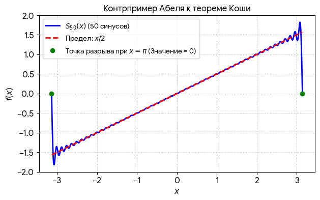

# На виражах числовой прямой

## Ответочка от Зенона

Закончив [предыдущее эссе](/math-inquisitor/), я думал, что уж теперь-то окончательно избавился от Зенона и его вечно соревнующейся в беге свиты. Однако не прошло и пары дней, как он бесцеремонно явился в мой сон на колеснице, в которую была запряжена крупная галапагосская черепаха. Возницей в повозке был Ахиллес. По-видимому, это устройство было какой-то античной разновидностью машины времени. Потрясая распечатанной страницей из моего персонального блога, Зенон гневно кричал:

— Вот вы где, негодник! Если бы вы не интересовались математикой, я не стал бы с вами и церемониться, а просто приказал бы своему телохранителю переломать вам рёбра… — на этих словах Ахиллес смачно хрустнул кулаками, а черепаха вроде как хихикнула. — …и уж тем более не стал бы обращаться на вы. Но я расправлюсь с вами по-своему, по-философски. 

— Да в чём же дело? — делано изумился я, при этом довольно отчётливо догадываясь, зачем он приехал.

— Вы тут напраслину изволили написать про нашу корпорацию. Зенон, мол, мошенник, под видом философии подсовывает читателям психологические выкрутасы. Употреблено даже такое нелитературное выражение, как «пудрит мозги»! Впрочем, — более миролюбиво продолжил элеец, вспомнив, видимо, что он философ, а не рэкетир — я сниму свои претензии, если вы опровергнете мои контраргументы, а именно: упрекая меня в злоупотреблениях бесконечностью, вы используете число 1111,1(1) (тысяча сто одиннадцать, одна десятая и один в периоде). Но я-то своим парадоксом, по крайней мере, позабавил читателя, а вот кто сжульничал, так это как раз вы с вашим обожаемым Вейерштрассом, перепрятавшим бесконечность из левой части уравнения в правую. Потрудитесь доказать, что это не так, иначе подам на вас в суд ещё и за жестокое обращение с животными. Аврора (так, оказывается, звали черепаху) очень расстроилась, когда узнала, что Ахиллес может её обогнать. На этих словах на лице героя Троянской войны промелькнуло что-то вроде самодовольной ухмылки, а у черепахи нервно дёрнулся глаз.

Банда растворилась в сонном мороке, а я вместо того, чтобы испугаться, задумался: а ведь претензия небезосновательна. Действительно, число 1111,1(1) в парадоксе Зенона не фигурирует. Его предлагает нам теория пределов, разработанная Карлом Вейерштрассом. Элеец же вправе заявить, что да, в его апории можно найти числа 1111,1, 1111,11, 1111,111…, но никаких «новомодных фокусов» с единицей в периоде он не признаёт. Это действительно выглядит для него как та же бесконечность, только вывернутая наизнанку.

***

Я не стал торопиться с ответом ночному гостю, ведь самые эффективные мысли - медленные. Они, как нейтроны в атомном реакторе, в отличие от скоропалительных делают свою работу неторопливо, но надёжно. Поэтому силы ответить на наезд разбушевавшегося античного философа я почувствовал только после того, как съездил на дачу, где скосил сотки три газона (там «бандиты» похлеще зеноновских - одуванчики, вот кому нужно давать незамедлительный отпор!), хорошенько выспался и выкушал изрядную тарелку приготовленной впервые в этом году по случаю наступившей жары окрошки. 

«Зенон-то, бедолага, не знает, - подумалось мне, - что представления человечества о числах за 2500 лет шагнули далеко вперёд. Да и сам я, признаться, уже подзабыл, какие числа называются натуральными, действительными, рациональными, вещественными… А ведь окончательная разгадка кроется именно в этой классификации». Я решил не упускать прилив мыслительных способностей и освежил свои математические знания, позвав на подмогу, как всегда, ИИ из семейства `Gemini`.

## Старина Леонтий

На самом деле я мог и сразу ответить на обвинение в упрятывании бесконечности в число 1111,1(1). Можно было бы сказать так:

— Достопочтенный Зенон, количество применённых в вашем парадоксе психологических мошенничеств воистину неисчислимо. Мало того, что вы подмешали время к пространству и заставили читателя ползать по следам черепахи со штангенциркулем, вместо того, чтобы отвечать на вопрос догонит ли её Ахиллес. Вы ещё и злоупотребили десятичной системой счисления. Ваш парадокс сам становится насквозь пропитанным бесконечными периодическими дробями, если принять разницу в скоростях, например, трёхкратной, а не десятикратной. Ведь на первом же шаге появляется столь нелюбимое вами число с бесконечным количеством цифр в периоде: пока Ахиллес бежит 1000 шагов форы, черепаха уползет на… 333,3(3) шага!

Однако я, как не обладающий никаким авторитетом в математике, во время первого «наезда» предпочёл промолчать. Лучше привлечь к спору авторов более заслуженных, желательно в хронологическом порядке, чтобы было видно, как развивались представления человечества о числах.

Первым мне вспомнился не какой-нибудь древнегреческий или средневековый мудрец, а русский математик Леонтий Филиппович Магницкий, современник Петра Великого. Его «Арифметика» несколько раз переиздавалась в СССР в конце 1980-х и легко нашлась на моих книжных полках. Там есть даже задача в зеноновском стиле, про состязающихся в беге:

> **На охоте**
>
> Пошел охотник на охоту с собакой. Идут они лесом, и вдруг собака увидала зайца. За сколько скачков собака догонит зайца, если расстояние от собаки до зайца равно 40 скачкам собаки и расстояние, которое пробегает собака за 5 скачков, заяц пробегает за 6 скачков? (В задаче подразумевается, что скачки делаются одновременно и зайцем, и собакой).

Выплыло из глубин подсознания и такое: «Дворовая девка Маланья потеряла невинность в 42 года. А холоп Тимошка — в 14. Сколько лет каторги получил бы Тимошка, ежели бы им было наоборот?» К счастью, я сразу вспомнил, что это не из «Арифметики» Магницкого, а из выступления команды КВН «Мегаполис», но раз уж пришло на ум — оставлю здесь на случай, если кто-то из читателей уже успел заскучать.

Шутки шутками, но мысль о том, что задачник времен Петра I может быть полезен в споре с Зеноном, не шла из головы. Элеец же не замедлил явиться во сне в ближайшую ночь всё на той же «машине времени», в обычном сопровождении. Он с ходу закричал:

— Подготовили контраргументы? Взбирайтесь на колесницу, поедем выяснять отношения.

— Куда путь держим? — скупо обронил возница-Ахиллес, повадками напоминавший таксистов всех времён и народов.

— Москва, Сухаревская площадь, 1702 год, — отчеканил я адрес, на ходу запрыгивая в повозку.

***

Старина Леонтий действительно поджидал нас на крылечке у Сухаревой башни, попивая квасок и составляя на свежем воздухе свой задачник. Он бормотал:

— Задача № 1. Один человек выпивает бочонок кваса за 14 дней, а вместе с женой выпивает такой же бочонок кваса за 10 дней. Нужно узнать, за сколько дней жена одна выпивает такой же бочонок кваса.

Задача № 2. В жаркий день 6 косцов выпили бочонок кваса за 8 часов. Нужно узнать, сколько косцов за 3 часа выпьют такой же бочонок кваса.

Увидев наш экипаж, он не слишком испугался, ведь «крышей» у него был сам царь. Узнав же, в чём дело, Магницкий заметил Зенону:

— Ваше греческое благородие, число 1111,1(1) никакое не «волшебное». Это самая обыкновенная дробь $10000/9$. Вы же, когда делите яблоко поровну на троих, не возмущаетесь тем, что каждому досталось по 0,3(3)? Если вас это всё-таки беспокоит, то назовите это одна треть, и дело с концом. Вот и с числом десять тысяч девятых всё точно так же.

Зенон было запротестовал, заявив, что неточность всё равно остаётся, что он продолжает видеть в $1/3$ $0,3(3)$, но Леонтий лишь пожал плечами: 

— Для нас, людей торговых, на десятичной системе свет клином не сошёлся, обходимся и простыми дробями, если они нам кажутся более удобными, а главное - справедливыми. Вот, например, как решается задача про бочонок кваса: «За 140 дней супруги выпьют 14 бочонков кваса, 10 муж и 4 жена. Значит один бочонок она выпьет за $140 / 4 = 35$ дней». Обыкновенная дробь-с. 

— Да какая же это дробь? — возмутился Зенон. — Это же просто операция деления!

— Вот, значит, вы как,.. — хмыкнул Леонтий. — Тогда следующая задача: «Лошадь съедает воз сена за месяц, коза — за два месяца, овца — за три месяца. За какое время лошадь, коза и овца вместе съедят такой же воз сена?» Решение: «Поскольку лошадь съедает воз сена за месяц, то за год (12 месяцев) она съест 12 возов сена. Так как коза съедает воз сена за 2 месяца, то за год она съест 6 возов сена. И, наконец, поскольку овца съедает воз сена за 3 месяца, то за год она съест 4 воза сена. Вместе же они за год съедят $12 + 6 + 4 = 22$ воза сена. Тогда один воз сена они все вместе съедят за $12/22 = 6/11$ месяца». 

Шесть одиннадцатых! Как вам такое? И ведь ничего страшного не произошло, верно? Лошадь, коза и овца не потеряли аппетит от того, что им скормили такое «некрасивое» количество сена. Вот и нам с вами бояться «магических чисел» не надо. У Бога все числа хорошие, даже такие «страшные», как 13. Кстати, двенадцатеричная система куда удобнее десятичной. Её ещё во времена праотца нашего Авраама в древнем Вавилоне использовали. Да и не о ней одной речь. Например, меха пушного зверя у нас упаковывают в связки по 40 штук, так проще перевозить, да и считать. Тюк хлопка не потому именно такого размера, что весит 500 фунтов, а потому, что именно столько может поднять и перенести один раб. Длину мы считаем в футах, потому что это длина ступни взрослого человека, и она у всех примерно одинаковая. Погрешность процентов в 5-10 — не беда, лишь бы не в два раза.

На этих словах Зенон как-то поскучнел, и мы, для приличия ещё попив с Леонтием кваску и напоив черепаху из Неглинной, тронулись в обратный путь.

— Мужлан ваш Леонтий, — бубнил Зенон. Бога зачем-то приплёл, Авраама какого-то. Математически он мне так ничего и не доказал, мало ли что там купцы напридумывали, но с дробями хорошо выкрутился. Только вот бывают такие числа, что никакая дробь их не берёт.

Тут он начал припоминать случаи из собственной практики:

— Один мой сосед в Элее зарабатывал на жизнь изготовлением тележных колёс, набивая по ободу каждого своего изделия железную полосу — шину, чтобы дольше служило. Однажды я спросил его, сколько железа затрачивается в расчёте на одно колесо. Он начал жаловаться, что точно никак не удаётся посчитать. Мол, нужно умножить диаметр колеса на три и прибавить ещё немного, но сколько именно — выяснить удаётся только опытным путём. Кузнец, которому колесник заказывает шину, сердится из-за такой невнятности. Недоумевает и купец, поставляющий железо в наш городок, потому что ему каждый раз заказывают какое-то странное, не кратное обычным единицам измерения количество железа. У колесника, правда, есть какая-то палочка, которой он отмеряет длину железной полосы, но она постоянно куда-то пропадает: то жена перепутает с дровами и в печке сожжет, то дети затеют между собой «войнушку» и утащат в качестве игрушечного копья, так что частенько приходится подбирать длину заново, опытным путём.

Другой сосед делает табуретки с квадратными сиденьями. Как-то раз он затеял рационализацию: чтобы узнать, соответствует ли заготовка общепринятым размерам, можно мерить не длину и ширину, а диагональ, то есть сократить количество измерений с двух до одного. Сказано — сделано, но рационализация сразу обернулась иррационализацией: длина диагонали представляет собой такое неудобное и ни с чем не сопоставимое число, что, как говорится, ни два ни полтора, так что лучше уж мерить по старинке.

В общем, даже мы, древние греки, знали, что бывают числа, не сводимые ни к каким дробям с целыми числителями и знаменателями. Это и число $\pi$, и $\sqrt{2}$, и ещё много какие. Если я в своём парадоксе заставлю Ахиллеса бежать в $\pi$ раз быстрее черепахи (или просто кругами), никакими преобразованиями в обыкновенные дроби вы от нарастающих бесконечностей уже не избавитесь!

— Да разве дело в «бесконечных числах»? — досадовал я на упрямство Зенона. Можно подумать, что вы не в Древней Греции родились, а в революционной Франции, где в 1795 году тоже озаботились упорядочиванием, как бы всё сделать покруглее да постандартнее. И ведь получилось у них! За последние пару столетий люди так привыкли к десятичной системе, жёстко навязанной другим странам во времена Наполеоновских войн, что обычные дроби уж и за числа не признаются. Вы, Зенон, я вижу, просто спорите ради самого спора, что и понятно: ученик диалектика Парменида. Ну, да ладно, заглянем в XVIII век, к Ньютону и Лейбницу. Они там исчисление бесконечно малых изобрели, посмотрим, что вы на это скажете. 

## Беркли против флюксий

Когда наша компания прибыла в Лондон, оказалось, что никто не представляет как найти здесь сэра Исаака Ньютона. По Википедии, с которой я время от времени сверялся в дороге, поскольку прихватил с собой смартфон, выходило, что великий физик и математик в зрелые годы занимал важные государственные должности. Мы засомневались, пустят ли нас в столь солидное учреждение, как Королевский монетный двор с гигантской черепахой. Ахиллес заявил было, что его удостоверение участника Троянской войны открывает любые двери, но большинством голосов это решение отклонили. Прохожие и так уже косо поглядывали на нашу компанию, принимая, видимо, за обитателей Бедлама или бродячую театральную труппу: гигантская черепаха, два древних грека, один в тунике, второй в полном боевом вооружении и джентльмен в футболке и штанах, сшитых не из добротного английского сукна, а из «убогого» синего генуэзского брезента.

Вдруг Зенон, рассмотрев кого-то в толпе, обрадовался: 

— Сейчас всё решим, я вижу хорошего знакомого.

— Откуда бы у вас, обитателя Элеи, жившего в V веке до новой эры, знакомые в Лондоне XVIII века? — спросил я.

— Видите ли, в загробном мире есть что-то вроде академии, куда после смерти зачисляют прославленных философов. — Мистер Беркли! — крикнул он в толпу и замахал рукой, привлекая внимание прохожего в священническом одеянии.

— А, мистер Зенон, — приветливо отозвался Беркли. — Какими судьбами в наших краях? 

Он подошел к нашей колеснице и, после дежурного обмена любезностями, порекомендовал переместиться в менее людное место, потому что количество недружелюбных взглядов, направленных в нашу сторону, приближалось к критической отметке. Раскачивающиеся на мосту через Темзу тела повешенных тоже намекали, что шутить с нелегалами здесь не любят. 

Мгновенно преодолев на волшебной колеснице несколько миль пространственно-временного континуума, мы оказались в пригородной таверне, порекомендованной мистером Беркли. Правда, сначала нас отказывались пускать внутрь всё из-за той же Авроры, так что пришлось придумывать версию о том, что мы действительно бродячий цирк, а черепаха — это лишь костюм, внутри которого скрывается обыкновенный ослик. Не без раздумий приняв такое объяснение, хозяин всё-таки пригласил нас в обеденный зал, потребовав, правда, чтобы рептилия была отправлена в хлев. Та, хоть и сделав обиженную физиономию, согласилась в очередной раз пострадать ради науки.

Расположившись в безлюдном уголке заведения, мы решили по совету мистера Беркли заказать местного пива. Зенон категорически отказался, пробурчав что-то про «питьё варваров и рабов»; Ахиллес хмыкнул, но сказал, что, так и быть, во время Троянской осады ему и не такое приходилось пить. Я же откровенно обрадовался: принесли что-то вроде Гиннесса, который в стране, где я живу, исчез из свободной продажи лет 15 назад. 

— Итак, джентльмены, чем могу служить? — спросил наконец мистер Беркли.

— У нас спор, ­— ответил Зенон. — Вы же помните мою апорию о состязании в беге Ахиллеса и черепахи? — На этих словах Ахиллес нервно заёрзал на табуретке. — Так вот, этот… дилетант, извините мне мою латынь, из XXI века утверждает, что справился с моим парадоксом.

— Я, может, и дилетант, только с этим вашим ахиллесово-черепаховым мозгокрутством ещё в XIX веке разделался немецкий математик Карл Вейерштрасс! А вы, Зенон, просто не хотите признавать поражение и, как утопающий хватается за соломинку, вцепились в число 1111,1(1), которое, видите ли, показалось вам «некрасивым» и «бесконечным»! — закипятился я.

— А в Лондон-то какими судьбами? — спросил Беркли.

— Да тут у вас, говорят, живёт какой-то Исаак Ньютон, который, якобы, навёл порядок в мире чисел. Хотим с ним проконсультироваться, что там за бесконечно малые он изобрёл. Да вот ещё и Лейбниц… — начал объяснять Зенон, но мистер Беркли перебил его, утратив на этих словах английскую вежливость. По мере произнесения имён Ньютона и Лейбница выражение его лица менялось с доброжелательного на саркастическое.

— Вы приехали в такую даль, чтобы посоветоваться с Ньютоном?! — изумлялся он. — С этим путаником? Да он сам не верит в то, что написал. В своем трактате «Аналитик» я камня на камне не оставляю от его теории «бесконечно малых». «Флюксии» он, видите ли, выдумал! Эти господа за вновь изобретёнными словечками хотят стыдливо скрыть научную проблему, которую в своём бессилии не могут решить строго математическими методами! — бушевал Беркли, видимо, уже затронутый парами выпитого пива.

Уловив знакомые нотки в его тирадах, я робко спросил:

— Скажите, пожалуйста, мистер Беркли, а в той вашей загробной философской академии не встречался вам человек по фамилии Ленин? Он в своём трактате «Материализм и эмпириокритицизм» примерно такими же словами кроет вас и других уважаемых философов, «погрязших в фантазиях»…

— Нет, не встречался… — буркнул Беркли, явно демонстрируя досаду на то, что его перебивают. — А впрочем… Да, припоминаю! Приходил какой-то хулиган в кепке. Буянил, требовал принять его в академию, утверждал, что вступительный экзамен по философии может сдать экстерном за 15 минут, грозился всё вокруг взорвать, если ему откажут. С ним и ещё какие-то бандиты были…

— И я помню этот случай, — усмехнулся Зенон. — Только у нас там всё покрепче устроено, чем в революционном Петрограде.

— И что с ними стало? — сердобольно поинтересовался я участью соотечественников.

— Да в ад их отправили. Ленина назначили старшим по котлу, только он не справился, филонил много, так что пришлось перевести в простые кочегары. Так до сих пор там и вкалывают: половина в котле варится, вторая половина дровишек подкидывает, потом меняются… Не отвлекайтесь, коллега, — обратился он к Беркли. — У нас же ещё Лейбниц в запасе.

— А что Лейбниц? И Лейбниц такой же путаник, — продолжал горячиться Беркли. — Они с Ньютоном — два сапога пара. И наврут одинаково, и выкручиваются одинаково бестолково. Один «флюксии»  придумал, у другого его хвалёные бесконечно малые то равны нулю, то не равны. Как привидения какие-то…

— …или крокодилы из моего любимого анекдота про прапорщика. Они там, вообще-то, не летают, но если летают, то «тихэнько-тихэнько, низэнько-низэнько».

Тут мне, по требованию присутствующих, пришлось пересказать бородатый советский анекдот. Зенон и Беркли покатывались со смеху, Ахиллес насупился в обиде за коллегу-военного. 

Насладившись старинным пивом и беседой, мы с Зеноном, однако, решили, что в Англии XVIII века нам больше делать нечего. Желание лично побеседовать с Ньютоном и Лейбницем сошло на нет. Стало понятно, что если парадокс Зенона и решён математиками, то не в это время, а где-то позднее. К тому же надо было позаботиться об Авроре, которой роль ослика в хлеву могла выйти боком. Мы извлекли её оттуда, матерящуюся на чём свет стоит, выкупали в Темзе на манер автомобиля и стали запрягать в колесницу времени. 

— Ты представляешь, Аврорушка, — умильно обняв черепаху за морщинистую шею причитал Зенон, назюзюкавшийся, всё-таки, местным «гиннессом», который распробовал к концу импровизированного симпозиума. — Этот британский варвар, Ньютонишка этот решил сварить себе «питательный супчик» из моего любимого парадокса! А на деле он просто стёр мою бесконечность тряпкой с доски и сделал вид, что так и было! И они ещё борются за почётное звание острова высокой культуры быта! 

В этот момент элеец представлял собой странную смесь извозчика их чеховского рассказа «Тоска», гайдаевского Антона Семёновича Шпака и персонажа кинокомедии «Афоня».

— Куда теперь? — отрезвил нас непробиваемый такими пустяками, как пиво Ахиллес. Зенон подтвердил вопрос насмешливо-хмельным взглядом в мою сторону.

— Сейчас, сейчас… — бормотал я, вдумчиво листая Википедию. — Вот, нашёл. Тут написано, что лет через сто отсюда живёт Огюстен Луи Коши, который, вроде бы, довёл до ума учение Ньютона и Лейбница о бесконечно малых. Это примерно 1821-й год, только по другую сторону Ла Манша. Кто-нибудь знает французский?

— Разберёмся, чай не сложнее латыни, — надменно буркнул всё ещё не окончательно протрезвевший Зенон. Он более чем когда-либо был уверен, что его парадокс никто не сможет опровергнуть. По крайней мере, Ньютон и Лейбниц, судя по оценке Беркли, не справились. Но смотреть на бесплодные потуги, лишь подчёркивавшие славу древнегреческой мысли, ему явно нравилось.

## В кабинете надменного барона

— Как же мне надоели пакости этих санкюлотов! — гремел в приёмной месье Коши, куда мы вскоре переместились, его голос, доносившийся из кабинета. — Они уже отняли у нас, благородных, почёт, доходы, собственность, а теперь принялись воровать наше время! В святая святых науки — Политехническую школу — приходят какие-то (тут он произнёс слово, которое даже мой смартфон не смог перевести) и требуют чего же? Консультации по теории бесконечно малых величин, вместо того чтобы заняться чисткой сараев, прямым своим делом!

«Где-то я это уже слышал», — мелькнула мысль в моей голове, а Ахиллес, хрустнув кулаками, бесхитростно поинтересовался: 

— Это он уж не о нас ли?

— Успокойся, мой друг, — попытался смягчить ситуацию Зенон. — Просто здесь времена сейчас неспокойные, вот и нервничает человек.

Однако его самого так просто было не провести. 

— Скажите, уважаемый, — обратился он ко мне шёпотом, чтобы не услышал Ахиллес. — Что это за санкюлоты такие? Я, видимо, переоценил свои способности быстро освоить французский язык, но из контекста понимаю, что Ахиллес правильно почувствовал: недоволен этот господин именно нашим визитом.

— Санкюлоты-то? — наивно откликнулся я. — Это те, кто ходит без штанов.

— То есть благородные люди? — с надеждой в голосе уточнил Зенон. — Ведь только варвары носят штаны… Тут он осёкся, поняв, что я перехватил его взгляд на мои джинсы.

— Да что вы, — успокоил я. — В моё время степень благородства слабо зависит от привязанности к штанам. А вот во времена Коши всё было в точности наоборот по сравнению с вашей эпохой: знать носила короткие панталончики особого покроя, а бедноту, которая не могла себе такую одежду позволить, как раз и называли санкюлотами, то есть «бесштанниками», или, если угодно, голодранцами.

Я не рассчитал громкость и мои последние слова услышал Ахиллес.

— Так это он всё-таки нас голодранцами обозвал?! — угрюмо проскрипел он, и тут же заорал в сторону кабинета со знакомой интонацией питерского гопника: — Э, фиу, кореш…

Предугадав дальнейший текст, я убедительным шёпотом попытался его унять: 

— Во-первых, не кореш, а месье Коши, а во-вторых, вы сейчас всё испортите, дорогой наш милитарист. Предоставьте дальнейшие разборки Зенону, он из нас самый… авторитетный. 

Но слишком много увещеваний и не понадобилось, потому что в кабинете вдруг воцарилась тишина, а затем прозвучал чей-то встревоженный шёпот: «Ладно, пусть войдут, а то опять устроят какую-нибудь революцию, камня на камне от Политехнической школы не останется». Через мгновение на пороге появился секретарь и попросил проследовать в кабинет месье Коши.

— Здравствуйте… господа, — с плохо скрываемой брезгливостью поприветствовал нас хозяин кабинета. А мы, надо сказать, действительно поистрепались в дороге и вид имели самый пролетарский, особенно всклокоченный Зенон, напоминавший питерского же бомжа. — Чем могу быть полезен?

— Здравствуй и ты, о, учёнейший из галлов, — начал было Зенон в патетическом духе, но быстро перешёл на более демократичный тон, усвоенный во время наших странствий на колеснице времени. — Я — древнегреческий философ Зенон, это мой слуга и телохранитель Ахиллес, а это мой оппонент… Эйкостос Протос. (Этот псевдоним для меня он придумал только что, и неспроста: Зенон наотрез отказался запоминать моё настоящее имя, уверяя, что я специально придумал такое заковыристое слово — Михаил — чтобы лишний раз ему досадить).

— Почему Двадцать Первый? — поинтересовался Коши, который, в отличие от меня, прекрасно понимал древнегреческий.

— Потому что он из XXI века, — дружелюбно пояснил Зенон. — Видите ли, с нами ещё учёная черепаха, умеющая перемещаться во времени…

В этот момент я заметил, что Коши как бы между прочим пишет записку и, почуяв неладное, навёл на неё камеру смартфона, сделал максимальный зум и запустил распознавание рукописного ввода. Там значилось: «Франсуа, зайдите ко мне со всей наличествующей в данный момент в Политехнической школе охраной. Этих троих нужно срочно доставить в ближайший дом для умалишённых». Он дописал и потянулся за колокольчиком, чтобы вызвать секретаря. Я похолодел, судорожно соображая, как выкрутиться, но в это время Зенон невозмутимым тоном продолжал вещать:

— …и вы не представляете, любезнейший господин Коши, насколько этот Ньютон оказался не только глупым, но и наглым. Он решил, как говорится, объехать меня на кривой козе: подменил в моём парадоксе об Ахиллесе и черепахе божественную бесконечность какими-то «флюксиями». А по-моему, так лучше бы назвать эти его «флюксии» фикциями…

Коши на несколько мгновений замер, что-то соображая.

— Любезнейший Зенон! — как бы очнувшись, воодушевился он. — Простите меня великодушно, что принял вас и ваших спутников за нечестивцев, которых так много развелось во Франции в последние годы! — Он отставил в сторону колокольчик и как можно более незаметно измельчил записку, выбросив обрывки в мусорную корзину. — Вы произнесли несколько слов, которые служат как бы паролем для своих в научном мире, и теперь мне проще поверить, что вы действительно античный Зенон, приехавший сюда на машине времени, чем предположить, что какая-то каналья выучила несколько научных терминов, чтобы сойти здесь за своего.

— …Вот, я и спрашиваю, — продолжал увлекшийся изложением своей точки зрения Зенон, так и не заметивший опасности. — Как учение о бесконечно малых может преодолеть мой парадокс, если в нём самом заложено принуждение делить любые бесконечно малые на ещё более малые?

Коши откашлялся, принял торжественный вид встал из-за стола и, прохаживаясь по кабинету важно произнёс:

— Господа! (Теперь я называю вас так с полным основанием, а не из распространённой в наши времена трусливой вежливости). Вы обратились по адресу. Именно мне посчастливилось сформулировать основы того, что потомки назовут математическим анализом. Дело вот в чём.

Тут месье Коши как бы невзначай развернулся на сто восемьдесят градусов. Можно было подумать, что траектория его движения изменилась потому, что она начала угрожающе приближаться к сандалиям Ахиллеса, утратившим за время нашего путешествия первозданную свежесть. Но математик подошёл к столу, открыл ящик и достал оттуда учебник пахнущий, в отличие от видавшей виды обуви, типографской краской. На обложке среди модных виньеток красовались заглавие «Алгебраический анализ» и год издания — 1821. 

— Месье Зенон, рад вам сообщить, что спустя 2300 лет ваш парадокс перестал быть мистикой. Ох, и задали же вы нам, математикам, задачку! Сами-то, наверно, ответ знали с самого начала, но решили дать человечеству повод поломать голову, развить математику, и я горжусь тем, что оказался первым, кто безупречно справился с вашим заданием. Примите от меня в знак уважения эту книгу с дарственной надписью, — он на минуту замолчал, выводя на форзаце: «Многоуважаемому Зенону от прилежного ученика Огюстена Луи Коши», потом продолжил. — Вот плоды моего многолетнего труда, превращающего интуитивные догадки Ньютона и Лейбница по поводу бесконечно малых величин в строгие определения. Епископ Беркли был прав: ещё каких-то 100 лет назад бесконечно малые были призраками. Но я изгнал их! У меня бесконечно малая — это не число, а **переменная величина**, предел которой равен нулю. Ахиллес догонит черепаху, потому что сумма бесконечного ряда его шагов имеет конечный предел. Математика больше не статична, она движется!

— А вы не могли бы вписать туда слово «барон»? «От барона Огюстена Луи Коши», — попросил я.

­— Но я не барон… — изумился математик.

— Будете, лет через 10, поверьте обладателю машины времени, — сказал я, сворачивая окно Википедии и обесточивая смартфон, потому что даже с учётом повербанка заряд подходил к концу.

Коши почему-то легко мне поверил и не без удовольствия дописал на свободном месте свой будущий титул.

— Зачем это нам? — шепнул Зенон.

— Скоро пригодится, — пообещал я.

Мудрецы ещё немного пообщались между собой, полистали свежеизданный учебник. Было заметно, что Зенон скис: он придумывал свой парадокс вовсе не для того, чтобы «человечество поупражнялось в математике». Он был искренне уверен в том, что апория про гонку Ахиллеса и черепахи истинна, что движения во Вселенной не существует благодаря бесконечной делимости пространства. Он готов был лучше согласиться с тем, что органы чувств нас обманывают, чем пожертвовать такой красивой идеей, как бесконечно замедляющееся движение. 

Мне стало жаль старика, и, хотя месье Коши явно хотелось ещё похвастаться своими достижениями в области математического анализа, мы засобирались на выход.

— Уже уходите? — вежливо спросил хозяин, у которого тоже были служебные дела по управлению Политехнической школой.

— Да, нужно ещё к месье Вольта заскочить, смартфон подзарядить… То есть, машину времени топливом дозаправить.

— Вы с ним знакомы? Передавайте привет, с интересом читаю его сообщения о гальванических опытах.

— Всенепременнейше! Au revoir, месье Коши!

— Au revoir, господа, счастливого пути.

***

Выйдя из Политехнической школы, мы направились на заливные луга, раскинувшиеся за городом вдоль Сены, чтобы Аврора могла пощипать свежей травки. Ахиллес брюзжал: 

— Au revoir, счастливого пути… покормил бы хоть гостей с дороги да в ведомственную гостиницу какую-нибудь пристроил… Да в баньке попарил, — добавил он, почёсываясь. — Пренеприятнейший типок, зря я ему морду не набил. Не люблю таких, — закончил он, сплюнув сквозь зубы точь-в-точь как какой-нибудь браток из наших 1990-х.

— Мне он тоже не понравился, но не своей надменностью, а тем, что так и не смог убедить меня в несовершенстве моего парадокса, — поддакнул Зенон. — Вроде, и учебник у него получился толковый, и явные промахи Ньютона с Лейбницем формулами прикрыты, но чует моё сердце — где-то там подвох. Сердце чует, а на словах выразить не могу. Так что, может, Ахиллес и прав… 

— Вы слышали что-нибудь про эффект бабочки? — обратился я к Зенону, пропуская мимо ушей продолжающиеся жалобы Ахиллеса на бурчание в пустом животе.

— Нет, а что это? Если какой-нибудь парадокс, расскажите, вы же знаете, я их коллекционирую.

— Именно парадокс! Заключается в том, что если бы полчаса назад наш воинственный друг покалечил месье Коши, тот не довёл бы до конца свои исследования по математическому анализу, а это, в свою очередь, не позволило бы Карлу Вейерштрассу усовершенствовать теоретический аппарат, безупречно опровергающий парадокс об Ахиллесе и черепахе, то есть узнать, в чём подвох, который вы заподозрили в учебнике Коши.

— На что вы, Эйкостос Протос, намекаете?

— На то, что прямо сейчас мы едем в Германию, в самый разгар времени, для которого французы придумали название `La Belle Epoque`. Там и пообедаем, — добавил я, перехватив вопросительный взгляд Ахиллеса. Запрягай, ветеран!

## Вейерштрасс здесь больше не живёт

Есть хотелось не только Ахиллесу. Зенон и я тоже были не прочь подкрепиться, но золотые античные монеты, которые элеец прихватил с собой в дорогу, заканчивались. К тому же часть их пришлось потратить на более современную одежду, потому что угроза оказаться в сумасшедшем доме или тюрьме была ежеминутной. Хорошо хоть полицейские побаивались грозного вида Ахиллеса и не слишком приставали, но такого телохранителя следовало хорошо кормить, поэтому вскоре мы оказались совсем на мели. Пробовали зарабатывать катанием детишек на Авроре в саду Тюильри, но это не понравилось уже ей, а обижать такого ценного члена команды было никак нельзя.

Между тем у меня был прекрасный бизнес-план, но для его осуществления нужно было оказаться в Германии, причём как можно дальше по времени, но так, чтобы ещё застать Вейерштрасса в живых. Поэтому мы отправились прямо в 1896-й, последний полный год его жизни, в надежде побеседовать с математиком, окончательно сформировавшим свои теоретические взгляды.

В Берлин мы приехали накануне Рождества. Для Авроры нашлась стоянка на каком-то пригородном хуторе, хозяевам которого мы разрешили показывать черепаху соседям за деньги, с условием, чтобы о ней хорошенько заботились. Потом пошли по антикварным лавкам, предлагая тот самый учебник с дарственной надписью «барона Коши». Местные торговцы, конечно же, не раз хотели нас объегорить и забрать раритет за бесценок, но я не зря в 1990-е торговал книгами на Невском проспекте — знаю цену таким вещам. В конце концов удалось найти ценителя, который согласился купить у нас этот уникальный экземпляр за сумму, на которую в Берлине втроём можно было безбедно прожить несколько недель. Его не смутил даже такой анахронизм, как баронский титул в дарственной надписи. Наоборот, именно это и делало книгу в его глазах более ценной. Не обратил он внимания и на то, что от книги по-прежнему (то есть уже 76 лет) сильно пахло типографской краской. 

Удалось продать под видом «старинной одежды» даже шмотки, в которых мы приехали из Парижа 1821 года. Старьёвщик цокал языком, удивляясь, в какой хорошей они сохранности, и не только охотно обменял на современную, соответствующую концу XIX века немецкую одежду, но и щедро приплатил наличными. Оказалось, что с помощью машины времени можно зарабатывать даже в эпоху, когда до появления биткоина остаётся ещё лет сто!

Накормив Ахиллеса до отвала сардельками, тушеной капустой и напоив пивом, которое ему с каждым разом нравилось всё больше, мы, наконец, отправились искать Карла Вейерштрасса. Это было несложно, учитывая его известность, но выяснилось, что он уже год как серьёзно болен, и врачи не допускают к нему не только посторонних, но и ближайших друзей. 

Ситуацию скрасило празднование Рождества и Нового года, но в январе мы снова вспомнили, зачем оказались в Берлине. Мы по-прежнему хотели из первых уст услышать, как Вейерштрасс опровергает парадокс Зенона, но рассчитывать приходилось уже не на него самого, а лишь на его учеников.

Ситуацию осложняло то, что нам так и не удалось подзарядить смартфон у господина Вольта. Его столбики, сложенные из металлических кружочков, оказались слишком маломощными. В Берлине 1897 года с этим было попроще. Здесь уже было полно электротоваров. Купив автомобильный аккумулятор и понизив его напряжение с помощью нескольких соединённых хитрым способом ламп накаливания до пяти вольт, я всё-таки подзарядил смартфон до уровня, чтобы можно было хотя бы заглядывать в Википедию. Открыв её, я узнал, что одним из любимых учеников Карла Вейерштрасса был Георг Кантор, которого мы и решили порасспрашивать. Где его найти, мы тоже знали, и знание это было предельно циничным и предельно логичным: гарантированно встретиться с Кантором можно было на похоронах Карла Вейерштрасса, который должен был скончаться  19 февраля 1897 года, но местные об этом ещё не знали.

***

— Как же мы узнаем Георга Кантора среди других скорбящих? — волновался Зенон, когда мы подошли к зданию, где несколько дней назад скончался великий математик, а теперь начиналась траурная церемония. — Более того, сможем ли мы с нами общаться, ведь никто из нас не знает немецкого? (Свои лингвистические услуги он предлагать уже не пытался). 

— Выглядит он вот так, — продемонстрировал я экран смартфона с соответствующей страницей Википедии, — а насчёт языкового барьера не беспокойтесь.

— Вы изучали немецкий в школе?

— Изучал, но ни черта не помню.

— Опять будете переводить с помощью смартфона? — Во время одного из перелётов я провёл для своих античных спутников небольшую лекцию по современным мне информационным технологиям. После этого довольно уверенно пользоваться мобильным устройством стал даже Ахиллес, всё чаще с тех пор выпрашивавший у меня компьютер, чтобы поиграть в «Сапёра». Зенон же тогда пробурчал что-то вроде: «Не так уж и сложно двигать научно-технический прогресс тем, кто стоит на плечах античных гигантов мысли». Я не стал возражать. В конце концов у него была настоящая машина времени с биологическим движителем, а у меня всего лишь размеченный определённым образом кусок кремния, устроенный, по мнению элейца, ничуть не сложнее наскальных рисунков времён неолита.

— Тот варварский способ, которым мы зарядили смартфон, даёт не много шансов на то, что непосредственный перевод речи проработает дольше пяти минут: это слишком нагружает процессор.

Зенон посмотрел на меня изумлённым взглядом, но не потому, что не понял как процессор рассеивает энергию. Он хотел понять, как же мы будем общаться с Георгом Кантором? Я ответил типично русской гримасой, сопровождаемой обычно жестом ладони: «Всё под контролем!», и он, почему-то, понял её без дополнительных разъяснений.

Глазастый и рослый Ахиллес без труда высмотрел Кантора в толпе провожавших Вейерштрасса в последний путь. Мы не стали беспокоить математика в минуты прощания с учителем и дождались момента, когда он засобирался домой. Не сказать, что Георг обрадовался, когда мы остановили его на тёмной улице (темнеет в феврале рано, а безупречное освещение в те годы немцы наладили ещё не везде). Мало кто не забеспокоится, когда к тебе в сумерках подходят двухметровый громила, пучеглазый старик с всклокоченной бородой и кто-то из Европы настолько восточной, что трудно понять, что у него на лице — приветливая улыбка или монгольский прищур. Тут я явил чудо, тщательно прибережённое именно для этого момента:

— Господин Кантор, — обратился я к одному из любимейших учеников Вейерштрасса на чистейшем русском языке. — Не пугайтесь, мы не грабители. Мы хотели бы поговорить с вами о математике, поскольку тоже с большим вниманием относимся к теоретическому наследию вашего великого наставника. Правда, у нас для этого довольно специфическая причина. Если вы не торопитесь — зайдём в кафе, где мы могли бы почтить память мэтра, а заодно прояснить вопрос, имеющий непосредственное отношение к теории пределов.

Герр Кантор, потянувшийся было в карман пальто за браунингом, облегчённо выдохнул.

— Да, извольте, земляк, зайдём, погреемся. Чертовски намёрзся на кладбище, как бы не схватить простуду. В такие моменты даже математикам не мешает пропустить стаканчик доброй горилки.

«Земляк?!» — снова одним взглядом изумился Зенон. «О то ж!» — горделиво сгримасничал я. 

— Давно из Питера? — спросил Кантор, когда мы уютно расселись в тёплом зале какого-то ресторанчика, заказали шнапса и столь полюбившихся Ахиллесу сарделек с тушеной капустой. Наш воин вообще стал напоминать видом и повадками доброго бюргера, что, в сочетании с его комплекцией, помогало избегать ненужных разговоров с полицией. Я дал ему смартфон: пусть добивает заряд своим «Сапёром», поездка, по-видимому, близится к концу.

— Да я, видите ли, не из Питера, и даже не из Москвы… Сейчас объясню, но прежде позвольте представить моих спутников. Это… греки (я не решился добавить слово «древние», чтобы в очередной раз не заронить в голову собеседника мысли о сумасшедшем доме). Почтенного философа зовут Зенон, а здоровяка — Ахиллес. Неправда ли, имена так идут к их внешности?

— Очень приятно, — отозвался Георг, приветственно потрясая руки моих спутников. — Особенно похвально, что родители старика дали ему античное имя. Ведь он, похоже, родился в начале XIX века, когда возрождающаяся Эллада вела освободительную борьбу против турецкого владычества. Вот и Карл Вейерштрасс, которого мы поминаем сегодня, родился примерно тогда же, в 1815 году. 

Тут мы выпили за усопшего великого математика не чокаясь, а я, воспользовавшись паузой, очень осторожно рассказал герру Кантору о том, кто мы такие на самом деле, как оказались в Берлине его времени, а самое главное — зачем. Подогретый спиртным Георг, по-видимому, даже обрадовался случаю поговорить о математике, тем более, что это было вполне уместно в такой день:

— Честно говоря, мне всё равно, ряженые вы шутники или действительно прибыли сюда на машине времени. Пару лет назад англичанин Уэллс издал роман с таким названием, а мы уже привыкли к тому, что всё, о чём пишут фантасты, через несколько лет становится явью. — На этих словах он покосился на смартфон, которым забавлялся Ахиллес. — Как бы то ни было, я уверен, что человеческий мозг ещё долго будет оставаться основным инструментом познания, поэтому в любом случае мне симпатичен ваш интерес к теории пределов, и я готов пояснить основные моменты, связанные с вашими приключениями.

Начнём с вашей парижской встречи. Огюстен Луи Коши, конечно, навёл порядок в математике, но не до конца. Его идея о том, что бесконечно малые есть переменные, стремящиеся к нулю, оставалась плодотворной лишь до поры до времени. По сути, он так и не выбрался из ловушки Зенона. Не этого почтенного грека, а того, античного. Коши вернул в чистую математику физическое время и интуитивное движение, словечки «стремится», «приближается» и тем самым испортил представление о непрерывности функций. Вот этим-то — устранением субъективности, исправлением ошибки Коши и занимался всю жизнь мой учитель Карл Вейерштрасс, если говорить несколько упрощённо. 

Например, Коши считал, что если есть бесконечная сумма (ряд) функций, и каждая из этих функций гладкая и непрерывная (без разрывов), то и их итоговая сумма тоже будет непрерывной. Только вот утверждал он это бездоказательно, опираясь на интуицию. Оказалось, что опровергнуть Коши при желании может даже не слишком опытный, но наблюдательный математик. 23-летний норвежец Нильс Абель уже в 1826 году, то есть задолго до того, как Коши закончил свою научную карьеру, придумал такую функцию, которая сумму плавных рядов собой представляла, а вот сама «гладенькой» быть отказывалась. На этих словах герр Кантор взял салфетку, карандаш и нарисовал график: 

А ведь в качестве исходных данных Абель взял ряд полностью соответствующих требованиям Коши  идеально гладких синусов:

$$
\frac{x}{2} = \sin x - \frac{1}{2}\sin 2x + \frac{1}{3}\sin 3x - \frac{1}{4}\sin 4x + \dots
$$

или, если вас не страшит такое:

$$
\frac{x}{2} = \sum_{n=1}^{\infty} \frac{(-1)^{n-1}}{n} \sin(nx)
$$

— Когда Абель опубликовал этот график, — продолжал Георг, — математический мир ахнул: бесконечная сумма идеально непрерывных функций дала разрывную ступенчатую функцию! Закон Коши сломался.

Меня-то формулы не страшили, я их много перевидал в студенческие годы, а вот Зенон давно уже ёрзал на стуле и, как только герр Кантор взял небольшую паузу, всем своим видом изъявил желание высказаться. Я думал, он сейчас начнёт возмущаться тем, что ему отказывают в праве называться тем самым философом Зеноном, жившим в V веке до нашей эры, или опять скажет, что ему всё пытаются объяснить на недоступном «птичьем языке», но он вместо этого буквально взревел:

— На-ду-ли! Наглейшим образом надули! В Лондоне надули, в Париже надули! И вот мы в Берлине… Я не удивлюсь, если и вы, господин Кантор, и ваш учитель Вейерштрасс не сможете разубедить меня в том, что Ахиллес не обгонит черепаху!

— De mortuis aut bene aut nihil, — охладил я его пыл, подогретый шнапсом, о котором он в начале ужина, как и о пиве, пробурчал что-то в духе «напиток варваров и рабов», но потом так подналёг, что ничуть не уступал нам с Георгом.

— Вы можете сколько угодно возмущаться, герр Зенон, — продолжал невозмутимым голосом Кантор, — но я точно знаю, что парадокс об Ахиллесе и черепахе опровержим. Не «догадываюсь», не «чувствую», а именно твёрдо знаю, и могу воспроизвести это доказательство в любое время дня и ночи, да ещё так, что и вас смогу убедить.

— Ставлю свою бороду против ваших золотых часов! — разошёлся непривычный к крепкому алкоголю и поэтому первым опьяневший Зенон.

— Что ж, извольте. Я мог бы сейчас повторить то доказательство, которое вы, несомненно, уже слышали, и продемонстрировать, что точкой схождения во времени и для Ахиллеса, и для черепахи является одно и то же число — 111,1(1) секунд, но вас оно, судя по всему, не впечатлило. Поэтому я поступлю как психолог (у нас тут, знаете ли, в последние годы очень популярными стали учения о подсознании). Дело в том, что в вашей голове никак не могут ужиться разнородные числа. Десятичные «живут» в одной области, делящиеся без остатка на 3 — в другой, квадратный корень из двойки, $\pi$ и основание натурального логарифма — в третьей. Между тем все они принадлежат одной и той же числовой прямой. Она для них как любящая мать, в просторном доме которой для каждого находится уютный уголок. Так что черепаха, проползая, скажем, первые 500 шагов своего пути, обязательно побывает в «странных» точках, значащихся как 0, $\pi$, $\mathrm{e}$, корень из двух, 333,3(3), с такой же достоверностью, как в «выглядящих прилично» точках 1, 2, 3… 300, 500. Причём сделает она это вне зависимости от того, гонится за ней Ахиллес или нет. Пересечёт она и точку 1111,1(1), где атлет догонит её, учитывая фору в 1000 шагов. Непрерывная числовая прямая, понимаете? Непрерывная!

— Непрерывная?.. — Зенон завис на манер компьютера, у которого закончилось swap-пространство на жёстком диске, да так и остался сидеть с отвисшей челюстью.

— Зенон, похоже, тоже сломался, — заметил я. — Не могли бы вы продолжить лекцию для… нас с Ахиллесом?

Это была, конечно, ирония. Воина формулы нисколько не интересовали, поскольку он, кажется, нашёл на смартфоне непонятно как там оказавшуюся папку с именем `xxx` и с головой погрузился в её содержимое. Поэтому лекция превратилась в персональную:

— Понимаешь, Мишаня, — доверительно продолжал Кантор, которого тоже уже изрядно развезло, — Коши думал, что если в каждой конкретной точке ряд сходится, то этого достаточно. Но он упустил из виду скорость этой сходимости. На моем графике видно, что ближе к краям (к числу $\pi$) синусоиды начинают бешено изгибаться. Это называется эффектом Гиббса. Ряд сходится к прямой линии везде, но делает это с разной скоростью! В самом центре — мгновенно, а у краев — бесконечно долго. Коши доверился физической интуиции «приближения», но оно в его грубой интерпретации оказалось неравномерным. Карл Вейерштрасс исправил это, введя жёсткое понятие равномерной сходимости, а мы с моим дорогим другом и коллегой Рихардом Дедекиндом продолжили его дело. Двигаясь параллельными путями и постоянно споря в письмах, мы довели теорию непрерывности до абсолютной строгости: Дедекинд закрыл бреши в понятии вещественного числа, а я создал теорию множеств. Теперь числовая прямая — это не интуитивная линия, а монолитный континуум. Благодаря сечениям Дедекинда математики строго доказали: любая последовательность, которая куда-то стремится, обязательно придёт в реальную, существующую точку континуума. Впрочем, почитайте про «сечение Дедекинда» самостоятельно, а то я что-то начинаю терять отчётливость мысли. Выйдем на улицу минут на пять, надо бы освежиться.

Немного протрезвев на февральском морозце, мы вернулись в зал, где Ахиллес и Зенон уже кемарили каждый на своём стуле. Мы же с Георгом продолжили разговор, но уже просто «за жизнь». Мне как историку хотелось, пользуясь случаем, узнать побольше о годах его учёбы в Петербурге, о знакомстве Вейерштрасса с Софьей Ковалевской, о зарождающемся психоанализе, о местной социал-демократии, и под конец я даже забыл, что приехал сюда ради выяснения чисто математических вопросов.

***

Пока мы всей компанией провожали Кантора домой, пары алкоголя понемногу улетучились. Прощаясь, он похлопал Зенона по плечу, как будто был среди нас старшим, и сказал:

— Герр Зенон! Вы, конечно, вправе перебирать десятые доли десятых долей сколь угодно долго, но не брезгуйте и другими числами, если таковые встретятся вам на числовой прямой. Я говорю не только об 1111,1(1). Вы не представляете себе, сколько их там, и по большей части они иррациональные, ни к чему не сводимые, или, говоря вашим языком, «неприглядные» и «бесконечные». Если каждому пытаться придавать какой-то смысл — не только формул, но и знаков не напасёшься. Когда вы в следующий раз будете размышлять о состязании Ахиллеса и черепахи, не жадничайте, а берите столько, сколько вам нужно для практических целей. Старина Леонтий был прав: у Бога нет плохих чисел, есть только плохие намерения, для которых человек хочет применить математику. 

После проводов Кантора нас окончательно отрезвила мысль: «Как там Аврора?» Наняв втридорога извозчика, согласившегося подбросить нас до хутора, где была оставлена черепаха, мы вскоре убедились, что спешили не зря. Фермеры встретили нас бранью: мол, никакие сборы от показа гигантской черепахи соседям не покрывают расходов на её содержание. «Всё сено у нас сожрала, троглодита проклятая, — бушевал отец семейства, — а до первой травы ещё два месяца! Чем мы коров кормить будем? У нас тут не Тиргартен!» Надо отдать фермерам должное. Несмотря на возмущение, они держали Аврору в тепле и ухаживали за ней, по её отзывам, вполне сносно. Более того, крестьяне немного лукавили, заявляя, что заработали на импровизированном шоу-бизнесе недостаточно средств, иначе с чего бы в их доме среди зимы появиться пианино и ещё кое-каким приятным мелочам? Как бы то ни было, мы выгребли из карманов всё до последней рейхсмарки (я взял на память лишь мелкую монетку) и, поблагодарив за сохранность «машины времени», тронулись в обратный путь.

— Надеюсь, вы подбросите меня домой, в XXI век? — тронул я за плечо всё ещё пребывающего в прострации Зенона.

— А?.. — испуганно откликнулся он, не переставая почёсывать непривычно бритый подбородок. — Домой? Да, конечно. Ахиллес, подбрось товарища Эйкостоса Протоса туда, где мы его нашли…

Когда мы прощались с Ахиллесом, он долго мялся, как бы не решаясь задать какой-то вопрос. Я сообразил, что он хотел бы заполучить на память мой сотовый, в котором ещё теплился какой-то заряд, и я охотно подарил его античному герою. Всё равно новый собирался покупать. Зенон же попрощался со мной очень рассеянно и прохладно, чем даже немного обидел. Впрочем, он — один из величайших мудрецов, ему позволительны такие вольности. Потрепав на прощание Аврору по морщинистой макушке, я крикнул: «Счастливого пути!», и колесница времени растворилась в пространственно-временном континууме.

Через месяц я вычитал в новостях, что археологи обнаружили на берегу Тирренского моря античный кувшин со смолой, остатками лимонной кислоты и какими-то металлическими штырями, напоминающими электроды. Такие находки встречались среди древностей и раньше, одна из них известна как «багдадская батарейка». Но тирренская отличалась двумя особенностями. Когда её наполнили водой, она выдала ровно 5 вольт. Самое же удивительное — рядом нашли тонкую керамическую пластинку с нанесённым на ней медным узором, удивительно точно совпадающим с дорожками разъёма USB Type-C. Учёные начали гадать, что это: розыгрыш современных пранкеров или, напротив, электронные корпорации руководствуются какими-то тайными стандартами, сохранившимися с античных времён. И только я знал точный ответ. Зенон не зря был задумчив на обратном пути. Он, видимо, наконец-то забросил размышления о том, догонит ли Ахиллес черепаху, и принялся, на китайский манер «копипастить» мой смартфон. Ему, в отличие от Ахиллеса, стыдно было признаться, что и он не прочь в такой поиграться. Ведь это же Зенон, поклонник чистого мышления, один из столпов античной философии, а вот поди ж ты — потянуло старика к практике… Значит, не зря прокатились!

