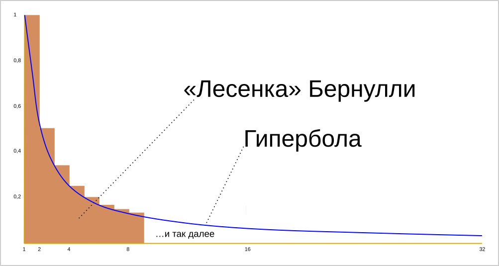
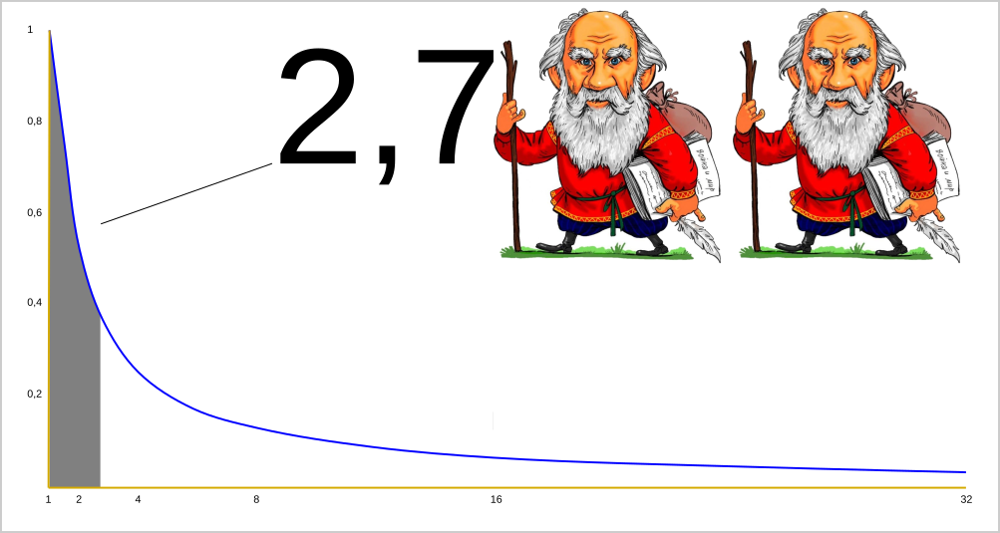
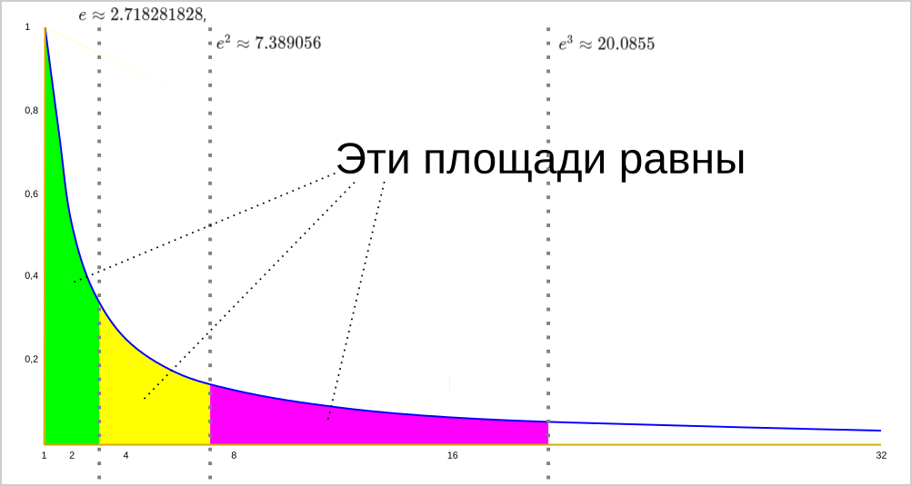
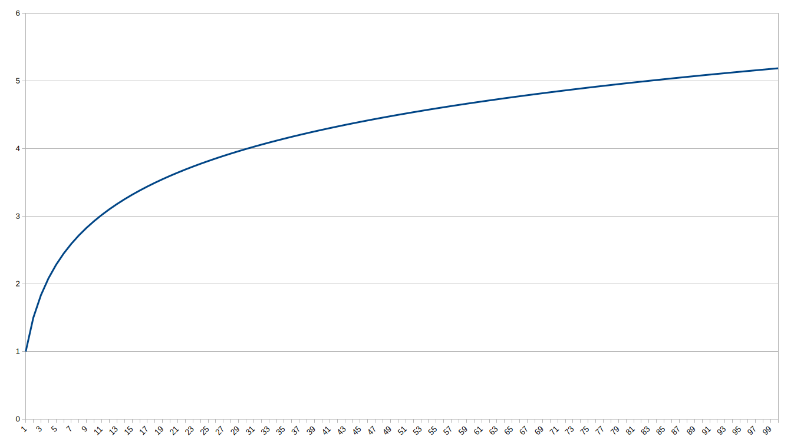
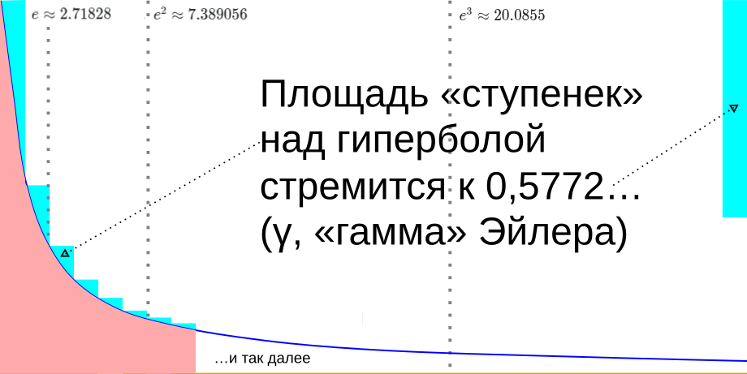

# Зенон играет на «гармошке»

## В западне Торгсина

— Опять с древнегреческими драхмами к нам пожаловали, молодой человек? — ехидно поинтересовался сотрудник Торгсина у Жоржа Милославского, знакомого нам по булгаковской пьесе и [предыдущему рассказу](/george-and-integrals/). 

В голосе неприятного старикашки, явно перешедшего на службу советской власти из имперского чиновничества, звучало злорадство: он намекал, что обладателями частных сокровищ рано или поздно заинтересуются чекисты. Жоржа такими манипуляциями было не пронять: в годы Гражданской войны он был беспризорником и на хорошее отношение к себе советской власти мог рассчитывать с бо́льшим успехом, чем клерк «из бывших». Он не испытывал слишком тёплых чувств к государству рабочих и крестьян, спасшему его ребёнком от голодной смерти. Ведь сиротой его сделало оно же. Тем не менее, в социалистической законности Жорж разбирался отлично, так что с лёгкостью парировал:

— Советскому человеку труда, папаша, конституция владеть антиквариатом не запрещает, особенно если до 1917-го года он доступа к таковому не имел!

Старичок заметно занервничал и начал молча оформлять сделку: убедился в подлинности монет, выписал книжку торгсиновских ордеров, на которые в закрытых распределителях можно было отовариться всем необходимым для безбедной жизни в уже постнэповской, сталинской Москве.

«Вот ведь времена настали, — думал Жорж, пересчитывая банкноты. — Вроде и ликвидные ценности в кои-то веки в кармане завелись, а спокойного житья всё равно не получается. Ну, ничего, лишь бы университет закончить». Он волновался небезосновательно, но преждевременно: в начале 1930-х советское правительство, убедившись, что к каждому подпольному миллионеру по чекисту не приставишь, решило вымогать у граждан ещё оставшиеся валюту и драгоценности через систему Торгсинов: пусть лучше такие «счастливчики», как Жорж, несут свои сокровища в официальные обменники, чем закопают в землю. Однако, учитывая уже усвоенные всеми гражданами хищные повадки большевистского правительства, было понятно, что такое послабление продлится недолго. Жорж торопился конвертировать стопку монет, полученных от Зенона в качестве бонуса за поездку к Нильсу Абелю, в высшее образование. Хотя бы для того, чтобы в случае излишнего внимания к себе компетентных органов найти защиту у профессуры МГУ в качестве подающего надежды молодого учёного.

***

Зенон в предыдущем рассказе собирался усыновить Жоржа не только из меркантильных соображений. Он проникся к смекалистому и расторопному парню, с которым они успели провернуть в античной Элее пару успешных комбинаций, искренней симпатией, поэтому время от времени наведывался в Москву на своей колеснице времени, как крестьянин-папаша навещает сына, отданного «в учение». Они, кстати говоря, именно эту легенду и использовали для случавшихся раз в несколько недель встреч: Зенон под видом частного торговца останавливался в одном из дворов ещё не полностью взятого под контроль чекистами района Сухаревки. Они с Жоржем шли в неприметную пивную, где заботливый философ снабжал московского студента очередной стопочкой драхм, отчеканенных в V веке до новой эры. Грек не зря подкармливал Жоржа. Он чувствовал, что рано или поздно ему пригодится этот математический талант, и такой день настал довольно скоро.

— Знаешь, старина, — говорил москвич элейцу, когда они, взяв пива с воблой, уселись за дальний столик распивочного заведения. — Не привози мне больше драхмы. Тут, я чувствую, такое начинается, что скоро и за николаевские червонцы можно будет надолго под фанфары загреметь. Меня только и спасает, что беспризорное детство да слава перспективного студента. Ещё пара посещений Торгсина и точно всерьёз заинтересуются, откуда у меня регулярные поступления античных монет, да ещё столь хорошей сохранности.

— Вот об этом я с тобой, Георгий, и хотел поговорить, — озабоченно ответил Зенон. — Монеты у меня как раз заканчиваются, так что и рад бы тебе помочь, да скоро, наверно, самому зубы на полку придётся положить.

— А что у тебя случилось? — с неподдельным участием спросил Жорж. Он тоже успел проникнуться симпатией к философу, столь положительно повлиявшему на его молодую жизнь. К тому же давнее сиротство подталкивало его видеть в Зеноне кого-то вроде заботливого старшего родственника.

— Да, понимаешь, парадокс мой перестал прибыль приносить. Мало того, что все уже пронюхали, каким образом я делаю так, что ни Ахиллес, ни любой другой атлет не могут догнать Аврору даже если очень стараются, так ещё и мысленный эксперимент мой, в котором производится бесконечное деление пространства на всё более мелкие отрезки, оспаривать стали. Неумело, конечно, не так железобетонно, как Вейерштрасс, но они числом берут: галдят, всей толпой в суд меня тащат, а судья тоже не дурак, понимает, что Ахиллес на практике всегда обгонит черепаху, хоть в частной беседе и соглашается, что доказать это, следуя моим установкам, не просто. В общем, я уже пару раз проиграл пари. Ты как математик не подскажешь ли что-нибудь свеженькое? А то я к этому бизнесу уже привык, да и мошенничеством свою деятельность не считаю. Я ведь это всё для умственного развития сограждан делаю, а то, что простофили деньги теряют, так — «на то и щука в море, чтобы карась не дремал».

Жорж задумался. Он искренне захотел помочь старику, да и возложенные на него как на математика надежды хотелось оправдать.

— Мы тут в прошлом семестре гармонический ряд изучали, — задумчиво ответил студент. — Это как твой парадокс про Ахиллеса и черепаху, только не сходимость, а расходимость надо доказать.

— Это как же? — заинтересовался Зенон.

— А вот представь: есть бесконечный ряд дробей:

$$
H = 1 + \frac{1}{2} + \frac{1}{3} + \frac{1}{4} + \frac{1}{5} + \dots
$$

Как ты думаешь, он сходится к какому-то конкретному числу или уходит в бесконечность?

— Конечно, сходится, тут и думать нечего! — постулировал Зенон. — Слагаемые-то малюсенькие, далеко не убегут!

— А вот и нет, — возразил Жорж задумчиво, — он расходится.

— Здо́рово, парадокс что надо! На нём у нас в Элее можно не меньше денег заработать, чем на Ахиллесе с черепахой. А доказывается как? — воодушевился Зенон.

— Да в том-то и дело, что я ту лекцию… прогулял, — с грустью сказал Жорж. — Дело молодое… А только с тех пор жалею: самому интересно было бы узнать.

— А давай как в прошлый раз, формулу Авроре покажем, она нас к какому-нибудь толковому математику и отвезёт! — предложил философ, в котором уже проснулся дух авантюризма.

— Годится! — ответил Жорж, которому не хотелось уступать старику в стремлении к приключениям.

Они направились в сторону заброшенного каретного сарая, где под сеном была укрыта колесница времени с впряженной в неё черепахой, продемонстрировали рептилии гармонический ряд, крупно написанный на бумажной салфетке, и через пару минут растворились в пространственно-временном континууме.

## Угольная пыль Николая Орема

Как и в предыдущий раз, когда они оказались в Норвегии у Нильса Абеля, путешественники вынырнули неподалёку от какого-то собора, из которого доносился колокольный звон, созывавший прихожан на службу. Правда, климат был помягче, но дождик так же накрапывал и близость моря ощущалась. Зенону опять пришлось кутаться в неуклюжий кафтан. С парковкой Авроры на этот раз проблем не возникло: они приземлились внутри стен какого-то монастыря, так что агрессивных местных жителей опасаться не приходилось, хотя, конечно, монахи тоже могли отнестись к пришельцам неприязненно. Эти опасения подтвердились. Вскоре к ним подошел здоровенный детина в рясе и знаками приказал следовать за собой.

Оказавшись в кабинете настоятеля, Зенон и Жорж были полны недобрых предчувствий. Тот тоже поначалу смотрел на них с нескрываемой враждебностью: странно одетые чужаки, прибывшие на упавшей с неба колеснице, запряженной черепахой, доверия у ревностного католика вызывать не могли. 

С минуту молча посмотрев на незваных гостей, аббат крикнул куда-то вглубь помещения:

— Брат Николя, принесите мне иллюстрированный манускрипт Диогена Лаэртского «О жизни, учениях и изречениях знаменитых философов».

Через минуту в зал вошел священнослужитель в чине не меньше архидьякона, и с уважительным поклоном положил на стол перед аббатом толстый рукописный том. Тот кивком отпустил помощника, и, полистав книгу, остановился на не слишком дальней странице. Он посмотрел на иллюстрацию, потом на Зенона, потом сверился ещё раз и, наконец, произнёс:

— Кажется, к нам в гости пожаловал один из самых знаменитых античных философов! Рад приветствовать вас и вашего спутника, Зенон, добро пожаловать в обитель Сен-Уэн. Брат, Николя, — вновь позвал он помощника. — Вверяю вам наших гостей. Обеспечьте им комфортный отдых, а вечером, когда они отдохнут с дороги, мы, надеюсь, славно пофилософствуем!

Зенон и Жорж проследовали за Николя во внутренние покои собора, где были устроены трапезная, опочивальня для братии и небольшая гостиница для приезжих. Гордостью аббатства была обширная библиотека, в которой хранилось немало рукописей, в том числе античных.

— Меня зовут Николай Орем, — сказал провожатый, демонстрируя гостям комнаты, где им предстояло отдохнуть с дороги. — Располагайтесь, пожалуйста. Я распоряжусь насчёт обеда, после которого, надеюсь, мы побеседуем о премудрости Божьей.

***

Освежившись сном и подкрепившись сытным монастырским провиантом, путешественники во времени проследовали в небольшую комнату при библиотеке, где Николай уже поджидал их. Зенону и Жоржу не терпелось выяснить, где найти того самого математика, который прояснил бы решение задачи о сходимости гармонического ряда. Когда они наконец задали этот вопрос, священник ответил:

— Искать никого не надо, я как раз отвечаю в нашем аббатстве за развитие математических знаний. Более того, задача, решение которой вас интересует, мне знакома. 

Он подошел к книжной полке, извлёк какую-то рукописную книгу и пояснил: 

— Вот трактат «О соизмеримости или несоизмеримости движений неба», где я разбираю этот вопрос. Здесь на полях есть даже рисунки, взглянув на которые сразу можно сообразить, в чём секрет. 

Заглянув в манускрипт и поразмыслив несколько мгновений, Зенон и Жорж одновременно воскликнули каждый на своём языке:

— Вот это да!

— Как же вы додумались до такого изящного решения? — спросил элеец.

— Видите ли, я представил себе простую хозяйственную ситуацию. Допустим, вам принадлежит участок земли, на котором есть месторождение какого-нибудь полезного ископаемого. Не важно какого: мрамора, гранита, золота. Возьмём для примера каменный уголь, который жители нашей прохладной Нормандии охотно покупают для отопления. 

Предположим, у вас есть постоянный покупатель, который раз в неделю приезжает к вам, чтобы забрать повозку угля определённого веса. Пока месторождение свежее, вы отгружаете свой товар большими кусками, размером, скажем, с лошадиную голову. Их помещается в повозку не так много, поэтому погрузка производится быстро и просто. Понемногу богатые пласты истощаются, и вы отгружаете уголь уже кусками не с лошадиную, а с баранью голову, затем камушки становятся всё мельче, мельче, и в конце концов вам приходится наполнять повозку покупателя с большим трудом. В такой момент месторождение обычно забрасывают, потому что добыча становится невыгодной, но ведь в задаче сказано, что ряд бесконечный, поэтому хоть и за всё большие интервалы времени, но вам сколь угодно долго удастся «наполнять повозку» всё более мелкими крупинками, а потом даже пылинками. 

Если же говорить о чисто математическом решении, то я показал, что такой ряд можно разбить на сколь угодно большое количество групп, количество членов в которых будет равно нарастающим степеням двойки. Посмотрите на мои наброски: первая «повозка» — это просто единица. Для второй нам нужна половинка. Для третьей — мы берем две четверти. Для четвертой — уже четыре восьмых. Видите? Чтобы каждая следующая «повозка угля» давала в сумме хотя бы половинку от самой первой, единичной, приходится «насыпать» всё больше и больше слагаемых — их количество растет как степени двойки: два, четыре, восемь, шестнадцать.

— Не может быть! — воскликнул Зенон. — Это, наверно, всего лишь ваше предположение. Столь медленно нарастающие дроби не могут уходить в бесконечность!

— Да, это неочевидно, тем не менее, если вы располагаете достаточным количеством времени, можете сами посчитать, — возразил Орем. — Мы с братьями монахами проверяли верность этого доказательства, подставляя в наш алгоритм конкретные числа. Хотите знать, сколько надо сделать подобных «отгрузок», чтобы достигнуть числа 10?

Зенон вопросительно посмотрел на средневекового математика.

— Вы, наверно, сообразили по рисунку, что сумма дробей в каждой группе ряда равна одной второй. Несложно выяснить, что таких «половинок» для достижения числа 10 понадобится всего 18:

$$
1 + 18 \times \frac{1}{2} = 1 + 9 = 10
$$

— Всего 18 таких малюсеньких дробей? — изумился Зенон.

— Вот в этом-то и заключается причина вашего недопонимания, — сказал Николай. — Не 18 дробей, а 18 «повозок», однако последние из этих групп будут наполнены столь мелкими «песчинками», что всего понадобится 262 144 членов ряда! Ещё удивительнее обстоит дело с достижением числа 20. Там дробей потребуется без малого 275 миллиардов, хотя «повозок» будет всего 38. Тем не менее, гармонический ряд медленно, но верно доберётся и до 30, и до 40, и до любого другого положительного числа, но количество членов, которое для этого придётся привлечь и разбить на группы, будет выражаться всё более гигантскими и абсурдными последовательностями цифр.

— Вот это парадокс! — воскликнул Зенон. Он заёрзал на стуле, потому что ему уже не терпелось отправиться в родную Элею, чтобы за деньги дурить там головы ротозеев новой математической диковинкой. Однако он понимал, что вежливость требует продолжить визит, так что заставил себя успокоиться, смирившись с необходимостью провести вечер в беседе с аббатом и посвятить следующий день осмотру достопримечательностей Руана.

Жорж же, попросив кусочек пергамента и крепко задумавшись, вывел гусиным пером формулу:

$$
\lim_{N \to \infty} \sum_{n=1}^{N} \frac{1}{n} = \infty
$$

— Так ведь, товарищ Орем? — с гордостью продемонстрировал он запись средневековому математику.

— Не думал, что вы владеете египетскими иероглифами, — удивился тот.

— Это не иероглифы. Так записывают подобные математические утверждения… в тех краях, где я живу, — пояснил московский студент сообразив, что в XIV веке, в котором они оказались, формулы могут выглядеть совсем по-другому.

— Очень компактно и, судя по всему, удобно, — оценил Николай. — У нас тут, к сожалению, математика ещё не так развита. Даже арабские числа не вполне вытеснили старые способы записи вычислений.

— Как же вы без них обходитесь? — удивился Жорж.

— Да так и выражаем, на латыни, обычными словами: equale, valet, pars, secunda, tercia, quarta, aggregare, in infinitum, maior quam media.

Николай ещё раз раскрыл манускрипт на странице с решением, и гости убедились, что числа в доказательстве практически не используются. Разве что сокращения от числительных.

***

— Хорошая задачка, и решение более-менее понятное, — рассуждал Зенон, когда они с Жоржем, попрощавшись с обитателями монастыря и убедившись, что Аврора хорошенько заправлена сеном, уселись в колесницу времени. — Только вот описание не слишком научное: слова вместо цифр, сравнение с повозкой, какие-то «лошадиные» и «бараньи» головы, «песчинки»…

— А кто нам запрещает переместиться немного вперёд по ленте времени и узнать, как эту задачу решали более поздние, продвинутые математики? — предложил Жорж.

— И то дело. Куда же мы теперь?

— Предлагаю в конец XVII века, там обычно происходит всё самое интересное в науке. А страну… Выберем Швейцарию, где живёт талантливое семейство Бернулли. Их там несколько поколений, — припомнил Жорж лекцию по истории, — кого-нибудь да застанем.

## Базельские Траляля и Труляля

Надеясь попасть на колеснице времени в пространственно-временную локацию, где живёт хоть кто-нибудь из семейства Бернулли, Зенон и Жорж застали сразу двоих: братьев Якоба и Иоганна. Те, как обычно, ссорились в своей базельской лаборатории:

— Да какой ты математик! — распалялся Иоганн. — Думаешь, вычитал решение задачи о расходимости гармонического ряда в средневековом манускрипте, пересказал его современными словами, так уже и нос можно задирать?

— На себя посмотри! — кричал в ответ Якоб. — Подумаешь, с Лейбницем он знаком! Чтобы прямоугольнички к гиперболе пришпандорить много ума не надо!

Они уже собирались вздуть друг дружку, но были отрезвлены появлением на пороге незнакомцев: крепкого старика в древнегреческом хитоне и не по здешней моде одетого студента. Якоб, впрочем, довольно быстро вновь впал в раж:

— Вот, полюбуйтесь, люди добрые, братец у меня: никакого старшинства не признаёт! Я ему говорю: «С чего ты взял, что к вычислению площадей под гиперболой можно применить натуральный логарифм?», а он, изволите ли видеть, «линейкой намерил»? Ты не линейкой, ты формулами продемонстрируй! И в кого ты только такой уродился? — воскликнул Якоб и, хлопнув дверью, вышел из мастерской.

— Скатертью дорога! — рявкнул вслед Иоганн. — Ещё посмотрим, кто тут старший математик! 

Тут он переключил внимание на вошедших и несколько успокоился: 

— Чем обязан, господа?

— Мы ищем господина Бернулли, который помог бы нам разобраться с доказательством расходимости гармонического ряда, — сказал Зенон.

— Вон он побежал, ваш господин Бернулли, — не мог успокоиться Иоганн. — Носится с какой-то средневековой чушью, как дурак с писаной торбой, — не унимался он, глядя в окно на обиженно удаляющегося по улице брата. — Впрочем, я тоже Бернулли, и у меня тоже есть что сказать на эту тему, но поймёте ли вы мои разъяснения? Ведь я почерпнул свои методы из бесед с величайшим умом нашего времени — господином Лейбницем. 

— А вы попробуйте, товарищ Иоганн, мы смекалистые! — заверил Жорж. — Мой спутник, чтоб вы знали, не кто иной, как древнегреческий философ Зенон, да и я не последний студент в Московском университете.

— Зенон? — презрительно буркнул Иоганн Бернулли. — Привет Ахиллесу и черепахе… Впрочем, простите меня великодушно, — продолжил он как бы опомнившись. — Мы с братом так часто и так горячо спорим на научные темы, что иногда и окружающим достаётся. Чтобы вы не сердились на меня за неподобающий приём, я готов продемонстрировать вам новейшее доказательство расходимости гармонического ряда прямо сейчас.

Он взял тряпку и начал стирать с чёрной доски написанные мелом формулы. Закончив, вызвал колокольчиком слугу и приказал подать обед на три персоны прямо в лабораторию. Подкрепившись со своими гостями нехитрым швейцарским супом, ломтями хлеба и сыром, Иоганн приступил к лекции:

— Уважаемые коллеги, гармонический ряд известен с античных времён. Его расходимость была доказана учёным-схоластиком по имени Николай Орем ещё в Средние века. Это было хотя и правильное, но скорее эвристическое, интуитивное решение, да ещё и с грубой асимптотой.

Зенон вопросительно взглянул на своего математического консультанта. 

— С плохим приближением, — пояснил Жорж шёпотом.

— В наше время, когда в вычислениях вовсю применяются функции, такой подход уже не годится. Вот, посмотрите, что я придумал.

Он нарисовал на доске координатную сетку, поверх неё гиперболу и разметил ось x натуральными числами, а y — дробями, членами гармонического ряда. 

— Как известно, график функции $x \times y = 1$ представляет собой гиперболу, — пояснил Иоганн, записав это выражение на доске.

Жорж отнёсся к этому спокойно, поскольку много раз видел подобное во время лекций на математическом отделении МГУ. Зенон же занервничал: для него это «как известно» звучало издёвкой. Он судорожно напрягал все свои философские способности, пытаясь уследить за мыслью преподавателя. 

Между тем швейцарец продолжал:

— Нарисуем на этом же графике прямоугольники, ширина каждого из которых будет равна единице, а высота — значению соответствующей дроби гармонического ряда. — Бернулли продемонстрировал это графически и продолжил: — Площади этих прямоугольников относятся друг к другу как значения соответствующих членов ряда, так что можно считать эти фигуры точно соответствующими рассматриваемой последовательности дробей.

Объяснение выглядело несколько путаным, но благодаря рисунку Зенон всё ещё кое-как успевал за ходом мысли Бернулли: утверждение швейцарца было похоже на правду.

— Верхние правые уголки наших прямоугольников приподняты над кривой, верно? — рассуждал Иоганн. — Теперь вспомним, что площадь под гиперболой подчиняется тем же законам, что и функция натурального логарифма, то есть удваивается при удвоении x. Ведь логарифм тем и хорош, что позволяет заменять умножение сложением. А раз так, то приподнятые над графиком уголки как раз и свидетельствуют о том, что сумма ряда будет всегда несколько больше, чем площадь под кривой. Сами значения y, конечно, стремятся к нулю, но сумма их приподнимается над любым пределом.

— Хватит! — взревел Зенон. — И это вы называете объяснением? Вы только что выгнали отсюда родного брата за то, что он якобы злоупотребляет тёмной средневековой схоластикой, а сами устроили здесь сеанс самого настоящего шаманского камлания! Произносите какие-то заклинания: «логарифм» (да ещё, почему-то, «натуральный»), «гипербола», «как известно». «Уголки» у него, видите ли, «приподнимаются»! Да объяснение «недоразвитого» Николая Орема с его «лошадиными головами» было в миллион раз доходчивее!

Иоганн Бернулли уже скривил недовольную физиономию, чтобы по привычке закатить небольшую истерику на тему «Я так и знал, что вы своими мужланскими умами не постигнете моих утончённых, передовых математических взглядов!», но потом сообразил, что это может ударить по популярности. Он взял себя в руки, переключился на доброжелательную интонацию и принялся разъяснять:

— Видите ли, уважаемый Зенон. В нашем бурном XVII веке математика из интеллектуальной забавы превратилась в важную часть практики. Мы, европейцы, уже изрядно исчерпали свои природные ресурсы и не можем обходиться без развитой торговли, а она требует большого количества навигационных, астрономических, коммерческих расчётов. Наши математики — не кабинетные учёные, а труженики, неустанно выполняющие гигантские объемы арифметических вычислений, да таких, где точность требуется очень высокая. Поэтому любое новшество, облегчающее эту рутину, мы воспринимаем как ценную добычу, не всегда успевая проверить его на теоретическую достоверность. Эффективные приёмы вычислений буквально удлиняют нам, математикам, жизнь. Случаются, конечно, и осечки, но ничего не остаётся, как двигаться на ощупь, стараясь по мере сил делать вычисления всё более надёжными.

Ведь как получилось с логарифмами? Их «изобрели» не для того, чтобы добавить в профессиональный лексикон лишнее мудрёное словечко. Просто жил несколько десятилетий назад в Шотландии один чудаковатый барон — Джон Непер. Люди его побаивались и обходили стороной: он слыл чернокнижником, держал при себе чёрного петуха, которому приписывали магические способности и тому подобное. Однако в математику этот шотландец привнёс пару приёмов, за которые ему благодарны до сих пор. Во-первых, он изобрёл очень удобные счётные палочки, с помощью которых умножение из утомительной писанины превратилось в сущее удовольствие. Главное же — он заметил, что умножение можно успешно заменять сложением. Если сопоставить натуральным числам возведённые в соответствующие степени значения какого-то числа (например: 2, 4, 8, 16…; или: 10, 100, 1000, 10000…), то можно вместо умножения складывать порядковые номера этих значений, и обнаружить в справочнике искомое значение в позиции с получившимся номером. Это и есть логарифм. Он получился сам собой, так что мы с Джоном Непером вовсе не хотели вас обидеть.

«Да это же он устройство логарифмической линейки описал!» — сообразил в этот момент Жорж.

А то, что площадь под гиперболой удваивается при возведении в степень значения координаты `x`, тоже выяснилось почти случайно. С этим графиком лет 40 назад экспериментировал геометр Грюар Сен-Венсан, который обнаружил этот факт не благодаря заумным вычислениям, а просто по клеточкам померив линии на бумаге. Так что и здесь нет никакого «камлания» и злого умысла.

Зенон после этих слов несколько успокоился.

— Если вам не нравится геометрическое решение, могу предложить такое, где не используется ничего, кроме чисел, — продолжил Иоганн. 

Зенон и Жорж кивнули.

— Но учтите, вы сами напросились!

_(Читатель, который не любит, когда в тексте много формул, может пропустить параграфы до начала следующей главы без ущерба для понимания сюжета)._

Предположим, что состоящая из дробей часть гармонического ряда (то есть за вычетом лидирующей единицы) сходится к конечному числу:

$$
A = \frac{1}{2} + \frac{1}{3} + \frac{1}{4} + \dots
$$

Это можно переписать немного по-другому:

$$
A = \frac{1}{2} + \frac{2}{6} + \frac{3}{12} + \dots
$$

То есть мы «поднимаем» знаменатель предыдущей дроби в числитель следующей и домножаем так, чтобы её значение не изменилось.

Рассмотрим ещё один ряд, похожий на предыдущий, но с единицами в числителе:

$$
\frac{1}{2} + \frac{1}{6} + \frac{1}{12} + \dots
$$

Его тоже можно преобразовать немного в другой вид:

$$
\frac{1}{1 \times 2} + \frac{1}{2 \times 3} + \frac{1}{3 \times 4} + \dots + \frac{1}{n \times (n + 1)} (1)
$$

Последнее выражение можно преобразовать вот так:

$$
\frac{1}{n \times (n + 1)} = \frac{1}{n} - \frac{1}{n + 1}
$$

С учётом этого, выражение (1) можно представить как 

$$
\left(1 - \frac{1}{2}\right) + \left(\frac{1}{2} - \frac{1}{3}\right) + \left(\frac{1}{3} - \frac{1}{4}\right) + \dots 
$$

У нас получился так называемый «телескопический ряд», где одинаковые положительные и отрицательные члены взаимно уничтожаются. Остаётся 1 и какой-то микроскопический отрицательный «хвостик», который при желании ещё можно уменьшить сколь угодно много раз. 

Вспомним, с чего началось это рассуждение и обозначим изначальное выражение как C:

$$
C = \frac{1}{2} + \frac{1}{6} + \frac{1}{12} + \dots = 1
$$

Вычтем из C одну вторую:

$$
\left(\frac{1}{2} + \frac{1}{6} + \frac{1}{12} + \dots\right) - \frac{1}{2}= 1 - \frac{1}{2}
$$

Останется

$$
D = \frac{1}{6} + \frac{1}{12} + \frac{1}{20} + \dots = \frac{1}{2}
$$

Продолжим сворачивать наш «телескоп»:

$$
\left(\frac{1}{6} + \frac{1}{12} + \frac{1}{20} + \dots\right) - \frac{1}{6} = \frac{1}{2} - \frac{1}{6}
$$

$$
E = \frac{1}{12} + \frac{1}{20} + \frac{1}{30} + \dots = \frac{1}{3}
$$

$$
\left(\frac{1}{12} + \frac{1}{20} + \frac{1}{30} + \dots\right) - \frac{1}{12} = \frac{1}{3} - \frac{1}{12}
$$

$$
F = \frac{1}{20} + \frac{1}{30} + \frac{1}{42} + \dots = \frac{1}{4}
$$

и так далее. И что же мы видим? Наш «телескопический ряд» превратился в гармонический!

$$
C + D + E + F + \dots = 1 + \frac{1}{2} + \frac{1}{3} + \frac{1}{4} + \dots
$$

Отсюда следует удивительное уравнение:

$$
A = 1 + A
$$

Разве может такое быть? Конечно нет, если только не предположить, что A — бесконечно возрастающее число. Ведь только бесконечность, если прибавить к ней любое другое число, остаётся сама собой. Понятно? — закончил разъяснение Иоганн Бернулли.

— Это, конечно, выглядит посолиднее, чем предыдущее, геометрическое доказательство, — сказал Зенон, — но…

— Мы, пожалуй, пойдём, — перебил его Жорж, дёрнув за рукав. — Дела, знаете ли… Спасибо большое за разъяснение, товарищ Бернулли, — добавил Жорж, по пролетарской привычке пожимая руку гиганта мысли.

— Ну, раз вы больше ничего не хотите… — не стал задерживать гостей швейцарец.

***

— Ты понял что-нибудь? — спросил Зенон, когда они покинули лабораторию и направлялись к альпийскому лугу, где среди коров, доверенная какому-то фермеру, мирно паслась черепаха Аврора.

— Ни-хре-нашеньки! — переходя на русский устный ответил Жорж. Впрочем, мне кажется, что если я перечитаю это раз 100, то что-нибудь, может, и усвоится.

— Вот и у меня такое же ощущение, — задумчиво ответил Зенон.

Они решили, пока материал не уляжется в голове, больше никаких математиков не беспокоить, а разъехаться по домам и взять тайм-аут для размышлений.

## «Чтобы `e` число запомнить…»

Когда хронопутешественники вновь встретились через неделю, всё в той же сухаревской пивнушке, оба светились энтузиазмом.

— Ну, как успехи? — спросил Жорж после приветствий.

— Отлично! — радовался Зенон. — Парадокс работает! Я уже развёл одного лошару на бабки (навещая своего подопечного в криминальных кварталах постнэповской Москвы, он уже нахватался словечек из жаргона урок), поспорил с ним, что смогу доказать расходимость гармонического ряда. При этом я, конечно, рисковал. Из объяснений Бернулли мне с прошлого раза стало понятно только одно: доказать расходимость возможно. А вот повторить в точности ни геометрическое, ни алгебраическое доказательство у меня не получалось. Но этого и не потребовалось! Бедолага был так потрясён самим фактом того, что из уменьшающихся дробей можно составить любое бесконечно большое число, что впал в ступор, безропотно отдал мне выигрыш и, кажется, до сих пор ходит по Элее с отвалившейся челюстью и выпученными глазами. Но это был пробный шар, больше я так рисковать не стану, пока не буду чётко всё понимать. На тебя вся надежда. Получилось разобраться?

Тут просиял уже Жорж.

— Зенон, старина! Получилось! Правда, пока я одолел только геометрическое доказательство, но теперь уверенно могу объяснить эту расходимость. Пойдём скорее в университет, там в аудитории нарисую на доске не хуже Бернулли!

Они переодели Зенона, чтобы он стал похож на одного из тех забитых середняков, что все ещё приезжали в начале тридцатых на столичные рынки продавать плоды своего огородничества, и направились на Моховую, в старый корпус МГУ (нового, на Воробьёвых горах, в то время, конечно же, ещё не было).

У входа в корпус Жорж обратился к пожилому вахтёру:

— Вот, родственник ко мне из деревни приехал. Можно я ему университет покажу?

— Пущай, пущай земляная башка, кулацкая морда на научное учреждение полюбуется, — снисходительно разрешил страж храма знаний. — Может, поймёт, наконец, за что советскую власть уважать надо. 

Зенон и Жорж нашли свободную аудиторию. Студент усадил гостя из античности за ближайшую парту, сам встал к доске и начал объяснять:

— Понимаешь, старина, когда нам на лекциях по математике объясняют те или иные термины, многое приходится принимать на веру.

— …как аксиомы Евклида, — продемонстрировал осведомлённость Зенон.

— Точно! — согласился Жорж. — И со временем этого бездоказательного хлама так много накапливается, что аж башка трещит. Вот поэтому многим так трудно даётся математика: люди хотят докопаться до сути, а им не позволяют, гонят по учебной программе как баранов. Тот, кто слепо решает примеры по методичке, проходит в следующий семестр, а тот, кто задумывается, пытаясь сначала как следует разобраться в уже пройденном материале, срезается на сессии и вылетает из вуза. А вот если бы нам объясняли **историю** появления тех или иных математических инструментов, всё было бы яснее ясного!

Например, есть два «странных» числа: `π` и `e`. Откуда берётся первое, можно объяснить даже детсадовцу: померить ниткой длину окружности, потом диаметр. Очень быстро выяснится, что, во-первых, для любого кругляша в окружающем нас мире соотношение этих двух величин одинаковое, а во-вторых, оно равно «трём с хвостиком», то есть диаметр не укладывается в длину окружности так, чтобы это можно было выразить рациональной дробью.

Совсем другое дело с числом `e`. От него все шарахаются, как чёрт от ладана, потому что это «основание натурального логарифма». Больше всего пугает слово «натуральный». Почему натуральный? «Потому что встречается в природе», — объясняют нам профессора. Да у обычного человека «в природе» ничего сложнее подсчёта сдачи в гастрономе не встречается! 

Тех, кто действительно хочет понять, откуда взялось `e`, нужно на экскурсию в прошлое на нашей с тобой колеснице времени возить (не бесплатно, само собой разумеется). Вот там бы эти граждане и познакомились с «великими математиками». Мы-то здесь думаем, что все эти Ньютоны, Лейбницы и Бернулли с Эйлерами были умудрёнными тысячелетним опытом мужами, а по факту они оказались весёлыми раздолбаями, которым повезло что-то там нащупать с помощью циркуля и линейки, наделавшими на радостях от своих открытий скоропалительных выводов, которые потом другим математикам, вплоть до Вейерштрасса, пришлось исправлять, приводить в соответствие со строгой теорией! Вот и с числом `e` что-то подобное получилось.

Тут Жорж начал рисовать на доске:

— Ты же помнишь гиперболу в координатной сетке? — он изобразил то и другое. — До такого графика может, в общем-то, додуматься даже любознательный ребёнок, и это уже полезно. Но кто-то (кажется, Грегуар де Сен-Вансан), решил ещё и площади померить. Делал он это, скорее всего, с помощью палетки — стёклышка с начерченными на нём клеточками. Он решил узнать: если метки по оси абсцисс размечены, скажем, с интервалом в дюйм, то как будет выглядеть часть гиперболы, площадью в один **квадратный** дюйм? Хорошенько поползав на манер мухи по своему нарисованному на большом листе бумаги графику, он с удивлением обнаружил, что справа эта недотрапеция будет ограничена странным, ни к чему не сводимым числом — 2,718281828…. 

Когда я это понял, математическая подсказка «чтобы `e` запомнить способ есть простой: два и семь десятых, дважды Лев Толстой» заиграла для меня новыми красками! Я действительно его мгновенно запомнил, не для шутки про Льва Толстого, а потому что оно действительно **нужное**!

— А кто это, Лев Толстой? — поинтересовался Зенон.

— Да, философ один, вроде тебя. Видишь, даже внешне похож, с бородой и в крестьянском кафтане. Только ты людям головы парадоксами морочишь, а он был наш, пролетарский, за трудовой народ заступался…

— Ну, я тоже кому попало мозги не пудрю… — заметил аполитичный Зенон. — Слушай, а мне вот кажется, что площадь в одну квадратную единицу должна выглядеть гораздо меньше, как квадратик.

— Это потому, что выбраны разные масштабы для осей `x` и `y`, — парировал Жорж.

— А-а-а! Точно.

— Но это не самое интересное, — продолжал студент. — Чтобы увидеть, как при таком раскладе выглядит двойка, сколько нужно отступить от единицы направо?

— Конечно же, `2e`, — мгновенно сообразил Зенон.

— А вот и попался! — торжествующе рассмеялся Жорж. — На оси `x` координаты надо не складывать, а умножать. Чтобы получить площадь «два», тебе придется отступить аж до $e^{2}$ (это почти семь с половиной)! Понимаешь фокус? Площади под кривой складываются ($1 + 1 = 2$), а границы на оси в это время перемножаются $(e \times e = e^2)$. Логарифм заменяет умножение сложением!

Эту задачу Зенон уже переваривал с трудом, и Жорж пришел на помощь:

— Так вот, эти ребята из XVII века чисто эмпирически нащупали… Чтобы изобразить вторую единичную площадь, нужна теперь ширина трапеции не $e \approx 2.718281828$, а огромный кусок от e до $e^2 \approx 7.389056$. Кривая-то идёт на убыль! Но ты не переживай, не ты один перед этим фактом сплоховал. Много было путаницы, пока в этом вопросе наводили порядок. Правильное теоретическое обоснование искали опытным путём, не забывая при этом, конечно же, фиксировать дельные соображения в публикациях. 

Для нас же с тобой главное вот что. Раз числа на графике выглядят как площади, суммирование представляет собой прибавление всё дальше уползающих вправо и при этом всё время удлиняющихся и сужающихся кусочков (как в случае с «повозками» Николая Орема). А вот график гармонического ряда похож на «лесенку», всегда приподнятую над стремящейся к оси `x` гиперболой. Вспомни рисунок Иоганн Бернулли!

Вот и получается, что площадь под «лесенкой» всегда чуточку больше, чем площадь под гиперболой, а поначалу и не чуточку: первые два прямоугольника больше площади трапеции под ними примерно в полтора раза! В общем, к нулю члены ряда стремятся, а их сумма — ни в коем случае! И ни к какому другому числу не стремится. Ведь прямоугольники для суммирования надо бы ставить друг на друга. Просто на доске не хватит места, чтобы показать это. 

Задумчивые глаза Зенона стали чем-то напоминать песочные часики, в которые превращается курсор компьютерной мыши, когда процессор загружен по максимуму.

— Годится. Теперь и я понимаю. Но наш-то бизнес основан на том, что нужно убедить спорщика, с которым заключается пари. Нужно ещё какое-то объяснение, в котором будет поменьше всяких «львов толстых» и картинок, но побольше железобетонной логики.

— Айда к Эйлеру, он, говорят, и вывел в точности это число `e`, основание натурального логарифма.

## Утративший зрение да увидит

Когда Зенон и Жорж тёплым апрельским днём 1783 года прибыли на влекомой черепахой колеснице времени в Санкт-Петербург, они были очень удивлены: их встречали как старых знакомых. Собралась празднично одетая толпа, звучал духовой оркестр, в воздух летели букеты цветов. Пожалуй, если бы не торжества по поводу присоединения Крыма к Российской империи, проходившие как раз в те дни, встречать хронопутешественников явилась бы и сама императрица. Поскольку же все самые высшие сановники были вовлечены в празднование по случаю территориального приобретения, встречал наших героев тверской губернатор Яков Александрович Брюс, находившийся в столице по семейным обстоятельствам. Из того, что он сказал, вскоре стало понятно, почему гостям оказано столь благосклонное внимание: 

— Рады снова приветствовать вас в российской столице, многоуважаемый Зенон!

Жорж вопросительно посмотрел на старшего товарища, но тот бы изумлен не меньше, хотя и продолжал, как ни в чём не бывало, приветливо улыбаться.

— Прошло без малого полвека с вашего предыдущего визита, — продолжал Брюс. — Мы помним впечатление, которое произвела в 1736 году на просвещённую публику ваша беседа с молодым тогда ещё господином Эйлером, а также демонстрацию удивительного гальванического автоматона, способного переводить человеческую речь с одного языка на другой, равно как и производить сложнейшие математические вычисления. Впрочем, вы можете своими глазами видеть, как с тех пор похорошела столица при матушке нашей Екатерине Алексеевне, покровительнице всяческих философий, наук и искусств! Россия стремится не отставать от лучших проявлений человеческого разума.

— Ты уже бывал здесь раньше? — спросил Жорж шёпотом.

— Ни разу в жизни, — недоумённо прошептал в ответ Зенон.

После стандартного обмена любезностями Брюс уже менее официальным и даже несколько заговорщицким тоном добавил:

— А ведь мне известно и о ваших неоднократных посещениях Москвы. В нашем семействе бытует предание о том, как вы ещё в бытность Петра Великого, приземлялись на этой вот колеснице у Сухаревой башни и беседовали с русским математиком Леонтием Магницким. С вами тогда был возница по имени Ахиллес и какой-то господин из будущего. Об этом, говорят, любил вспоминать мой покойный двоюродный дедушка Яков Вилимович Брюс, основатель Навигацкой школы. Он ведь тогда чуть из пушки по вам не пальнул-с, за шпионов принявши. Да и черепаха ваша славно Аптекарский огород общипала, хе-хе…

Зенон недоумевал, но Жорж догадался:

— Наверно, ты заезжал в Россию из более позднего времени своей жизни, но в более ранний период развития Российской империи, поэтому ничего ещё не знаешь о своих будущих поездках в 1702 и  1736-й годы.

Читателю, который уже, наверно, запутался в этих петлях времени, напоминаем, что есть ещё два рассказа о поездках Зенона в Россию: [«На виражах числовой прямой»](/otvetochka-zenona/) и [«На просторах интуиции»](/leontij-intuitivist/). Их можно найти на домашней странице автора этих строк и прочитать соответствующие лонгриды для лучшего понимания сюжета.

Отправив Аврору пастись всё на тот же Царицын луг, наши путешественники сообщили о своём желании встретиться с Леонардом Эйлером, который доживал в Санкт-Петербурге, в особняке на Васильевском острове последние месяцы своей жизни. Их просьбу охотно приняли к сведению, и вскоре они уже стояли на пороге кабинета, где застали не утратившего бодрости духа, живости ума и прекрасной памяти 76-летнего старика, правда, совершенно ослепшего несколько лет назад.

— Рад вас снова приветствовать, Зенон, — сказал Эйлер, подтвердив догадку Жоржа о том, что элеец уже встречался с этим одним из величайших математиков XVIII века. — С вами ли Ахиллес? Мы с ним в прошлый раз так славно рубились в «Викингов» на его смартфоне!.. Знаете, а ведь наша тогдашняя беседа сильно изменила мою жизнь. Я был молодым, горячим, хватался за всё подряд, ничего не доводя до конца. Смешно вспоминать, что в ту пору меня интересовали такие пустяки, как задача о кёнигсбергских мостах! После вашего отъезда я взялся за ум и сосредоточился на разработке учения о математическом анализе и бесконечных величинах, хотя меня нет-нет да и заносило в течение жизни то в физику, то в астрономию, то даже в ботанику… 

Зенон, чтобы не расстраивать старика, притворился, что помнит о ещё не состоявшейся встрече, постаравшись, впрочем, поскорее перевести тему на суть визита:

— И я рад видеть вас, мой друг Эйлер, — сказал он. — Я хоть и путешествую во времени, но мой нынешний биологический возраст, пожалуй, уже уступает вашему, так что на этот раз уже мне хотелось бы получить совет от вас как от более мудрого. Ваш приятель Ахиллес, к сожалению, остался на этот раз дома, но со мной приехал молодой математик из Москвы 1930-го года, его зовут Георгий. Я предоставляю ему, с вашего позволения, слово, чтобы он сформулировал вопрос, ради которого мы оказались здесь.

— Товарищ Эйлер, — горячо заговорил Жорж, — приветствую вас от имени…  — Он чуть не ляпнул по советской привычке «ленинского комсомола», но вовремя спохватился, да и комсомольцем не был, поэтому продолжил обтекаемо: — …творческой молодёжи будущего. Как студент математического отделения Московского государственного университета хочу спросить, какой способ доказательства расходимости гармонического ряда лучше: геометрический или алгебраический? Их оба продемонстрировал нам товарищ Иоганн Бернулли, но мы до конца не разобрались.

— Рад, что Московский университет и спустя более 150 лет привечает в своих стенах таких ревностных поклонников математики, как вы, молодой человек, — ответил Эйлер с искренним пафосом. Ведь он всю жизнь неустанно заботился о развитии российской науки. — Михаила Васильевича Ломоносова, основавшего это прекрасное учебное заведение, я имел честь знать лично, состоял с ним в переписке и как мог продвигал его талант в европейском научном сообществе. Величайший был ум!

После минутных воспоминаний Эйлер не торопясь продолжил:

— Что касается вашего вопроса, отвечу на него с особенным удовольствием, поскольку посвятил решению задачи о расходимости гармонического ряда много сил и добился в этом деле некоторых успехов. Не люблю хвастаться, но некоторые математики уже сейчас, при моей жизни называют число `e` — то самое 2,718281828… — числом Эйлера. Ведь `e` — это первая буква моей фамилии, которая по-немецки пишется как `Euler`. Меня трудно удивить почётными титулами и правительственными наградами, но когда в твою честь называют одну из важнейших математических величин, это дорогого стоит. Без понимания того, почему гармонический ряд расходится, невозможно, на мой взгляд, постичь ни подлинного смысла логарифмов, ни основ дифференциального и интегрального счислений… Вы сами-то, молодой человек, какой метод доказательства предпочитаете: графический или числовой?

— Графический, конечно, — бесхитростно ответил Жорж. — Мы люди простые. Нам бы руками пощупать да глазами позырить. — Тут он осёкся, почувствовав, что напускная наивность вылилась в непроизвольную грубость: Эйлер был незрячим, напоминать ему о полноценном зрении было бестактностью.

— Не переживайте, Георгий, — подбодрил его математик. — Я понимаю, что вы сейчас испытываете некоторую неловкость, упомянув способность видеть в присутствии ослепшего старца, но вам это более чем простительно. Вашими устами говорит сама молодость, которой возможность беспрепятственно пользоваться глазами кажется чем-то само собой разумеющимся. Да и я уже привык к своей слепоте, хотя, конечно, был в отчаянии, когда в первый раз утратил зрение. Мне тогда удалили катаракту, но я так торопился вновь увидеть мир, что, вопреки наказу врача, снял повязку раньше времени, чем окончательно всё испортил… Впрочем, со временем я обнаружил, что у незрячего человека развивается мощная способность оценивать накопленные знания, так сказать, внутренним взором, что для меня как для учёного стало даже некоторым приобретением. Я, например, гораздо лучше в таком состоянии «вижу», чувствую взаимосвязь между гиперболой и натуральным логарифмом. Задумывались ли вы, почему он называется натуральным?

— Не то слово! — воодушевился Жорж. — Очень часто об этом думаю и никак не могу понять. По-моему, его как раз лучше было бы назвать противоестественным. Ведь в чём его суть? «В какую степень нужно возвести число 2,718281828…, чтобы получилось столько-то?» А почему мы обязаны возводить в степень именно эту «раскоряку», а не какую-нибудь другую? Я бы скорее назвал естественным, натуральным десятичный логарифм. Он гораздо полезнее.

— У человека и у природы разные представления о «полезности». Распространённость десятичных логарифмов объясняется тем банальнейшим обстоятельством, что у нас десять пальцев на руках. То есть это как раз вкусовщина, стремление подогнать мир под свои субъективные представления. Натуральный же логарифм гораздо тоньше. 

Представьте себе: вот капля жидкости коснулась гладкой и твёрдой поверхности. Что с ней случится? Если она плавно опустилась с небольшой высоты, как закапывают, например, из пипетки лекарство в мои больные глаза, то она просто растечётся в стороны, оставаясь по сути единым объектом. Если же это капля росы, упавшая на камень с невысокой травинки, она от удара распадётся на две-три части. Если же это капля дождя, упавшая с облаков, летящих над землёй на высоте сотен метров, она разлетится на множество мелких брызг. Улавливаете? Единица делится сама на себя, на два, на три и так до бесконечности. Разве это не типичное природное явление?

— Вот это поворот! — изумился Жорж. — Нам-то в школе объясняют, что деление нужно только для того, чтобы яблоки или конфеты поровну октябрятам раздавать!

Эйлер загадочно улыбнулся и продолжил:

— Теперь представьте себе такой диалог между Человеком и Природой:

### Натуральные успокоительные капли 

_(Это описание мысленного эксперимента приводится здесь как вставной сюжет в лучших традициях русской литературы, таких как притча о Великом Инквизиторе из «Братьев Карамазовых» Ф. М. Достоевского, повествование о злоключениях Иешуа из булгаковского «Мастера и Маргариты» или рассказ о гусаре-схимнике из «12 стульев» Ильфа и Петрова)_.

— Разлетится ли капля от удара на две части, если я капну её из пипетки, приподняв над камнем на толщину волоса? — спрашивает Человек.

— Нет, — отвечает Природа, этой высоты недостаточно, просто растечётся, оставшись целой.

— А если приподниму пипетку на четверть дюйма? — продолжает Человек.

— Маловато, не разлетится, — отвечает Природа.

— А на треть дюйма? 

— Уцелеет.

— А на половину дюйма?

— Мало.

— А если капнуть с высоты одного дюйма?

— А вот теперь, пожалуй, распадётся от удара.

— На сколько частей?

— На две, конечно.

— А почему не на три?

— Можно подобрать и высоту, при падении с которой капля разгонится так сильно, что распадётся и на три части, но всегда есть меньшая высота, при которой частей будет две, так что не торопи события.

— А есть высота, при падении с которой капля разлетится на 2,5 части?

— С чего бы это? В реальных условиях, конечно, размер брызг будет разным, потому что в полёте капля испытала множество воздействий, да и от свойств камня кое-что зависит, но мы-то проводим идеальный эксперимент. Капля состоит из чистой воды, летит строго вертикально в ничем не возмущённом пространстве. Камень идеально ровный и идеально твёрдый, лежит строго горизонтально. С чего бы капле, состоящей из идеально распределённого по симметричному пространству вещества, распадаться на неравные части? Так что честно продолжай эксперимент, не пытайся меня обмануть.

Человек, поняв, что схитрить не удалось, заходит с другого конца:

— А с какой высоты нужно сбросить каплю, чтобы она впервые разлетелась на две, так уж и быть, одинаковые части?

— С высоты 2,718281828… плюс ещё совсем немножко, — отвечает Природа.

— 2,718281828 дюйма?

— Нет.

— 2,718281828 сантиметра?

— Нет.

— А тогда 2,718281828 **чего же**???!!!

— Да я и сама не знаю. Так принято, — равнодушно отвечает Природа.

— Хорошо же, — не сдаётся Человек. — А с какой минимальной высоты нужно сбросить каплю, чтобы она разлетелась на три части.

— Нет ничего проще, — отвечает Природа. — С высоты 7.389056… и ещё небольшой плюсик. Предвижу твой следующий вопрос про высоту для четырёх капель. Ответ: 20,0855… и ещё немножко для распада на четыре части. Только давай сразу договоримся, что ты не будешь спрашивать в каких это единицах и сколько это «немножко».

— Это почему же запрещено спрашивать? — возмущается человек.

— Потому что тебя никто не приглашал сюда, чтобы совать везде свой любопытный нос. Нравится заниматься ерундой — на здоровье, а больше положенного не узнаешь: здесь начинаются… проприетарные драйвера.

— Ладно, ладно, не сердись, — пытается усыпить бдительность Природы и впрямь чересчур любознательный Человек. — Только вот что же это получается, мне теперь для каждого количества брызг по особому числу запоминать придётся? Для двух — 2,718281828…, для трёх — 7.389056…, для четырёх — 20,0855…

— Зачем же запоминать? Это просто степени одного и того же числа, самого первого, начинающегося с двойки. Держать в голове придётся только его, где-нибудь рядом с числом `π`. Но я вижу в твоих глазах вопрос: «Почему поведение простых, естественнейших дробей регулируется степенной функцией столь странного числа?» Ещё раз тебе повторяю: не спрашивай, тебе это знать не положено! Думай дальше сам. Ха-ха-ха!..

***

Эйлер закончил свой рассказ, и в кабинете повисла тишина. Её прервал сам математик:

— В этой притче заложено две задачи. С одной стороны, Человек хочет понять принцип распада единой капли на целое количество равных частей. Это и есть функция $x \times y = 1$. С другой — он как бы спрашивает каждый раз у Природы: «А можно поделить каплю на ещё большее количество брызг?» «Дели на здоровье, если тебе, дураку, больше заняться нечем», — отвечает Природа. При этом она асимптотой, приближающейся к оси `x`, как бы намекает, что ничего, что можно было бы назвать здравым смыслом, в этом всё более мелком делении не предвидится. Всё самое интересное уже случилось на участке гиперболы от 1 до примерно 10. Но делить Природа не запрещает. Это и есть гармонический ряд, если только такое глупое занятие можно назвать гармоническим.

— Так это же мой парадокс про Ахиллеса и черепаху, только вывернутый наизнанку! — изумился Зенон.

Эйлер в ответ лишь загадочно улыбнулся. 

— Георгий, — обратился он к Жоржу, — вы ведь в университете уже проходили взаимосвязи между различными функциями? Вам говорили, что одни из них представляют собой интегралы от других?

— Конечно! — откликнулся Жорж.

— Тогда давайте вместе со мной проведём ещё один мысленный эксперимент. Представьте себе таблицу из трёх столбцов. В первом — натуральные числа по порядку, во втором — соответствующие дроби, частные от деления единицы на число в клетке слева, а в третьем — сумма чисел второй колонки нарастающим итогом. Представили? Что получилось?

— Вижу, вроде бы, ту же гиперболу, только отраженную относительно горизонтальной прямой пологой частью вверх. Асимптота теперь приближается не к оси `x`, а к чему-то приподнятому над ней. Да и приближается ли? Непонятно.

— Не приближается, уходит в бесконечность, — пояснил Эйлер. — Это и есть изображение гармонического ряда в форме логарифмической функции (интеграла от гиперболы), но его, на мой взгляд, всенепременнейше нужно рассматривать вместе с самой гиперболой. Во время лекции они должны быть нарисованы рядом, на смежных половинах доски, потому что в обоих случаях Природа намекает: «Человек! Я не запрещаю тебе делить числа, но ты сам видишь, что если этим заниматься слишком усердно, пропадает самое главное — смысл».

— Вот это философия! — восхитился Зенон.

— Не столько философия, сколько наблюдение за природой, в том числе с помощью внутреннего взора, который мне… посчастливилось обрести на старости лет. Видимо, такая способность и называется математикой. 

Знаете, что ещё предстало перед моим внутренним взором? Давайте вспомним «лесенку», которую так любил рисовать над гиперболой мой учитель Иоганн Бернулли. Однажды мне захотелось сравнить площадь под «ступеньками» лесенки Бернулли и площадь под гладкой гиперболой на участке от 1 до очень большого числа `n`. Если вычесть одну площадь из другой, то по мере ухода в бесконечность этот избыток площади перестает расти! Он застывает и становится равен разности, составляющей ровно 0,5772… Я обозначил это число как `γ`, греческой буквой гамма (на этих словах Зенон горделиво приосанился), только вот пока не понял, можно ли его выразить простой дробью или оно такое же иррациональное, как `π` или `e`. И уж тем более невозможно понять, почему природой в этом вычислении заложена именно такая пропорция.

— Да, точно, нам говорили про какую-то «гамму», — воодушевился Жорж, — только я никак не мог уловить её геометрический смысл. Спасибо вам, товарищ Эйлер!

— Пожалуйста, — ответил почтенный математик. — Так приятно видеть в лице моих гостей античную мыслительную традицию в сочетании с талантливым молодым энтузиазмом будущего. А сейчас простите меня, уважаемые Зенон и Георгий, мне, старику, нужно часок вздремнуть. Мой мозг в последнее время быстро утомляется от учёных бесед, хотя, освежившись сном, я готов ещё поговорить с вами, допустим, за ужином.

— Рады такому приглашению, мой друг Леонард, — Зенон по древнегреческой традиции избегал при обращении добавлять слова «господин» или «товарищ», — но нам пора, а то, боюсь, Аврора превратит Царицын луг в пустыню, и в следующий раз нас примут в Санкт-Петербурге не столь благожелательно.

Улыбнувшись этой шутке, собеседники вежливо распрощались, отправившись каждый по своим делам.

***

— Ну, понял теперь, как выигрывать пари о гармоническом ряде? — спросил Жорж, когда они вновь припарковались на Сухаревке в 1930-м году.

— Понял, причём могу порассуждать об этом несколькими способами. Всё оказалось не скажу чтобы просто, но, по крайней мере, интересно и естественно. Только вот про «гамму» мало удалось выяснить, устал старик, придётся самим разбираться.

— Я тоже хотел бы этот материал закрепить. В принципе, что нам мешает воспроизвести его рассуждения прямо здесь?

Жорж попросил у буфетчика большой кусок обёрточной бумаги, достал из кармана двухцветный (наполовину синий, наполовину красный) карандаш, нарисовал гиперболу и уже привычные несколько «ступенек» над ней. «Лесенку» он закрасил синим, пространство под гиперболой заштриховал красным.

— Какое там было соотношение между верхней и нижней частями? — спросил он Зенона.

— Точно не запомнил, примерно 0,6. Что-то я здесь ничего подобного не вижу. Площадь под гиперболой гораздо больше, чем площадь ступенек над ней… Тут соотношение хорошо если один к пяти. Может, это на более длительном ряде проявляется?

— Я тоже никакого 0,5772… здесь не нахожу. Впрочем, ведь Эйлер и не говорил, что это соотношение площадей. Он говорил, что сумма этих вот синих треугольничков стремится примерно к  0,5772… чего же? А, я понял! Имеется в виду 0,5772… в чистом виде, то есть чуть больше половины прямоугольника единичной площади! Смотри…

Он нарисовал справа прямоугольник шириной 1 и высотой 1 (вспомним, что это был именно вытянутый вертикально прямоугольник, а не квадрат, потому что масштабы осей `x` и `y` были разными). Закрасив сверху синим примерно 0,6 его высоты, Жорж сказал:

— Вот сюда улягутся площади всех треугольничков, сколько бы много их ни было. Это действительно чудо! Гармонический ряд и логарифм растут неограниченно, а их разность стабилизируется в этой ловушке!

— Но почему? — изумлялся Зенон.

— «Так Природа захотела. Почему — не наше дело», — ответил Жорж словами песни, которую другой москвич напишет лет через 30. Затем он молча написал под графиком:

$$
\gamma = \lim_{n \to \infty} \left( \sum_{k=1}^{n} \frac{1}{k} - \ln n \right) = 0,5772…
$$

— Понимаешь, интересы Природы и Человека действительно различаются, хотя и пересекаются. Ведь мы, люди, питаемся галлюцинациями. В реальности нет ничего круглого, ничего прямого. Да, спил дерева похож на круг, капля воды, форма планеты могут показаться сферическими, но при ближайшем рассмотрении всегда обнаруживаются отклонения, и порой довольно существенные. То же и с прямыми. В лесу ты не найдёшь ни одной по-настоящему ровной палки. Прокладывая автострады и железные дороги по кратчайшим маршрутам, люди то и дело упираются в холм, в болото, или приходится приподнимать магистраль над рекой, строя мост. Природа постоянно сводит на нет наши усилия привести окружающий мир в соответствие с нашими абстрактными представлениями, искривляя прямое, нарушая циркулярное. Поэтому, изучая математику, нужно пытаться разглядеть ещё и физику, заложенную в формулы и графики.

— Звучит дельно, — похвалил Зенон. ­— Ну, а в гиперболе, например, какую ты видишь физику? Ведь она отражает всего лишь деление. Это когда, например, собрались купцы после удачной сделки и посчитали выручку. Заработали вдесятером  300 драхм, каждому причитается по 30. Где же здесь Природа? Здесь самая что ни наесть голая человеческая спекуляция.

— Неужели на тебя не произвела впечатления притча Эйлера о каплях?

Зенон почувствовал себя в родной стихии. Дискуссии он любил больше всего на свете, поэтому охотно принял и парировал подачу:

— Этого вопроса я и ждал! Предположим, по оси `x` на графике гиперболы, соответствующей гармоническому ряду, откладывается высота, с которой с помощи идеальной пипетки сбрасываются капли. Площади под кривой, кратные степеням числа `e`, соответствуют количеству брызг, на которое распадётся капля при ударе. Внимание, вопрос: как называется то, что откладывается по оси `y`?

— Вот и я ждал случая, чтобы проговорить мысль, вытекающую из твоего вопроса, — с энтузиазмом ответил Жорж. — Вспомни, что говорил Эйлер во время нашей беседы. То, что действует вдоль оси ординат и прижимает асимптоту к оси абсцисс — это и есть **доля смысла** в эксперименте с каплей, и при увеличении высоты сбрасывания она стремится к нулю! Ведь гораздо чаще приходится делить на 2, 3, 4, 5, чем на 1000, 1 000 000, 1 000 000 000. Точнее говоря так: выбор между тем, разделить ли целое на 3 или на 4 части встречается в человеческой практике гораздо чаще, чем выбор между разделить ли на 1000 или на 1001 часть.

— Ух ты, лихо закрутил, — Зенон задумался, но лишь на пару секунд. — А объясни-ка тогда своё мелкое мошенничество: ты уже не первый раз рисуешь мне график, где ряд начинается с единицы. Но ведь на оcи `x` есть числа левее, как минимум до нуля, не говоря уже об отрицательных, а на оси `y` есть числа выше единицы. Что это за единица смысла у тебя получается? Смысл меньше единицы я ещё могу себе представить, но что такое смысл больше единицы?

— А это, видимо то, на что Природа в притче Эйлера указала Человеку как на «не твоё собачье дело». То, что Человек пока ещё не обнаружил, то, что скрыто, как она выразилась, за «проприетарными драйверами». Божественный замысел, если хочешь. У нас тут, в атеистическом СССР, за такие слова и в лагерь загреметь можно, но когда-то я рос в православной семье, так что и такую мысль вполне могу допустить.

— Ха-ха-ха…  — покатился от смеха Зенон. — Ну, Георгий, ну насмешил! Дай-ка мне эту бумажку с графиком. Отвезу в Грецию, буду там ротозеям про божественный замысел на её примере рассказывать, чтобы охотнее расставались с драхмами. Может, её когда-нибудь в рамочку поместят и объявят святой иконой. Жаль только буфетчик на этой обёрточной бумаге своими жирными лапами пятен наоставлял. Ха-ха-ха!.. Ладно, будем закругляться. Честно говоря, вне зависимости от того, удастся ли мне зарабатывать в Элее с помощью этого нового парадокса, сама поездка доставила мне огромное удовольствие. 

— Я тоже был рад услышать объяснения из уст первооткрывателей, а не от теперешних советских  профессоров. Скажу тебе по секрету, что не стал расстраивать товарища Эйлера рассказом о том, что в наши дни МГУ переживает плохие времена. Лучшие преподаватели физики и математики несколько лет назад уволились. Большевики одно время вообще собирались закрывать Московский университет, но даже до них вскоре дошло, что учёные — это не сумасшедшие, которые рассказывают о своих галлюцинациях на тарабарском языке, а люди, обеспечивающие превосходство в экономике и победу в войнах.

— Береги себя, — помолчав, серьёзно сказал на прощанье Зенон, и колесница времени исчезла в одной из червоточин пространственно-временного континуума.

Жорж пешком отправился в общежитие, попутно выполняя кое-какие накопившиеся бытовые дела. Комнату ему выделили в одном из строений бывшего Андроникова монастыря. Большевики разместили в соседнем храме небольшой атеистический музей. Вновь вспомнив о своём православном детстве, Жорж заглянул туда. Под церковными сводами звучал рассказ экскурсовода, который, указывая на потемневшее от времени изображение, заключённое в деревянную рамку, говорил:

— Здесь, товарищи, мы с вами видим одно из немногих сохранившихся произведений прогрессивного живописца XV века Андрея Рублёва. Это эскиз, выполненный на плотной бумаге красным и синим карандашами. К сожалению, время не пощадило шедевр, но мы до сих пор можем различить плавный изгиб одеяния кого-то из изображенных здесь святых. Прямоугольник справа скорее всего был частью креста, торжественно поднятого над собравшимися. По центру мы видим несколько расплывчатых пятен, на месте которых, видимо, задумывались лики персонажей. Обратите внимание на полустёртую старославянскую вязь в нижней части. Не правда ли, она напоминает современные математические формулы? Это, как бы намекает нам, потомкам, живущим в самом прогрессивном в мировой истории государстве рабочих и крестьян о прогрессивных, атеистических устремлениях средневекового живописца, который пока ещё не был способен бросить вызов феодальному гнёту… 

